# SURG Project Record: Data-Center Load, Volatility, and the Grid

Tony Yu  
Summer 2026  
Repository: [github.com/tonyyu2170/surg](https://github.com/tonyyu2170/surg)

**This is an accumulation of all data, sources, and papers read and
analyzed throughout this summer undergraduate research project.**
Every number here is copied from the project's own log of record
(`decisions.md`), the research notes (`research-notes/`), or the
pre-registration documents (`plans/`); each section specifies where
information in greater depth lives. Figures are in `assets/final_report/` and are generated from the project's own scripts from the data on disk.
The raw data is not in the repository because of its size (about 28 GB),
but every dataset can be re-pulled: the fetch commands are in the root
`README.md`, and §2 says, per source, what each pull needs and where its
constraints are documented.

---

## 0. Orientation

Before discussing the datasets and analysis of the actual project, it is worth going over the original proposal in greater depth. The full text of the original proposal is reproduced in [Appendix A](#appendix-a-the-original-research-proposal).

**The original research proposal.** Hyperscale AI data centers in Northern
Virginia were assumed to have more volatile load profiles than other large
customers, since AI training and inference draw power differently from
traditional data-center uses like storage and cloud services. The original
proposal asked two questions. At what level of load *volatility* (in MW per minute) do congestion prices in
the Dominion zone undergo a non-linear phase transition (a sudden change of
regime rather than a gradual one)? And in what year would the growth
forecast from JLARC (Virginia's Joint Legislative Audit and Review
Commission) make that the chronic state of the grid?

### Proposal Creation: The Reading Behind the Question

The proposal was built from a dozen sources, and it is worth recording what
each contributed. The full citations are in §6.

- JLARC's *Data Centers in Virginia* (Report 598, December 2024) provided a
  baseline understanding of the data center buildout in Virginia, as well
  as growth estimates for the second half of the original research
  question. It forecasts Virginia's electricity consumption doubling by
  2040 under scenarios of 1.95, 2.23, and 2.90 times current load, and it
  does so on annual and monthly consumption. However, the report treats
  data center load as a flat baseline. The proposal's premise was that this
  flat baseline misses what happens at short timescales, and that these
  volatile events can have negative impacts on the DOM region's
  transmission grid.
- Li and Li (arXiv 2502.01647) supplied the volatility argument for the
  original research question. They argue from a power-electronics view that
  AI training makes load "spiky": GPUs run flat out during a compute
  phase, but then drop to near idle during a communication phase while they
  exchange data. A synchronized job swings between the two phases several
  times a second, causing the volatile swings. Unfortunately, the
  measurements behind this argument rest on single desktop GPUs, which is
  unideal because the megawatt-scale swings the proposal was about are an
  extrapolation from a single workstation to large, hyperscale data centers
  (§3.12).
- Chen et al. (arXiv 2509.07218) supplied a broader perspective: a survey of
  the electricity demand of AI data centers and of the grid problems they
  raise, including load volatility. Unfortunately, as a survey it carries
  the volatility claim without measuring it, and the primary sources behind
  that claim turned out to be single-GPU measurements and operator
  statements with no published data (§3.12).
- Hogan and Harvey (2022) and PJM's Manual 11 explained how the price
  variable, locational marginal pricing (LMP), worked. It is a sum of a system energy price, a congestion price, and a marginal loss price, where a
  high LMP generally means the grid is unable to move power to where it is needed. LMP will be explained in greater detail shortly.
- Monitoring Analytics' 2024 State of the Market report described the
  location. Monitoring Analytics is PJM's independent market monitor, and
  its report names the Pleasant View to Ashburn line and the Goose Creek
  transformer in the DOM zone as constraints whose congestion costs had
  already risen. This is why most of the project's pricing nodes (the
  specific points on the grid at which PJM computes a price) sit in Loudoun
  County, with a few outliers to compare against. Of course, this was only
  in the original proposal's plan, before expanding to the rest of the US
  and even Europe due to data constraints.
- Hines et al. (2009), *Cascading failures in power grids*, supplied the
  "phase transition" idea in the original proposal. It reviews how large
  blackouts propagate: a grid carries load in a roughly linear regime until
  one component trips, the redistributed flow overloads its neighbors, and
  the failure cascades. This results in the size distribution of blackouts
  being heavy-tailed (the self-organized criticality view): many small
  blackouts, a few enormous ones, and far more of the enormous ones than a
  bell curve would predict. The proposal borrowed this to argue that
  congestion prices would likewise move from a linear to a heavy-tailed
  regime past some stress threshold, which is the "critical volatility
  threshold" it set out to find.
- Yang et al. (2023) model a data-center park under distribution-level
  locational marginal prices, with the park scheduling its own flexible
  resources (storage, shiftable compute, cooling) against the price signal
  until it reaches an equilibrium with the distribution utility. It shows
  LMPs reaching down to the distribution level, which matters here because
  the project's two Ashburn nodes sit on the distribution side (35 kV),
  where such prices would apply.
- Lindberg et al. (2021) use locational marginal CO₂ emissions to show that
  a hyperscale operator can shift load between regions to cut emissions.
  Its point for the proposal was that hyperscale load is something its
  operator actively moves, not a fixed local demand, so the load seen at
  one location is a management decision as much as a physical one.
- PJM's 2023 paper on price formation during reserve shortages supplied the
  method as first planned: a generalized Pareto tail model (a statistical
  model of the largest values in a distribution) tied to the
  reserve-shortage price steps. However, upon a more in-depth reading, this method was later changed to threshold regression (which searches for the
  point at which a relationship changes) plus quantile regression (which
  measures how the top of the price distribution, rather than its average,
  responds), with Hansen's (1996, 2000) threshold-regression papers added
  at set-up.

An initial read of these sources missed several details that made the original proposal difficult to sustain. The "spiky load" premise had never been
measured at a facility; the phase-transition idea came from
cascading-failure physics, not from anything observed in PJM prices; the
reserve-shortage mechanism lands in a price component that is uniform
across PJM, so it cannot carry a Loudoun-specific signal; and the
proposal's own isolation filter (shoulder months, meaning spring and fall
when heating and cooling loads are lowest, and the 2 to 5 AM hours) removes
the very price events it was meant to explain. By the first few weeks of
the project, the possibility that the transition simply does not exist in
this market was on the table, and a very appealing conclusion to make.

### How PJM Prices Form

Given that pricing is one of the main variables involved in the original proposal, it makes sense to do a deeper reading into how PJM computes prices at specific nodes. The primary sources were PJM Manuals M11 (revision 137), M12 (revision 57), and M03 (revision 71), plus PJM's 2023 paper on reserve-shortage pricing, all
vendored under `reference/`. The write-up is
`reference/pjm-manuals/pjm-lmp-formation.md`.

Prices are formulated as locational marginal prices (LMP), calculated by the formula below.

**LMP = system energy price + congestion price + marginal loss price**

Given the nature of this project, it makes sense to focus primarily on system energy price and congestion price.

**System energy price.** When PJM runs short of reserves (generation held
in standby to cover a sudden loss of supply), a penalty from its operating
reserve demand curve (ORDC) is added to the price. The curve has the same
two steps for every reserve product: every megawatt short of the
reliability requirement is valued at $850/MWh, the next 190 MW at $300/MWh,
and nothing beyond that (Figure 1). That penalty lands in the system energy
component, which is the same everywhere in PJM, regardless of zone or node. This was verified independently in the data: across 350,174 rows, the largest difference in system energy between
any two DOM nodes was 9.09 × 10⁻¹³.

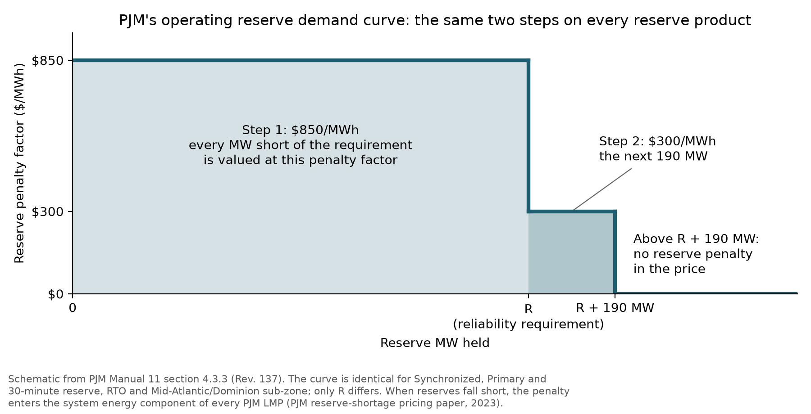
*Figure 1. PJM's two-step operating reserve demand curve, drawn from Manual 11 section 4.3.3 [4]. The horizontal axis is how much reserve PJM is holding relative to its requirement R; the vertical axis is the penalty added to every PJM price when reserves fall short. The first step ($850/MWh) applies to every megawatt short of the requirement and the second ($300/MWh) to the next 190 MW; beyond that there is no penalty. Drawn by `scripts/plot_ordc.py`.*

**Congestion price.** PJM always dispatches the cheapest generation that the wires can deliver. When a transmission line or transformer reaches its limit, the cheap generator on the far side can no longer serve the load behind the constraint, so a more expensive generator on the near side must run instead. The difference is charged to the nodes
behind the constraint as their congestion price. Manual 11 §2.2 defines it
as the effect on transmission congestion costs of "consumption by the
resource on transmission line loadings," and it is computed for each node
from the shadow price of every binding constraint (the cost of moving one
more MW across a line or transformer that is already at its limit, capped
at PJM's $2,000/MWh transmission penalty factor) weighted by how much that
node's consumption loads the constraint. That is why the congestion price
differs from node to node while the system energy price does not, why it
sits near zero most of the time and then jumps when a limit binds, and why
the Loudoun nodes pay it when the Pleasant View to Ashburn line or the
Goose Creek transformer is at its limit.

### Working Conclusion as of the End of This Project

At hourly timescales, data-center load barely fluctuates, and the
originally hypothesized "volatility" can't be seen in the data explored throughout this project
(although none of the datasets were ideal). Modern mitigation techniques
such as voltage ride-through (staying connected through a voltage dip
instead of tripping to backup power), fast frequency response (batteries
or loads reacting within a second to a frequency deviation), soft-start
(ramping a facility's load up gradually) and on-site batteries appear to be
absorbing what happens below one second, and other factors are flattening
the slower parts of the curve: behind-the-meter generation (a facility's
own power plant, whose output never passes through the utility meter) takes
load off the meter altogether, and policy such as the Texas grid operator
ERCOT's proposed 10 MW per 5-second limit, the North American Electric
Reliability Corporation's (NERC) ride-through guideline, and Texas Senate
Bill 6 demand response is aimed at the sub-second and emergency ends.

### Repo Structure

The repository is a research pipeline. Data is pulled from an API
or archive into `data/raw/`, cleaned and joined into analysis tables in
`data/interim/`, and every analysis reads those tables and writes its results
to `outputs/`. Nothing is passed between stages in memory.

Note: because this project's direction changed several times, the repository is not tidy. It holds dead ends, findings that carry
little weight, and elaborate work that did not pan out. For anything in the repo to make sense, make sure to read the high-level overview below before looking at any specific code.

```text
surg/
├── README.md               setup, API keys, the fetch and analyze commands
├── pyproject.toml          package definition; entry points surg-pull, surg-prep,
│                           surg-analyze (hourly suite), surg-run-5min (5-minute suite)
│
├── src/surg/               the PJM pipeline as a Python package
│   │
│   ├── acquisition/        API clients and pull orchestration
│   │   ├── client.py               PJM Data Miner 2 client, throttled to ~6 requests/min
│   │   ├── gridstatus_client.py    gridstatus.io client; rotates the six free keys
│   │   ├── gridstatus_pull.py      the 5-minute backfill and (gridstatus_validate.py) its checks
│   │   ├── entsoe_parse.py         ENTSO-E XML to rows, A03 curves left unexpanded
│   │   ├── chunking.py, storage.py date chunks; skip what is already on disk
│   │   ├── pull.py                 the surg-pull entry point
│   │   └── targets.py              the 11 pricing nodes
│   │
│   ├── preprocessing/      raw pulls to analysis tables
│   │   ├── loaders.py, schema.py, features.py, build.py          the hourly DOM panel
│   │   ├── loaders_5min.py, schema_5min.py, build_5min.py        the 5-minute DOM panels
│   │   ├── <market>_features.py    one per ISO: caiso, ercot, ieso, isone, miso, nyiso, spp
│   │   └── entsoe_zones.py, entsoe_expand.py, entsoe_panel.py   the European panel
│   │
│   ├── analysis/           the statistics
│   │   ├── tar.py                  threshold regression (Hansen)
│   │   ├── qr.py, qr_full.py       quantile regression
│   │   ├── gpd.py, gpd_components.py, gpd_continuous.py   generalized Pareto tail models
│   │   ├── mechanism.py, robustness.py, year_fe_diagnostic.py   the conditional-Z test and its checks
│   │   ├── tail_risk_curves.py, ashburn_diagnostic.py, panel.py, bootstrap_strategies.py
│   │   ├── entsoe_seasonal.py      the summer-minus-winter solar identification
│   │   └── run.py, run_5min.py     the hourly and 5-minute suites
│   │
│   └── diagnostics/
│       └── stage1.py               the level-versus-volatility check every market driver calls
│
├── scripts/                39 stand-alone drivers, run by path
│   ├── <market>_fetch.py, <market>_diagnostic.py   caiso, ercot, ieso, isone, miso, nyiso, spp
│   ├── entsoe_fetch.py, entsoe_ireland.py, entsoe_solar.py, entsoe_italy_stage1.py, cso_fetch.py
│   ├── ukpn_fetch.py, ukpn_flatness.py
│   ├── pecanstreet_fetch.py, pecanstreet_headroom.py, pecanstreet_1sec.py, pecanstreet_lib.py
│   ├── aidc_psd.py (GPU spectrum), aidc_edges.py (GPU edge speed), plot_aidc_timeseries.py
│   ├── necec_price_test.py, run_5min_nofilter.py
│   ├── compute_figure_inputs.py, plot_subq1_results.py, figures/   the figure pipeline
│   ├── plot_ordc.py, plot_hourly_series.py   the two figures drawn only for this record
│   └── poll_gridstatus_usage.py, verify_retention.py, build_report_docx.py, entsoe_probe.py
│
├── tests/                  585 test functions
│   ├── acquisition/, analysis/, preprocessing/, figures/   unit tests by package
│   ├── test_<market>_features.py, test_<market>_fetch.py, test_stage1_core.py, test_pecanstreet_lib.py
│   └── regression/         pins numbers from production runs; a failure there is a real behavior change
│
├── data/                   gitignored, ~28 GB
│   ├── raw/                one folder per source, exactly as downloaded
│   └── interim/            the assembled analysis tables (parquet)
├── outputs/                gitignored: JSON results and figures, one folder per analysis
├── notebooks/              01_data_miner_spike.ipynb, the day-one Data Miner API spike
├── logs/                   run logs, gitignored
│
└── docs/
    ├── decisions.md        the log of record: 60-plus entries, ~6,100 lines, append-only
    ├── Yu_Tony_SURG_Grant_Proposal.md   original research proposal
    ├── final_report.md     this record
    ├── final_reflection.md the Office of Undergraduate Research reflection
    │
    ├── research-notes/     the findings, one note each; INDEX.md is the entry point
    │   ├── A-primary-verify.md ... H-event-catalog.md    the PJM and Virginia desk research (§3.13)
    │   ├── I-advisor-links-2026-08.md                    Professor Wei's links (§3.13)
    │   ├── J-ukpn-flatness.md                            §3.9
    │   ├── K-ireland-dc-shape.md, L-solar-metering-artifact.md   §3.10
    │   ├── M-pecanstreet-xfra-headroom.md                §3.11
    │   ├── N-subsecond-provenance-and-filters.md         §3.12
    │   ├── EU-0-synthesis.md ... EU-5-policy-renewables.md   the Europe scoping (§3.13)
    │   └── external-context-research-2026-08.md          the external-context digest (§3.13)
    │
    ├── sources/            what each API allows and where it breaks
    │   ├── pjm-api-constraints.md, gridstatus-api-constraints.md, ukpn-api-constraints.md
    │   ├── entsoe-api-constraints.md, entsoe-endpoint-reference.md
    │   ├── pecanstreet-access-constraints.md, data-catalog.md
    │   └── availability/   one depth memo per market (caiso, ercot, ieso, isone, miso, nyiso, spp)
    │                       and the cross-ISO summary
    │
    ├── plans/              42 plans, pre-registrations, and errata
    │   └── advisor/        the weekly meeting agendas, with the notes taken in each meeting
    ├── specs/              seven design documents
    ├── reference/          vendored PJM manuals (M03, M11, M12) and the Data Miner API guide,
    │                       PJM's reserve-shortage paper, the Pecan Street catalog and dictionary
    └── assets/final_report/  the figures in this record
```

---

## 1. Timeline

This research project's timeline at a high level, in order. Each entry
points to the section that writes it up.

1. **Set-up and orientation.** Built the repository, validated the PJM
   Data Miner 2 API (PJM's public data portal), locked the 11 pricing
   nodes, and read PJM's reserve-shortage paper, which changed the planned
   method from a tail model to threshold regression plus quantile
   regression (§3.1).
2. **Hourly analysis in PJM.** Ran the original proposal's tests on the
   hourly DOM panel: threshold regression, quantile regression, tail models, the conditional test of the mechanism, and the tail-risk curves
   (§3.1).
3. **5-minute analysis on PJM's own data.** Re-ran the tests on the 27
   days of 5-minute load that PJM keeps, and found that hourly publication
   hides most 5-minute price spikes (§3.2).
4. **5-minute analysis on gridstatus.io data.** Pivoted to a new data source, gridstatus.io, and then pre-registered and ran the one-year
   two-sided test on three nodes; everything came back weaker than hourly
   (§3.2).
5. **Dropping the filter.** Dropped the proposal's 2 to 5 AM
   shoulder-season filter and interpreted the extended 3.4-year panel:
   congestion is driven by load level, not volatility (§3.2, §3.3, §3.4).
6. **Events.** Verified the 2024-07-10 ride-through event in the
   project's own data and built the catalog of thirty grid-stress events
   (§3.5).
7. **ERCOT, then seven additional markets.** Ran the level-versus-volatility check in ERCOT, then in NYISO, CAISO, IESO,
   MISO, ISO-NE, and SPP; level beats volatility everywhere (§3.6, §3.7).
8. **Desk research and the macro pivot.** Swept the policy and market
   context (notes A to H) and shut down the original proposal's JLARC
   projection and event-correlation ideas. The project then pivoted to a more exploratory mode (§3.13).
9. **ISO-NE follow-ups.** Tested the Canada-tie, solar, and NECEC explanations for New England's rising volatility (§3.8).
10. **Facility-level data at last: UKPN.** Cut the flatness note on 96 UK
    data-center profiles (§3.9).
11. **Europe.** Got the ENTSO-E token and ran Ireland against the
    Netherlands, the solar check across 12 zones and the Italian Stage 1
    (§3.7, §3.10).
12. **Residential: Pecan Street and XFRA.** Pulled the 22 GiB corpus and
    cut the panel-headroom note (§3.11).
13. **The sub-second claim.** Traced its provenance, mapped the filters
    between a GPU and a meter, and computed the project's own GPU spectrum
    (§3.12).
14. **Close-out.** Sanitized the repository and wrote this record and the
    final reflection.

---

## 2. Datasets

In total, around 28 GB was pulled and analyzed in this project. All data is gitignored and
reproducible from the fetch commands in the root `README.md`. The API keys
are not published, for obvious reasons, but most were easy to obtain: every
source has a free tier, and while none of the free tiers was ideal, all of
them were usable. Table 1 lists every dataset used, and Table 2 lists the two sources pulled but never used, left in just for record-keeping and consistency. Each source name links to its note below, and the
notes say, per source, what the source is, how it was accessed, and the source's limitations, along with links to the data and its documentation. Two words
recur in the tables: an ISO (independent system operator) is the
organization that runs a regional grid and its wholesale electricity
market, and a zone is the sub-region of an ISO for which load and prices
are published.

**Table 1.** Every dataset used in this record.

| # | Source | Dataset | What it is | Resolution | Window | Size (rows or files; on disk) | Used in |
|---|---|---|---|---|---|---|---|
| 1 | [PJM Data Miner 2](#source-1-pjm-data-miner-2) | `rt_hrl_lmps` | Real-time LMP with its three components, 11 nodes | hourly | 2022-10-02 to 2026-05 (Ashburn from 2024-05) | ~320k rows, 3.6 MB | §3.1, §3.4 |
| 2 | [PJM Data Miner 2](#source-1-pjm-data-miner-2) | `rt_fivemin_hrl_lmps` | Five-minute real-time LMP, 11 nodes | 5-minute | 2025-11-12 to 2026-05-10 | 570k rows | §3.2 (hidden-spike comparison) |
| 3 | [PJM Data Miner 2](#source-1-pjm-data-miner-2) | `hrl_load_metered` | DOM zonal metered load | hourly | 2021-01-01 to 2026-05-07 | 47k rows, 650 KB | §3.1 |
| 4 | [PJM Data Miner 2](#source-1-pjm-data-miner-2) | `sync_reserve_events` | PJM's calls on synchronized reserves in the Mid-Atlantic/Dominion (MAD) sub-zone | events | 2023-01-26 to 2026-03-05 | 38 events, 71 KB | stress flag, §3.1 and §3.5 |
| 5 | [PJM Data Miner 2](#source-1-pjm-data-miner-2) | `reserve_market_results` | Clearing prices for synchronized and primary reserves in MAD, averaged to hourly | 5-minute to hourly | 2022-10-02 to 2026-05-10 | 758k rows, 1.3 MB | the "stressed hour" definition, §3.1 |
| 6 | [PJM Data Miner 2](#source-1-pjm-data-miner-2) | `dom_pnodes_all` | Registry of all 2,328 DOM pricing nodes | snapshot | | 2,328 rows | node name and ID resolution |
| 7 | [gridstatus.io](#source-2-gridstatusio) | `pjm_load` | DOM zonal aggregate 5-minute instantaneous load | 5-minute | 2023-02 to 2026-06 | 750 files, 47 MB (with 8) | the extended 5-minute panel, §3.2 to §3.4 |
| 8 | [gridstatus.io](#source-2-gridstatusio) | `pjm_lmp_real_time_5_min` | 5-minute LMP for LOUDOUN, PLEASANT VIEW, GOOSECRE, and SKFFSCRK | 5-minute | 2023-02 to 2026-06 | | the extended 5-minute panel, §3.2 to §3.4 |
| 9 | [gridstatus.io](#source-2-gridstatusio) | `isone_interchange_hourly` | Flows on every ISO-NE external tie (a transmission line connecting ISO-NE to a neighboring grid) | hourly | 2026-03-01 to 03-08 | one week | NECEC dose check, §3.8 |
| 10 | [ERCOT](#source-3-ercot) | `native_load_<YYYY>.zip` | Load by weather zone (ERCOT's regional divisions, drawn around areas of similar climate), 9 zones | hourly | 2017-01-01 to 2026-07-31 | 30 files, 179 MB (with 11) | §3.6 |
| 11 | [ERCOT](#source-3-ercot) | report 13061, `RTMLZHBSPP_<YYYY>.zip` | Real-time settlement point prices (the prices at which energy is bought and sold at each hub or load zone), 15 hubs (trading locations whose price is the average over a group of nodes) and load zones | hourly | 2022 to 2026-07-31 | | §3.6 |
| 12 | [MISO](#source-4-miso) | `df_al` | Forecast-and-actual load by local resource zone (6 LRZs), one file per market day | hourly | 2023-01 to 2026-08 | 1,317 files, 1.4 GB (with 13) | §3.7 |
| 13 | [MISO](#source-4-miso) | `da_expost_lmp` | Day-ahead ex-post LMP at the hubs, with congestion and loss components | hourly | 2023-01 to 2026-08 | | §3.7 |
| 14 | [SPP](#source-5-spp) | hourly load by control zone | 17 zones used | hourly | 2016 to 2026-03-23 | 914 files, 3.7 GB (with 15) | §3.7 |
| 15 | [SPP](#source-5-spp) | day-ahead LMP by settlement location | With LMP components | hourly | 2017 to 2026-03-23 | | §3.7 |
| 16 | [NYISO](#source-6-nyiso) | `palIntegrated` | Integrated actual load, 11 zones | hourly | 2001-06 to 2026-08 | 928 files, 391 MB (16 to 18) | §3.7 |
| 17 | [NYISO](#source-6-nyiso) | `damlbmp_zone` | Day-ahead zonal LBMP (NYISO's name for LMP) with congestion and loss columns | hourly | 2001-06 to 2026-08 (available from 1999-11) | | §3.7 |
| 18 | [NYISO](#source-6-nyiso) | `realtime_zone` | Real-time zonal LBMP | hourly | 2001-06 to 2026-08 | | §3.7 |
| 19 | [ISO-NE](#source-7-iso-ne) | SMD hourly workbooks | Load, day-ahead and real-time LMP with components, and weather, 8 zones | hourly | 2016-01 to 2026-06 | 10 files, 83 MB | §3.7, §3.8 |
| 20 | [IESO](#source-8-ieso) | `PUB_DemandZonal_<YYYY>.csv` | Demand for the 10 Ontario zones | hourly | 2003 to 2026-08 | 73 files, 28 MB (20 to 22) | §3.7 |
| 21 | [IESO](#source-8-ieso) | `PUB_Demand_<YYYY>.csv` | Ontario total demand | hourly | 2002 to 2026-08 | | §3.7 |
| 22 | [IESO](#source-8-ieso) | `PUB_PriceHOEPPredispOR_<YYYY>.csv` | The Hourly Ontario Energy Price, the single province-wide price until 2025-04-30 | hourly | 2003-05 to 2025-04 | | §3.7 |
| 23 | [CAISO](#source-9-caiso) | actual load by transmission access charge (TAC) area | PG&E, SCE, SDG&E and Valley Electric areas plus the ISO total | hourly | 2009-04 to 2026-08 | 864 files, 22 MB (with 24) | §3.7 |
| 24 | [CAISO](#source-9-caiso) | day-ahead LMP | Four utility load aggregation points and three trading hubs (NP15, SP15, ZP26), with components | hourly | 2023-04-12 to 2026-08 | | §3.7 |
| 25 | [UKPN](#source-10-uk-power-networks-ukpn) | `ukpn-data-centre-demand-profiles` | Utilization ratio (observed apparent power over contracted import capacity) for 96 anonymized data centers | half-hourly | 2023-01-01 to 2026-05-13 | 5,442,348 rows (47 MB for 25 to 27) | §3.9 |
| 26 | [UKPN](#source-10-uk-power-networks-ukpn) | `ukpn-data-centres-by-local-authority` | Count of data centers per district | snapshot | | 45 rows | §3.9 |
| 27 | [UKPN](#source-10-uk-power-networks-ukpn) | `ukpn-large-demand-list` | Large demand connection projects | snapshot | | 496 rows | §3.9 |
| 28 | [ENTSO-E](#source-11-entso-e-transparency-platform) | actual load, document 6.1.A | 19 bidding zones: Ireland (IE_CTA), the Netherlands, the seven Italian zones, Germany-Luxembourg, France, Spain, Finland, both Danish zones, the four Swedish zones | 15, 30 or 60-minute, parsed to hourly | 2015 to 2026 (2026 excluded from analysis) | 376 parquet files, 34 MB (28 to 30) | §3.7 (Italy), §3.10 |
| 29 | [ENTSO-E](#source-11-entso-e-transparency-platform) | day-ahead price, document 12.1.D | Ireland (the all-island Single Electricity Market, SEM) and Italy | hourly | 2015 to 2025 | | §3.10 |
| 30 | [ENTSO-E](#source-11-entso-e-transparency-platform) | installed solar capacity, document 14.1.A (A68) | 7 zones | annual | 2015 to 2025 | | §3.10 |
| 31 | [CSO (Ireland)](#source-12-cso-irelands-central-statistics-office) | table MEC02 | Metered electricity consumption in GWh, split into data centers, all other customers, and the total | quarterly | 2015Q1 to 2025Q4 | 44 quarters, 8.5 KB | §3.10, the only measured data-center dose |
| 32 | [CBS StatLine (Netherlands)](#source-13-cbs-statline-statistics-netherlands) | data-center share of electricity consumption | The Netherlands' data-center share of electricity, used as the "dose" for the control country in the Ireland comparison (§3.10) | annual | 2017 to 2024 | 8 values | §3.10 |
| 33 | [Pecan Street](#source-14-pecan-street-dataport) | Austin bundle, 25 homes | Whole-home and circuit-level power | 15-minute, 1-minute, 1-second | 2018 to 2019 | ~13 GB | §3.11 |
| 34 | [Pecan Street](#source-14-pecan-street-dataport) | New York bundle, 25 homes | Whole-home and circuit-level power | 15-minute, 1-minute, 1-second | six months, no winter | ~6.3 GB | §3.11 |
| 35 | [Pecan Street](#source-14-pecan-street-dataport) | California bundle, 23 homes (in fact San Diego) | Whole-home and circuit-level power | 15-minute, 1-minute | 2018 to 2019 | | §3.11 |
| 36 | [Pecan Street](#source-14-pecan-street-dataport) | metadata and surveys | `metadata.csv`, the audits and surveys, EV and weather, indoor temperature | | | 22 GB and 37 files for 33 to 36 and 39 | §3.11 |
| 37 | [rs-7943457 (York University and IESO)](#source-15-rs-7943457-gpu-telemetry) | GPU telemetry | Per-GPU power, utilization, memory, and temperature for AI-training sessions on 8-GPU H100 and B200 nodes; 8 of 32 sessions downloaded, 15 minutes each | polled every 20 ms, refreshing every ~103 ms (about 9.7 Hz) | 2025 | 143 MB on disk | §3.12 |

**Table 2.** Datasets pulled but not used in any analysis.

| # | Source | Dataset | What it is | Resolution | Window | Size (rows or files; on disk) | Why it was not used |
|---|---|---|---|---|---|---|---|
| 38 | [PJM Data Miner 2](#source-1-pjm-data-miner-2) | `da_hrl_lmps` | Day-ahead LMP, 11 nodes | hourly | 2024-05-26 to 2026-05-10 | 189k rows | pulled for a day-ahead versus real-time spread analysis that was never needed |
| 39 | [Pecan Street](#source-14-pecan-street-dataport) | Puerto Rico, September 2023 | Per-metric files: real power, apparent power, current, harmonic distortion (the phase-angle file is broken on the server) | 15-minute, 1-minute, 1-second | 2023-09 | counted in dataset 36 | one month of data from a grid the project never studied |

### Source 1: PJM Data Miner 2

*Data: [Data Miner 2](https://dataminer2.pjm.com/list); the feeds used are [`rt_hrl_lmps`](https://dataminer2.pjm.com/feed/rt_hrl_lmps), [`da_hrl_lmps`](https://dataminer2.pjm.com/feed/da_hrl_lmps), [`rt_fivemin_hrl_lmps`](https://dataminer2.pjm.com/feed/rt_fivemin_hrl_lmps), [`hrl_load_metered`](https://dataminer2.pjm.com/feed/hrl_load_metered), [`sync_reserve_events`](https://dataminer2.pjm.com/feed/sync_reserve_events), [`reserve_market_results`](https://dataminer2.pjm.com/feed/reserve_market_results) and [`pnode`](https://dataminer2.pjm.com/feed/pnode).*

*Documentation: the [PJM API portal](https://apiportal.pjm.com/) and the vendored API guide (`reference/pjm-manuals/data-miner-2-api-guide.pdf`).*

*[Back to the dataset table](#2-datasets).*

PJM Interconnection is the grid operator for 13 states and the District of
Columbia across the Mid-Atlantic and Midwest, from Virginia and North
Carolina north to New Jersey and west to Illinois. Data Miner 2 is its
public data portal: a web interface at `dataminer2.pjm.com` and a REST API at `api.pjm.com`, documented in the API guide (vendored at
`reference/pjm-manuals/data-miner-2-api-guide.pdf`) and the developer
portal at `apiportal.pjm.com`. An API key is required; the free tier allows
about 6 requests a minute, and anything older than a specific number of days (differs between datasets) sits in a separate "Historic" tier with fewer filtering options available. Everything pulled from this source is for the Dominion (DOM) zone: Dominion Energy's service
territory in Virginia, which contains the Loudoun County data-center
corridor (data center alley). Documentation of data and API constraints
can be found in `sources/pjm-api-constraints.md` in the repo.

Two of these datasets define what a "stressed" hour is for this project. Hours are "stressed" when the reserve clearing price ([dataset 5](#2-datasets)) reached
$850/MWh, the first step of PJM's reserve-shortage penalty curve, so the
mechanism tests could be run separately on stressed and normal hours. The
event records in [dataset 4](#2-datasets) were too sparse (38 events in 3.6
years) to define stress on their own, and "any nonzero reserve price"
turned out to be too lax (44% of intervals).

**What went wrong.**

- The load is aggregated for the whole DOM zone, not for data centers and
  not even for individual pricing nodes, so what any one facility is doing
  is essentially invisible within the larger aggregate.
- The resolution is hourly for load and at best 5-minute for prices, which
  is too coarse of a time scale for a project questioning volatility at the second timescale.
- The API rate limit (about 6 requests a minute) made every data pull slow.
- The data runs out past a certain date: 5-minute instantaneous load is
  kept for only about 30 days (`inst_load`), operational reserves for 15
  days, and the node-filterable 5-minute LMP for 186 days, which is one reason the project later pivoted to gridstatus.io.
- The boundary between the Standard and Historic tiers slides forward one
  day per day, and the Historic tier cannot filter by node, only by node
  subtype, so recovering the two Ashburn 35 kV nodes' history would mean
  downloading all ~10,786 LOAD-subtype nodes (about 94.5M rows a year) and
  discarding 99.98% of it. This was deliberately not done, which is why
  Ashburn has two years of coverage instead of 3.6.
- The `type` column is the node *subtype*, not its type.

### Source 2: gridstatus.io

*Data: [`pjm_load`](https://www.gridstatus.io/datasets/pjm_load), [`pjm_lmp_real_time_5_min`](https://www.gridstatus.io/datasets/pjm_lmp_real_time_5_min) and [`isone_interchange_hourly`](https://www.gridstatus.io/datasets/isone_interchange_hourly) on gridstatus.io.*

*Documentation: [docs.gridstatus.io](https://docs.gridstatus.io/) and the [`gridstatusio` client source](https://github.com/gridstatus/gridstatusio).*

*[Back to the dataset table](#2-datasets).*

gridstatus is a hosted data warehouse that republishes ISO data with
deeper history than the ISOs' own portals keep. In the context of this project, it was used for PJM 5-minute data because PJM itself keeps only 186 days for LMP and 30 days for load.
Like Data Miner 2, an API key is required; since each key is limited to 500k rows and 250 requests a month, this project rotated between six free-tier keys. However, due to the volume of data pulled, the quota still ran out, and the ISO-NE pull ([dataset 9](#2-datasets)) stopped after one week. Constraints are in `sources/gridstatus-api-constraints.md`.

**What went wrong.**

- The same two problems as PJM: nothing finer than 5 minutes and nothing at
  the data-center level for load.
- The rate limits were once again a pain: 500k rows and 250 requests a month
  per free key meant creating two more Google accounts and two Yahoo accounts
  to get to six keys, and the ISO-NE pull still ran out after a week.
- `pjm_load.dom` is empirically PJM's Southern-Region aggregate, not a strict
  DOM series.
- 0.1 to 0.4% of intervals are missing upstream and cannot be recovered, and
  a naive difference across a 5h50m hole reads as a −4,933 MW step, larger
  than anything real. Therefore, every gradient in the project is only computed between adjacent intervals and gap-masked.

### Source 3: ERCOT

*Data: [hourly load by weather zone](https://www.ercot.com/gridinfo/load/load_hist) and [report 13061, historical real-time load zone and hub prices](https://www.ercot.com/mp/data-products/data-product-details?id=NP6-785-ER).*

*Documentation: the [ERCOT data product catalog](https://www.ercot.com/mp/data-products) and [developer portal](https://developer.ercot.com/).*

*[Back to the dataset table](#2-datasets).*

ERCOT (the Electric Reliability Council of Texas) is the independent grid
operator for most of Texas. Its archives are public on `ercot.com` with no
key and no quota: the hourly load archive by weather zone and report 13061,
the real-time settlement point prices for load zones and hubs. Earlier load years were skipped because they use different zone names and file formats.
More information is located at
`sources/availability/ercot-data-availability-research.md`.

**What went wrong.**

- Hourly only, and load by weather zone, so once again the time granularity
  is too coarse, and there is no data-center-specific load.
- `Native_Load_2026.xlsx` republishes all of May 2026 as 744 duplicate rows,
  a publisher-side defect.
- The Panhandle hub price (HB_PAN) is negative in 20.4% of hours because of
  wind, so West-zone correlations are uninterpretable.

### Source 4: MISO

*Data: [MISO market reports](https://www.misoenergy.org/markets-and-operations/real-time--market-data/market-reports/); the files themselves are served from `docs.misoenergy.org/marketreports/`.*

*Documentation: the report descriptions on the same page, and `sources/availability/miso-data-availability-research.md`.*

*[Back to the dataset table](#2-datasets).*

MISO is the Midcontinent ISO, covering 15 central US states and Manitoba.
Its market reports are public at `docs.misoenergy.org/marketreports` with
no key. Retention is the current year plus three calendar years, which is
what set the 2023 start; each `df_al` file carries actual load for only one
day, so every market day needs its own file. Memo:
`sources/availability/miso-data-availability-research.md`.

**What went wrong.**

- The same problems as before: hourly and by local resource zone (LRZ,
  MISO's six planning regions), with nothing at the data-center level.
- MISO publishes no zonal price, so each LRZ had to be paired with a hub, and
  LRZ3_5 and LRZ4 both map to `ILLINOIS.HUB`. MISO's 36 of 36 result in §3.7
  is therefore slightly inflated, since two of its cells are not
  independent.

### Source 5: SPP

*Data: [hourly load](https://portal.spp.org/pages/hourly-load) and [day-ahead LMP by settlement location](https://portal.spp.org/pages/da-lmp-by-settlement-location) on the [SPP file portal](https://portal.spp.org/).*

*Documentation: the portal's page for each file set.*

*[Back to the dataset table](#2-datasets).*

SPP stands for the Southwest Power Pool, 14 states in the central US. Its
file portal (`portal.spp.org`) is public with no key: one annual zip per
year through 2024 (about 2.5 GB), then daily CSVs from 2025 (1.6 GB more).
Memo: `sources/availability/spp-data-availability-research.md`.

The panel stops on 2026-03-23 on purpose: the next day the load file's
layout and the zone roster both change (SPP's new RTO West region joins).

**What went wrong.**

- Hourly and by control zone, like the rest, with no data-center load.
- SPP has no zonal price either. The zone price used is an unweighted
  mean of the nodal LMPs whose names match the zone prefix, which matches
  64.5 to 75.1% of nodes.
- The 2016 price zip mixes two naming families.

### Source 6: NYISO

*Data: [`palIntegrated` (report P-58B)](http://mis.nyiso.com/public/P-58Blist.htm), [`damlbmp_zone` (P-2A)](http://mis.nyiso.com/public/P-2Alist.htm) and [`realtime_zone` (P-24A)](http://mis.nyiso.com/public/P-24Alist.htm).*

*Documentation: [NYISO energy market and operational data](https://www.nyiso.com/energy-market-operational-data).*

*[Back to the dataset table](#2-datasets).*

NYISO is the New York ISO. Its monthly CSV archives are public at
`mis.nyiso.com` with no key. Memo:
`sources/availability/nyiso-data-availability-research.md`.

**What went wrong.**

- Hourly and zonal, like the rest.
- The zone roster changed on 2005-01-31, when New York City and Long Island
  stopped being reported as one combined zone. Therefore, the market ships as two
  panels (a merged 10-zone roster that spans the whole archive, and a split
  11-zone roster from 2005 on) that are not interchangeable.

### Source 7: ISO-NE

*Data: the [SMD hourly workbooks](https://www.iso-ne.com/isoexpress/web/reports/load-and-demand/-/tree/zone-info).*

*Documentation: the [pricing node tables](https://www.iso-ne.com/markets-operations/settlements/pricing-node-tables/) and [ISO-NE web services](https://webservices.iso-ne.com/).*

*[Back to the dataset table](#2-datasets).*

ISO-NE stands for ISO New England, the project's control market due to its
little data-center development: by the ISO's own statement, New
England "has not experienced similar growth so far, and only a small amount
is expected in the coming decade." Its "SMD hourly" annual workbooks (SMD
is Standard Market Design, the 2003 market redesign whose name the public
hourly data files still carry) are public static files on `iso-ne.com`, one
per year, no key. Memo:
`sources/availability/isone-data-availability-research.md`.

**What went wrong.**

- Hourly and zonal, like the rest.
- The workbook switches its time convention in 2024 (checked: hour labels
  line up across the break).
- 2026 is a half-year due to when this project took place.
- Separately, EIA-930's `ISNE → HQT` interchange series omits the NECEC line
  entirely (EIA is the US Energy Information Administration; EIA-930 is its
  hourly grid monitor; NECEC is the New England Clean Energy Connect line,
  §3.8).

### Source 8: IESO

*Data: [`DemandZonal`](https://reports-public.ieso.ca/public/DemandZonal/), [`Demand`](https://reports-public.ieso.ca/public/Demand/) and [`PriceHOEPPredispOR`](https://reports-public.ieso.ca/public/PriceHOEPPredispOR/).*

*Documentation: the [IESO data directory](https://www.ieso.ca/Power-Data/Data-Directory).*

*[Back to the dataset table](#2-datasets).*

IESO (the Independent Electricity System Operator), Ontario's grid
operator, was the first look outside of the US. Its annual CSVs are in a
public directory at `reports-public.ieso.ca`, no key. Also note that Ontario
moved from a single province-wide price (HOEP, the Hourly Ontario Energy
Price) to nodal prices on 2025-04-30. Memo:
`sources/availability/ieso-data-availability-research.md`.

**What went wrong.**

- Hourly and zonal, like the rest.
- After the market change, prices are published in a roughly 90-day rolling window, and no collector was set up, so the price series ends in
  April 2025.

### Source 9: CAISO

*Data: [CAISO OASIS](http://oasis.caiso.com/).*

*Documentation: the [OASIS interface specification](https://www.caiso.com/documents/oasis-interfacespecification_v5_1_2clean_fall2017release.pdf), which defines the `SingleZip` query the fetch script uses.*

*[Back to the dataset table](#2-datasets).*

CAISO is the California ISO. Its OASIS (Open Access Same-time Information
System) API (`oasis.caiso.com`) needs no key but has informal rate limits,
so the fetch works in 28-day chunks with a 6-second pause (note that there
may be a more efficient way to gather data; this is just what this project found to work quickly). Although prices were requested as far back as 2009, OASIS only returns them
from 2023-04-12, so the market ships as two panels (full depth and modern).
Memo: `sources/availability/caiso-data-availability-research.md`.

**What went wrong.**

- Hourly and by utility area, like the rest.
- An initial probe claimed 2010 price depth; the `PRC_LMP` archive actually
  starts on 2023-04-12.
- Silicon Valley's data-center cluster is invisible since Santa Clara is
  served by a municipal utility that has no load area in CAISO's data.

### Source 10: UK Power Networks (UKPN)

*Data: [`ukpn-data-centre-demand-profiles`](https://ukpowernetworks.opendatasoft.com/explore/dataset/ukpn-data-centre-demand-profiles/), [`ukpn-data-centres-by-local-authority`](https://ukpowernetworks.opendatasoft.com/explore/dataset/ukpn-data-centres-by-local-authority/) and [`ukpn-large-demand-list`](https://ukpowernetworks.opendatasoft.com/explore/dataset/ukpn-large-demand-list/).*

*Documentation: the portal's [API console](https://ukpowernetworks.opendatasoft.com/api-console/explore/v2.1).*

*[Back to the dataset table](#2-datasets).*

UKPN is the distribution network operator for London, the East, and the
South East of England. It runs the local wires rather than the transmission
grid, which is why it meters individual large customers. Its open-data
portal (`ukpowernetworks.opendatasoft.com`, built on Opendatasoft)
publishes anonymized half-hourly profiles for the data centers connected to
its network. A free API key is required; the quota is 100k calls a day, and
an export counts as one call regardless of size, so the rate limit is effectively infinite, a breath of fresh air after PJM and
gridstatus. Constraints: `sources/ukpn-api-constraints.md`.

**What went wrong.**

- The large-demand list cannot be filtered to data centers, and there is no
  MW, no location, and no price: shapes only.
- Half-hourly resolution is far too coarse for the sub-second question, even
  though this is the one source with facility-level data.
- The utilization ratio is not bounded between 0 and 1 (it runs from 0 to 3.992).
- `local_timestamp` is UTC despite its name (verified across seven
  daylight-saving boundaries).
- 13.1% of rows are exact zeros across 69 of the 96 sites, four sites are
  dead for the whole period, and about 1,700 short dropouts manufacture fake
  full-scale ramps that would corrupt any volatility statistic.
- Site #67 has a 5.4× structural break: its mean utilization ratio is 1.396
  before 2025-11-27 and 0.260 after, and it sits above 1.0 (that is,
  reporting more power than its contracted capacity) for 86% of its span.
  Running above contracted capacity continuously for nearly three years is
  not physically plausible, so the likely explanation is that the
  contracted capacity on file was stale and was revised on that date.
  Either way, any statistic pooled across the site's whole 3.4-year span
  is not interpretable.

### Source 11: ENTSO-E Transparency Platform

*Data: the [ENTSO-E Transparency Platform](https://transparency.entsoe.eu/).*

*Documentation: the [RESTful API sitemap](https://transparencyplatform.zendesk.com/hc/en-us/articles/15692855254548-Sitemap-for-Restful-API-Integration) and [how to get a security token](https://transparencyplatform.zendesk.com/hc/en-us/articles/12845911031188-How-to-get-security-token).*

*[Back to the dataset table](#2-datasets).*

ENTSO-E is the association of Europe's transmission system operators, and
its Transparency Platform (`transparency.entsoe.eu`) is their shared data
platform. Its REST API needs a free token, which took three working days
to obtain; the limit is 400 requests a minute per token, and a breach is allegedly a short-term ban. The vendor's documentation is a Zendesk help
center plus a Postman collection; what matters from them is summarized in
`sources/entsoe-api-constraints.md` and `sources/entsoe-endpoint-reference.md`.

**What went wrong.**

- National and bidding-zone aggregates at 15 to 60 minutes, so the same
  aggregation and granularity problems as every ISO source. (A bidding
  zone is the area within which Europe's day-ahead market treats
  electricity as freely tradable at one price; most countries are one
  zone, Italy has seven.)
- Irish load lives on the CTA (control area) identifier, which covers the
  Republic only, not on SEM (all-island, about 1,015 MW higher), which voided
  an earlier "footprint" objection to using Ireland; price is the opposite
  (CTA returns "no data" on price).
- Resolution is per document (NL 15-minute, IE 30-minute since 2015).
- The platform's compressed "A03" curve format makes a naive
  one-row-per-point parse read spikier than reality.
- Price documents come back as whole days in the area's time zone, so
  year-boundary days arrive twice.
- The Irish feed omits the daylight-saving fall-back hour, and 3,774 of
  203,604 slots are missing (1.85%, in 661 runs).
- Metered solar (document A75) is invisible to the transmission operator for
  rooftop PV (photovoltaic panels; the Netherlands: 204 MW metered against
  27,980 MW installed), so the solar dose has to be installed capacity
  (A68), and even A68's coverage runs from about 100% of national PV in
  the Netherlands to about 3% in Finland.
- Annual capacity documents start at local midnight expressed in UTC, which
  is 31 December of the previous year, so every zone-year was initially
  joined to the following year's capacity.

### Source 12: CSO (Ireland's Central Statistics Office)

*Data: [table MEC02](https://www.cso.ie/en/statistics/energy/datacentresmeteredelectricityconsumption/), or the [JSON-stat API call](https://ws.cso.ie/public/api.restful/PxStat.Data.Cube_API.ReadDataset/MEC02/JSON-stat/2.0/en) that returns it.*

*Documentation: the [PxStat API wiki](https://github.com/CSOIreland/PxStat/wiki/API-Cube-RESTful).*

*[Back to the dataset table](#2-datasets).*

Ireland's Central Statistics Office (CSO) is the national statistics agency.
Since 2015, it has published a quarterly table, MEC02, of metered electricity
consumption split into data centers, all other customers, and the total,
built from the meter readings the electricity networks report to it. The
table is served through PxStat, the CSO's open statistics system, as a
JSON-stat API at `ws.cso.ie` that needs no registration: one HTTP request
returns the whole table.

**What went wrong.**

- It is a national quarterly total, so it says how much data centers
  consume, not when or how fast.
- The CSO has no data-center classification of its own. Sites are identified
  heuristically (name matching, business parks, meters above 1 GWh a year),
  and the CSO itself warns that new small sites may fall below its thresholds.

### Source 13: CBS StatLine (Statistics Netherlands)

*Data: the [CBS custom table](https://www.cbs.nl/nl-nl/maatwerk/2025/51/elektriciteit-geleverd-aan-datacenters-2017-2024).*

*Documentation: [StatLine open data](https://opendata.cbs.nl/).*

*[Back to the dataset table](#2-datasets).*

Statistics Netherlands (CBS) is the Dutch national statistics office, and
StatLine is its open statistics database, with no key. The data-center
series, electricity delivered to data centers from 2017 to 2024, is a custom
table that CBS publishes as a downloadable file rather than a standing
StatLine series: annual, national only, with no regional breakdown, no size
classes and no facility list.

**What went wrong.**

- Annual national totals, so coarser still than the CSO's.
- The CSO and CBS definitions differ (CSO's heuristic against CBS's "main
  activity" classification), so the two countries' *levels* are only roughly
  comparable.

### Source 14: Pecan Street Dataport

*Data: [Pecan Street Dataport](https://www.pecanstreet.org/dataport/); the bulk route is the [JupyterHub](https://jupyterhub.pecanstreet.org) contents API.*

*Documentation: the vendored catalog and data dictionary (`reference/pecan-street/`) and [dataport.pecanstreet.org](https://dataport.pecanstreet.org).*

*[Back to the dataset table](#2-datasets).*

Pecan Street is a research nonprofit that instruments volunteer homes with
circuit-level eGauge monitors (meters that record each circuit in the home
separately), mostly in Austin. The free University tier gives no database
access; the bulk route is the JupyterHub contents API
(`jupyterhub.pecanstreet.org`), which `scripts/pecanstreet_fetch.py` drives
with a JupyterHub token. The vendor's catalog and data dictionary are
vendored in `reference/pecan-street/`; access mechanics and traps are in
`sources/pecanstreet-access-constraints.md` and the docstring of
`scripts/pecanstreet_lib.py`.

**What went wrong.**

- Whole-home use is not a column and had to be reconstructed as
  `grid + solar + solar2`.
- The dictionary's `use` and `gen` columns do not exist in `metadata.csv`,
  and row 2 of that file is a dictionary row, not a home.
- The "California" bundle is San Diego homes stamped in Central time.
- 136 of the 1,198 homes with 1-minute data lack the `grid` column.
- Heavy intervention programs contaminate many homes. Pecan Street runs
  experiments on its volunteers, and the metadata flags the homes that took
  part: a CCET pricing trial (time-varying electricity prices), a Verizon
  low-income apartment program, an LG appliance swap, the SHINES
  solar-plus-storage demonstration, and Civita text-message nudges. A home
  in one of these programs is not a natural observation of household
  demand, because the program itself changed how and when the home used
  power, so analysis was rerun without those homes as a robustness check (§3.11).
- Austin home 7536 emits a 5,308.7 kW telemetry fault with ±1.15 MV leg
  voltages (filtered out).
- The Austin 1-second files zero-fill gaps in 18 of 25 homes, so a
  resumption after a gap reads as a ~23 kW step that no plausibility filter
  can catch; it corrupts maximum-based statistics only.
- No electrical service size is recorded anywhere in the free tier (i.e.
  whether a home has a 200 A panel, a 150 A panel, or something else).

### Source 15: rs-7943457 GPU Telemetry

*Data: the [GitHub dataset](https://github.com/Ahmed-Elsayed95/High-resolution-AI-Data-Center-Training-Workloads-Dataset).*

*Documentation: the [preprint rs-7943457](https://www.researchsquare.com/article/rs-7943457/v1).*

*[Back to the dataset table](#2-datasets).*

This source contains per-GPU power telemetry from real AI training runs,
recorded at York University on two 8-GPU servers (one with NVIDIA H100
cards, one with B200 cards) by reading each card's built-in power sensor
every 20 ms. The 32 sessions cover fine-tuning of 1B to 8B parameter
language models and diffusion-model training, about 15 minutes each, with
per-GPU power, utilization, memory, and temperature all recorded. It is the
dataset behind the Research Square preprint rs-7943457 (Elsayed, Al-Obaidi
and Farag, York University and Ontario's grid operator IESO) and was
published alongside it on GitHub under CC BY 4.0 (a license that allows
reuse with attribution). It is the only source in the project that is fast
enough to see the second-scale cycle (other than the residential data from
Pecan Street), at the cost of being only one server node rather than a
full, hyperscale facility.

**What went wrong.**

- The file says 50 Hz, but 80.7% of consecutive samples are identical, so the
  sensor refreshes every ~103 ms. The instrument is mute above about 5 Hz by
  construction.
- The repository's "sequence length" sweep (seq1024, 2048, 4096) has
  identical memory use (within 0.01%) and power (within 0.1%) across a
  claimed 4× range, so those are not independent runs; because of this, two files were dropped.

### Assembled Tables

Because most upstream data sources aren't clean, every analysis reads a
single cleaned table rather than the raw files. These live in
`data/interim/` and are built by the preprocessing code from the raw pulls:
the raw files are joined, put on a common clock, gap-masked, and given the
derived columns (load gradient, cluster means, event flags) the tests need.
The main ones are the hourly DOM panel (31,536 rows by 23 columns), the
5-minute DOM panels (the extended one at 351k rows and the one-year
two-sided one at 105k), one Stage-1 panel per market (from MISO's 31.6k
rows to NYISO's 220k), the Irish, Dutch, and Italian hourly series, the UKPN
site tables, and the Pecan Street reconstructed whole-home series.

---

## 3. Analyses and Findings

Each subsection describes what question was asked, what data it ran on, and what the results/findings were. Numbers in square
brackets are 95% bootstrap confidence intervals unless stated otherwise: a
bootstrap re-estimates a statistic on many random resamples of the data,
and the interval brackets the middle 95% of those re-estimates, so it says
how much the number could move by chance.

### 3.1 PJM/DOM Hourly: Answering the Original Proposal's Question

**The question.** The proposal's idea was that fast swings in data-center
load push Loudoun's congestion prices into a different regime once the
swings get big enough.

Figure 2 shows where the Dominion zone sits inside PJM. PJM is divided into
transmission zones, one per transmission-owning utility; Dominion's zone
covers most of Virginia and a corner of North Carolina, and every PJM
pricing node in this record is inside it.

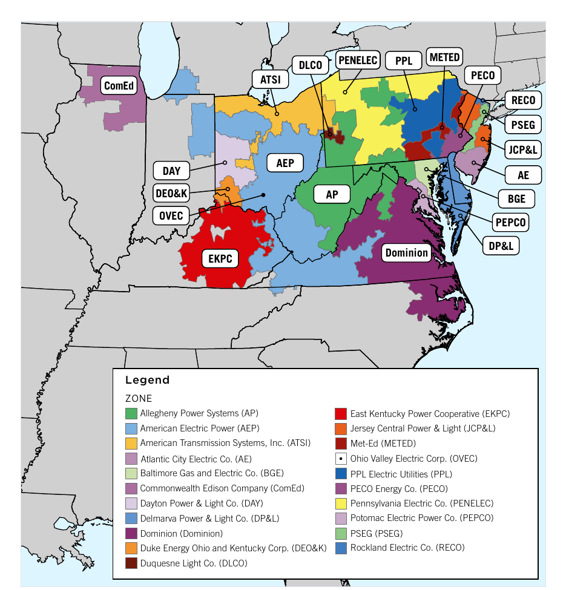
*Figure 2. PJM's transmission zones, from PJM's own zone map (dated 2023-05-11) [106]. Dominion (purple, lower right) is the DOM zone of this record; Loudoun County sits at its northern tip, just west of Washington, DC.*

**The data.** An hourly panel from 2022-10-02 to 2026-05, 31,536 hours. The
price variable is the congestion component of the locational marginal price
(LMP), averaged over the six 500 kV nodes in the Loudoun cluster (LOUDOUN,
PLEASANT VIEW, GOOSECRE, BRAMBLET, MOSBY, and SKFFSCRK). After an initial round of analysis, several tests were repeated on total LMP as opposed to
just the congestion price component. The volatility variable, called Z
throughout, is how fast DOM load changes, measured as the absolute
hour-over-hour change in MW per minute. Two 500 kV nodes outside the
cluster (OX and BRISTERS) and the DOM zonal price served as controls, and
the two 35 kV Ashburn nodes (data from May 2024) served as the
distribution-side comparison. After filtering for the original proposal's
isolation hours (shoulder months, 2 to 5 AM), only 2,027 hours remain.
However, within those hours, very few high-MW events remained, so most tests were run on the full, unfiltered panel instead.

Figure 3 shows the two series over the whole panel, before any statistics
are run on them. DOM load (top) has a strong seasonal shape, with summer
and winter peaks near 24 GW and spring and fall troughs near 10 GW, and a
daily cycle too fast to resolve at this scale. The cluster price (bottom)
sits in a $20 to $60 band most of the time, with sharp spikes above $1,000
that last a few hours. The congestion component is near zero most of the
time, jumps when a transmission limit binds, and is occasionally negative,
which §3.5 explains.

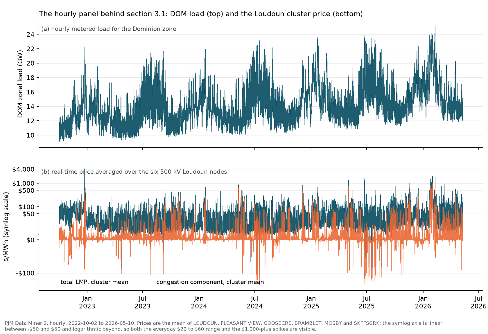
*Figure 3. The hourly panel behind this section: DOM zonal load (top) and the real-time price averaged over the six Loudoun nodes (bottom), 2022-10-02 to 2026-05-10. The price axis is a symmetric log scale (linear between −$50 and $50, logarithmic beyond), so both the everyday $20 to $60 range and the $1,000-plus spikes are visible at once. Drawn by `scripts/plot_hourly_series.py`.*

**Is there a threshold?** Threshold regression (TAR, Hansen's method) fits
two separate regimes on either side of a cut in Z and searches for the cut
that fits best. It put the cut at 4.3927 MW/min on the cluster and on both
control nodes alike, with the bootstrap p-value at its floor. However, it
turned out that the response curve is smooth and monotone (it rises
steadily, with no kink), and the estimator was just finding the steepest
point of a smooth curve. Moreover, as design choices such as the filter, resolution, and definition of Z changed, the estimated cut also moved. Thus, it was determined that there is no single MW/min threshold, and that the original proposal's question was a dead end.

**How much does the top of the price distribution move with Z?** Quantile
regression estimates how a chosen percentile of prices, rather than the
average, responds to Z. At the 90th, 95th, and 99th percentiles (τ = 0.90,
0.95, 0.99, where τ is the percentile written as a fraction) the
congestion slopes were 0.393 [0.325, 0.462], 0.578 [0.428, 0.761] and
0.358 [−0.075, 1.194] dollars per MWh per MW/min of Z. On the total LMP at τ = 0.95, the slope was 2.334 [1.85, 2.73], about four times the congestion
slope, because PJM's reserve-shortage penalty lands in the system energy
component. However, there was nothing Loudoun-specific in it: the cluster, OX, and BRISTERS all sat at 0.57 to 0.61.

**How heavy is the price tail?** A generalized Pareto distribution (GPD) is
fitted to the prices above a high threshold; its shape parameter ξ says how
heavy the tail is (larger is heavier, zero is exponential). On the cluster's
total LMP, ξ = 0.851, 0.706, 0.275, and 0.024 at the 90th, 95th, 99th, and 99.5th percentile thresholds: a heavy tail that becomes essentially
exponential at the extreme.

**Does high volatility make the tail heavier? (the proposal's mechanism)**
Exceedances above the 95th percentile were split into a high-Z half and a low-Z half, and then their two tail shapes were compared. The difference was −0.180
[−0.371, −0.044] (n = 789 per half, congestion): the high-volatility half
has the *lighter* tail, the opposite of the proposal's prediction.

**Tail-risk curves inside the filter.** Figure 4 plots the probability that
the LMP exceeds $X given the decile of Z (the hours sorted into ten equal
groups from the calmest tenth to the most volatile tenth), for 10 deciles,
5 thresholds and 7 nodes, inside the proposal's own filter (n = 2,027).
The probability is exactly 0.000 at $250, $500, $1,000 and $2,000 in every
decile and at every node, and only 10 hours exceed $100. The filter that
isolates the volatility signal removes the very price events the proposal
was about.

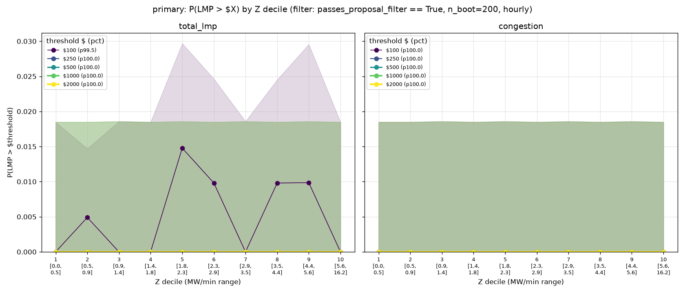
*Figure 4. Probability of LMP exceeding $X by decile of Z inside the proposal's filter, Loudoun cluster. Each line is a price threshold, and the horizontal axis runs from the calmest tenth of hours (decile 1) to the most volatile tenth (decile 10). Every line above $100 is flat at zero: inside the filter there are no large price events left to explain.*

**Tail-risk curves on the full panel.** Figure 5 repeats the exercise on
the full hourly panel. The top decile of Z runs 13.4 to 36.4 MW/min. The
probability that total LMP exceeds $250 given the top decile is 0.019 on
the cluster and 0.047 at Ashburn TX1; the congestion ratio between the top
and bottom deciles is about 1.3 (0.7 on the DOM zonal price).

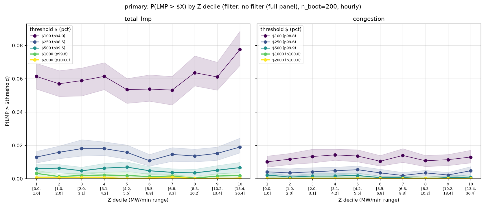
*Figure 5. The same curves on the full hourly panel (no filter, 200 bootstrap resamples), Loudoun cluster: total LMP (left) and congestion (right). The shaded bands are the bootstrap intervals. Flat across deciles at every threshold, with a small lift in the top decile on the total LMP only.*

Additionally, more tests were run and left out of this record as more detail than the question needed. Each is written up in full in `decisions.md`.

- A year-effects split of the quantile slopes.
- A robustness battery on the tail-shape comparison.
- Spec B, a continuous version of the tail-shape test.
- The same test on the three price components separately.

**Where things stood after the hourly analysis.** The honest summary was
that progress had been very slow, and that three problems were on the table.

- Resolution: the question is about volatility, so 5-minute data makes more
  sense than hourly. However, PJM keeps 5-minute load for only 30 days (six months
  in its archive) and publishes no load at individual nodes at all, only the
  DOM aggregate; the fix was to switch to gridstatus.io, whose 5-minute DOM load dates back to February 2023.
- The filter: inside the proposal's isolation hours, the maximum LMP was
  $177/MWh and the average about $25, while outside it the maximum was above
  $4,000. The filter was removing exactly the high-price events the question was about, so the filter was then dropped.
- The premise: the non-linear phase transition came from the literature, and
  the smooth curve above suggested it might simply not exist in PJM.

*Full record: `decisions.md` 2026-05-11, 05-13, 05-14 (Strategy C, conditional-Z, Spec B, #2, #3, #4) and 05-15 (#6, #9).*

### 3.2 Five-Minute Companions and the Extended Panel

**Zooming in to 5-minute data, still from PJM Data Miner 2.** The only 5-minute DOM load held by Data Miner 2 was PJM's 30-day archive, so the joint
5-minute load and price window was 27.2 days (6,855 five-minute stamps, 845
inside the proposal's filter). Comparing six months of 5-minute LMP (582,780 rows, 11 nodes) with the published hourly LMP produced a standalone finding: hourly publication hides a large share of
5-minute price spikes, and the hidden share *rises* with severity (Table
3). A spike is "hidden" when a 5-minute price exceeded the threshold but
the published hourly average for that hour did not.

**Table 3.** Five-minute price spikes hidden by hourly publication (PLEASANT VIEW, 2025-11-12 to 2026-05-14).

| Threshold | 5-min intervals above it | Hour-buckets containing one | Hidden by the hourly value | Hidden fraction |
|---|---|---|---|---|
| $50 | 17,293 | 2,448 | 839 | 0.343 |
| $100 | 7,950 | 1,329 | 604 | 0.454 |
| $250 | 3,932 | 739 | 428 | 0.579 |
| $500 | 1,539 | 279 | 162 | 0.581 |
| $1,000 | 413 | 81 | 48 | 0.593 |

**The two-sided 5-minute test, on gridstatus.io 5-minute data.** One year of
gridstatus.io data (2025-06-24 to 2026-06-24, 105,019 rows, three nodes),
with three pre-registered tests: the quantile regression at τ = 0.95, the
tail-shape median split, and the decile curves. "Pre-registered" means the test, its data window, and the rule for reading its results were written into `decisions.md` before looking at the data, so the outcome could not be
steered after the fact. Surprisingly, all three came back weaker than
hourly: the quantile regression slopes at τ = 0.95 all span zero (cluster
congestion −0.0031 [−0.0295, +0.0007]); the tail-shape median split was
−0.034 [−0.100, +0.033], the same direction as hourly; and the decile
curves were flat (congestion top-to-bottom decile ratio 1.0). From this analysis, there was no confirmatory evidence for a volatility-to-tail mechanism at native resolution.

**The extended 5-minute panel** (still gridstatus.io, but pulled further
back: February 2023 to June 2026, about 351k rows) is the panel behind the figure set below and behind the July reframe. Four findings came out of it, and
each has its figure.

**The premise is weak.** DOM load grew 28.0% from 2023 to 2026 (full years;
the first draft's 21.5% compared a half-year with a full one). The 90th
percentile of the 5-minute ramp moved from 21.91 to 28.38 MW/min, with a
trend p-value of 0.158 (not significant), and normalized by the load of the day, it *fell* every year, from 0.1850% to 0.1596%. A typical 5-minute ramp
moves 0.32% of zonal load. Figure 6 shows the three series together.

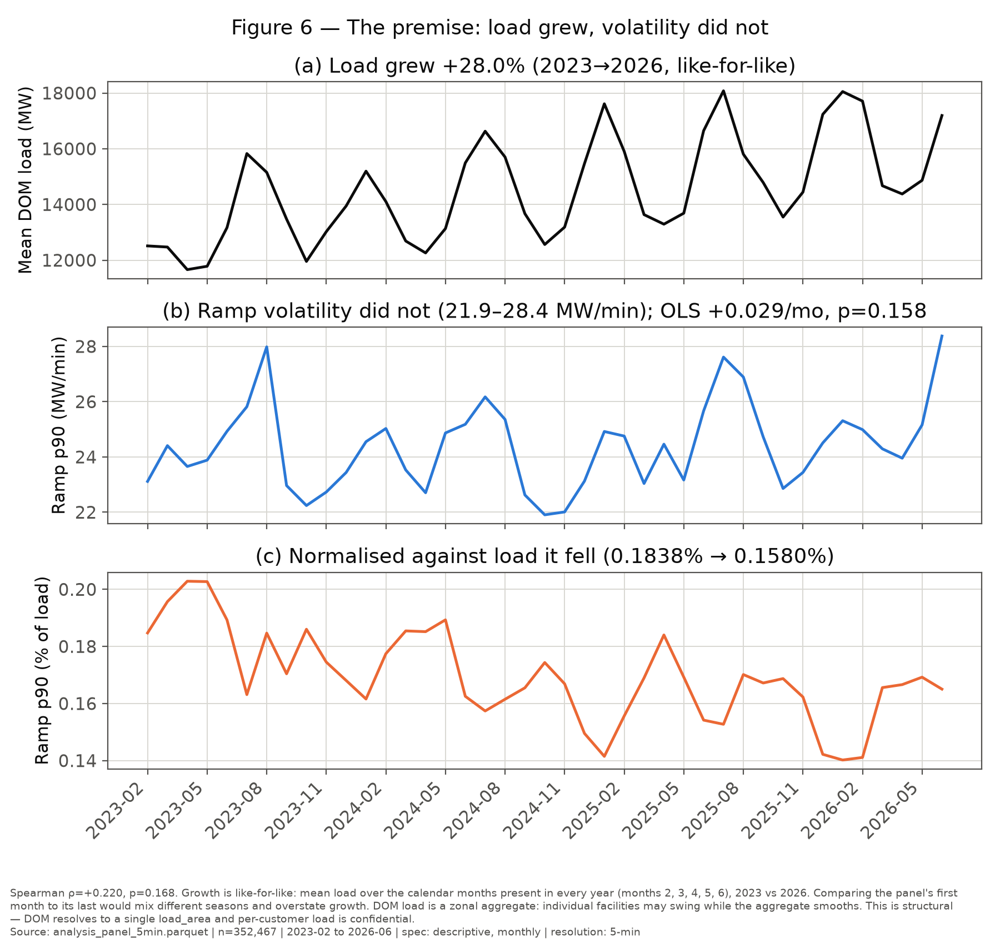
*Figure 6. The premise. Monthly mean DOM load (rising), the 90th percentile of the 5-minute ramp in MW/min (flat; trend p = 0.158), and the same ramp as a share of load (falling by year, 0.1850% to 0.1596%). If data-center growth were making load spikier, the ramp panels would rise with the load panel; they do not.*

**Congestion is driven by load level.** Intervals with congestion above
$500 sit at the 99.1st percentile of load but only the 45.9th percentile of
ramp; the correlation of congestion with load is +0.188 and with the
absolute ramp +0.008. By load decile, the system energy price rises
smoothly from $17.22 to $61.80; congestion behaves like a switch, with a
median of about $0.30 for nine deciles and a 95th percentile that jumps
from $8.14 to $254.36 in the tenth. Holding load fixed, the 95th percentile
of congestion *falls* across ramp deciles, from $103.39 to $67.71. Figure
7 is the picture of this, and the centerpiece of the whole record.

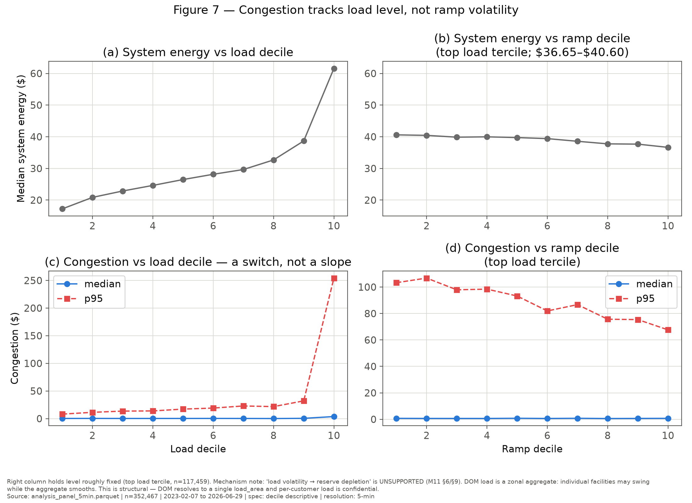
*Figure 7. The centerpiece. Left: system energy and congestion by load decile (the intervals sorted into ten equal groups from lowest to highest load). Right: the same by ramp decile within the top third of load, so that load level is held roughly fixed. System energy rises smoothly with load; congestion switches on in the tenth load decile; neither responds to ramps.*

**The effect size is small.** Across the whole observed range of Z (about 29.3 MW/min), the τ = 0.95 slope implies a shift in the 95th-percentile
congestion price of $1.91 pooled, or $4.44 in 2025, against the $71.20 it
would take to reach $100. Above τ ≈ 0.97, nothing is measurable. Figure 8
shows the implied shift at every quantile.

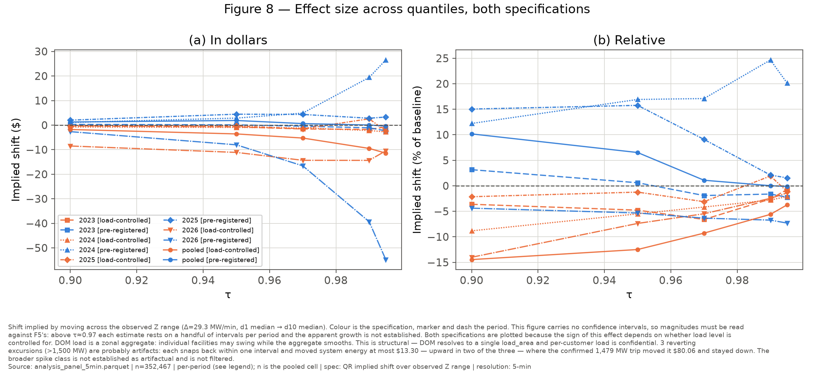
*Figure 8. The congestion shift implied across the full range of Z, by quantile τ, in dollars (left) and as a percentage of the baseline quantile (right). The shaded bands are bootstrap intervals; where they cross zero, nothing is measurable.*

**The no-filter tail risk (Figure 9).** With 1,000 bootstrap resamples over
351,371 rows, the probability of congestion above $100 by decile of Z is
flat at 1.78 to 1.95%, top-to-bottom ratio 0.9797. The test resolves ±19%
on that ratio against a predicted 2 to 5% lift, so this is a non-result,
not a refutation.

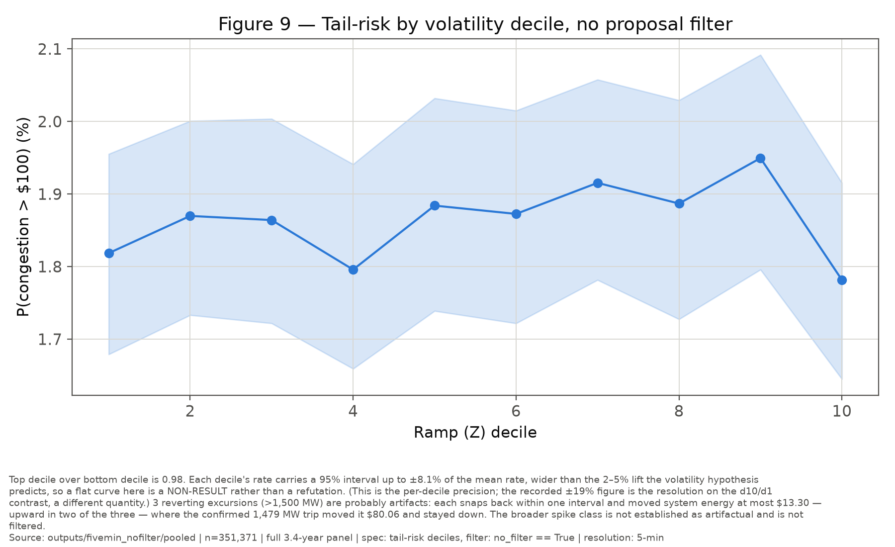
*Figure 9. Probability of congestion above $X by decile of Z, unfiltered 5-minute panel, 1,000 bootstrap resamples. Flat at $100 (ratio 0.98) with a small real lift at $5 to $25; the $100 test cannot resolve a 2 to 5% effect.*

Figure 10 is the fuller version of Figure 9: the same decile curves for
the Loudoun cluster mean at all five dollar thresholds ($100, $250, $500,
$1,000 and $2,000), pooled over the whole February 2023 to June 2026
window, for the total LMP (left) and the congestion component (right).
It is included because Figure 9 shows the $100 threshold in detail, and
whether the flatness holds at the larger thresholds, where the proposal's
phase transition would have lived, deserves its own look. It does: every
curve is flat across the deciles of Z, within its bootstrap band, and the
higher thresholds are simply rarer (the $1,000 line sits near 0.2% of
intervals and the $2,000 line on the axis), not more volatility-dependent.

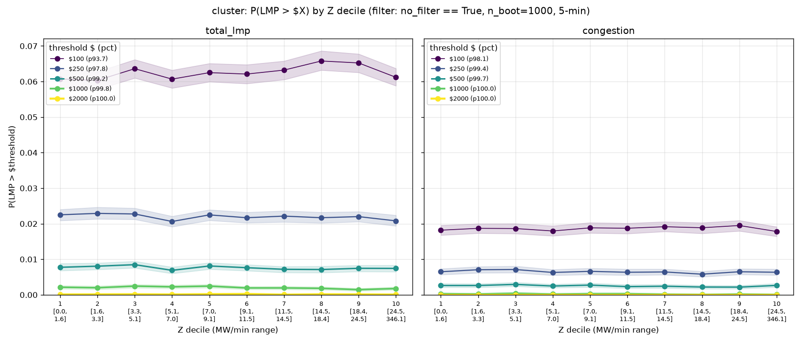
*Figure 10. The cluster-mean decile curves at all five thresholds, pooled 2023 to 2026 window, total LMP (left) and congestion (right). The legend gives each threshold's percentile in the price distribution (for example, $100 is the 93.7th percentile of the total LMP). The horizontal axis labels give the MW/min range of each decile of Z.*

*Full record: `decisions.md` 2026-05-15 (#8), 2026-07-19, 2026-07-29, 2026-07-30 (extended-panel interpretation), 2026-08-08 (figure set).*

### 3.3 The 2026 Escalation: What Changed, and What It Is Not

Congestion in the Loudoun pocket rose sharply in 2026, even though 2026 was
only halfway done at the time of this analysis (Table 4).

**Table 4.** Five-minute intervals with cluster congestion above each threshold, by year.

| 5-minute intervals with congestion above | 2023 | 2024 | 2025 | 2026 (half-year) |
|---|---|---|---|---|
| $100 | 479 | 804 | 1,505 | 3,768 |
| $250 | 59 | 206 | 399 | 1,620 |
| $500 | 0 | 73 | 128 | 681 |
| $1,000 | 0 | 7 | 13 | 62 |

Figures 11 and 12 show the same escalation month by month. Figure 11
counts the intervals above $100 in each month, and next to it counts the
intervals above a threshold that moves with the times (the trailing
12-month 99th percentile), so that a month is judged against its own recent
past rather than against 2023. Figure 12 splits the counts by threshold.

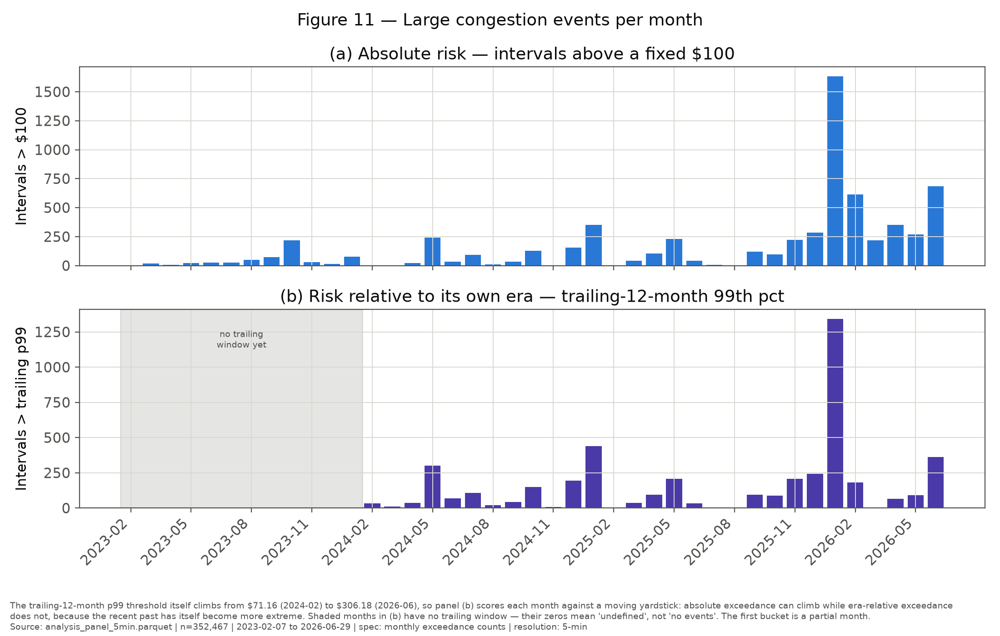
*Figure 11. Intervals with congestion above $100 per month (absolute) and intervals above a trailing 12-month 99th percentile (relative to their own era). The divergence between the two in 2026 is the regime shift: prices are not only higher than 2023, but they are also higher than the preceding year.*

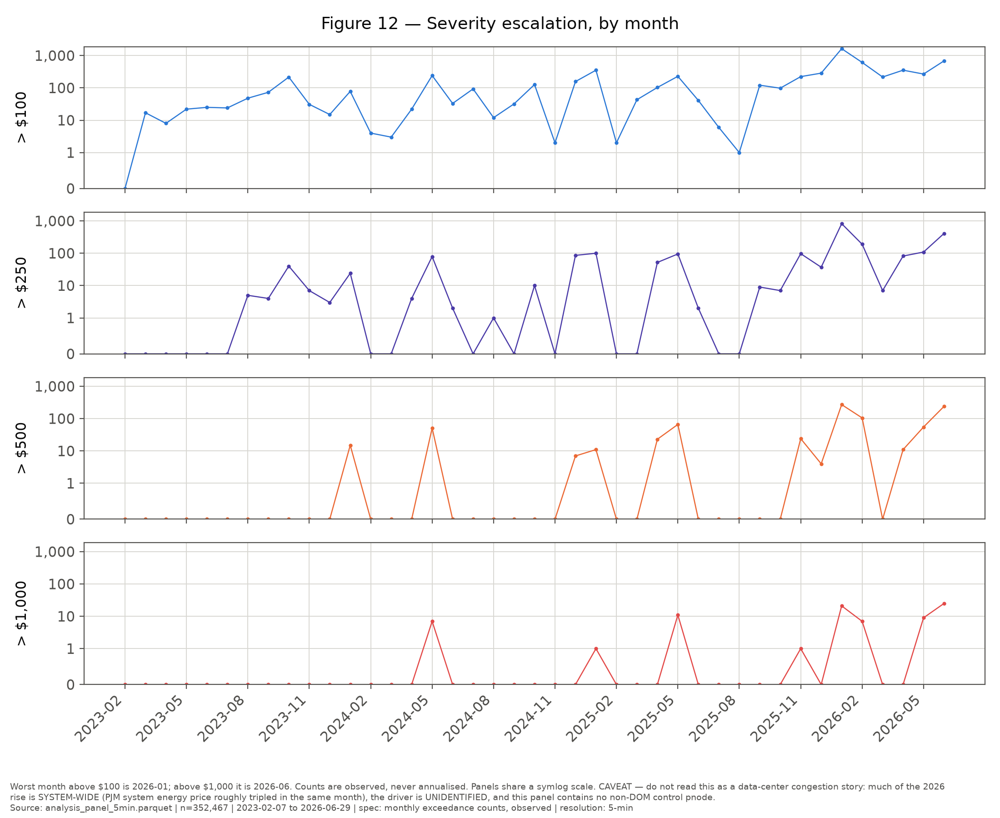
*Figure 12. Severity by threshold and year, in monthly buckets, 2026 partial. Intervals above $500 did not occur at all in 2023.*

The 90th percentile of congestion by year is $9.56, $8.81, $13.46, and $60.76
(2026 is 6.4 times 2023). Within a fixed 20 to 22 GW load bin, the
probability of congestion above $100 runs 1.89%, 5.58%, 5.02%, and 35.84%: the
same load now produces $100-plus congestion seven times as often. Applying
2023's price-given-load relationship to each later year's load distribution,
load growth alone explains 85.1% of 2024's exceedances, 59.2% of 2025's and
12.7% of 2026's. Figure 13 shows both calculations.

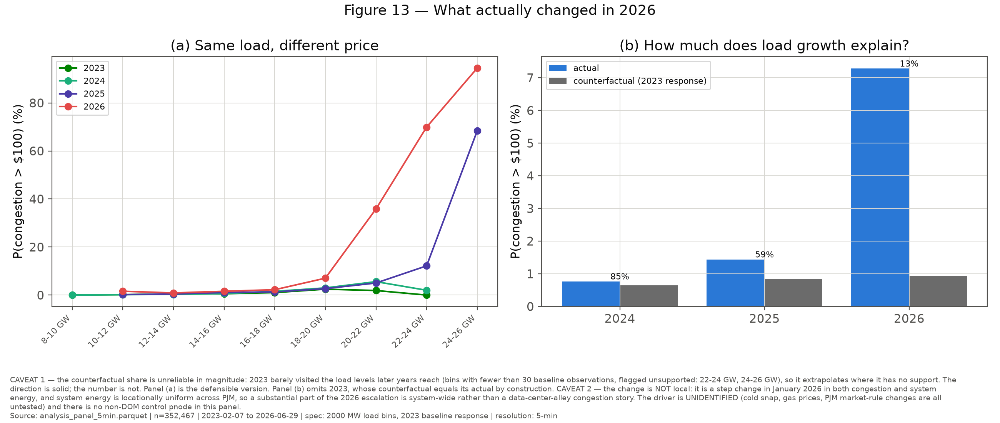
*Figure 13. Same load, different price: the probability of congestion above $100 within fixed 2 GW load bins by year (left), and the share of each year's exceedances explained by load growth alone (right). The caveats (2026 is a half-year; the 2023 baseline has few high-load intervals) are printed in the figure.*

**But the change is not local.** It is a January 2026 step in *both* price
components: the 90th percentile of congestion went from $20.46 to $231.29,
and the 90th percentile of system energy went from $86.32 to $292.19. Desk
research (note F) ranks Winter Storm Fern (2026-01-21 to 2026-01-30) as
the best single explanation of a simultaneous step. Fern brought 18 to 19
GW of forced generator outages, against 12 to 13 GW in the comparable
January 2025 event, and about $798M of gas-electric misalignment uplift
(payments to generators whose gas costs were not covered by the energy
price). Spot prices ran above $3,000/MWh PJM-wide and above $1,800/MWh in
Dominion's territory, PJM called pre-emergency demand response
specifically for localized transmission constraints in the BGE (Baltimore
Gas and Electric), Dominion, and Pepco zones, and the Department of Energy
(DOE) issued a §202(c) emergency order. Additionally, the congestion spike
of 2026-01-31 to 2026-02-01 coincides with a PJM-requested DOE order
directing data centers onto backup generation. Figure 14 shows all three
price components over the full panel; the system energy panel is PJM-wide,
so its 2026 rise is not a Northern Virginia phenomenon.

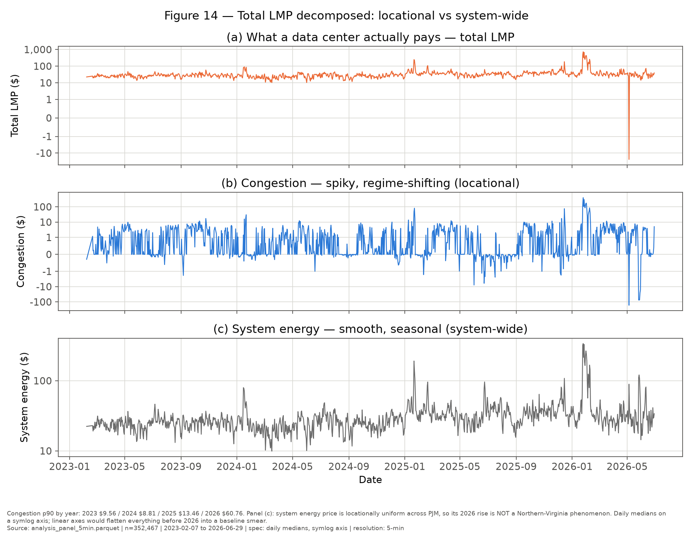
*Figure 14. Cluster total LMP, congestion, and system energy over the full 3.4-year panel (symlog scale). System energy is smooth and seasonal; congestion is spiky and shifts regime. Panel (c) is PJM-wide, so its 2026 rise is not a Northern Virginia phenomenon.*

*Full record: `decisions.md` 2026-07-30 (three entries), 2026-08-08; `research-notes/F-jan2026-driver.md`, `H-event-catalog.md`.*

### 3.4 Location: Ashburn Against the Rest

Ashburn TX1, the 35 kV distribution-side node in the data-center corridor,
behaves differently from every transmission node. A transmission node sits
on the high-voltage backbone (500 kV here) that moves bulk power across
the region, while a distribution-side node sits on the lower-voltage
network (35 kV) that delivers power to a local area, so its price reflects
local conditions that the backbone averages away. On the common window
(2024-08-06 to 2026-05-10, n = 15,432), 4.78% of Ashburn's hours have
congestion above $100 against 1.60% at SKFFSCRK, and its 99th percentile is
$610.03 against $95.92: roughly a threefold contrast. Ashburn correlates
only 0.25 to 0.48 with every other series, while the cluster, both controls, and SKFFSCRK correlate with each other at 0.83 to 0.94. Figure 15 shows the
exceedance rates and the correlation matrix.

However, Ashburn is a 35 kV distribution-side node, while everything compared to it sits on 500 kV transmission lines, so the two are not very
comparable. Not a lot of analysis was done after that, so comparing Ashburn to
another 35 kV distribution-side node outside of a data-center-heavy
location is an open direction to explore.

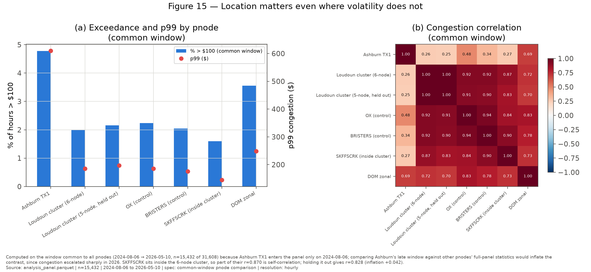
*Figure 15. Exceedance frequency and 99th percentile by node (a) and the correlation matrix (b) on the common window. Ashburn TX1 stands apart on both. SKFFSCRK is labeled "inside cluster", never "control".*

*Full record: `decisions.md` 2026-07-30, 2026-08-07 (SKFFSCRK ruling), 2026-08-08; `research-notes/B-loudoun-geography.md`.*

### 3.5 The One Verified Event, and the Event Catalog

**2024-07-10, 19:05 Eastern.** NERC's incident review describes about
1,500 MW of data-center load across about 60 facilities dropping to backup
power after a lightning-arrestor failure on the Ox to Possum 230 kV line
(six faults in 82 seconds, voltage down to 0.25 to 0.40 per unit, that is,
25 to 40% of normal). A one-week supplemental 5-minute pull (4 requests)
reproduced it in the project's own series: DOM load fell 1,478.6 MW in
five minutes, a gradient of 295.7 MW/min (the maximum in the pulled week;
for scale, the hourly analysis's 90th-percentile Z is 13.4), and the
system energy price fell from $136.76 to $56.70. That endpoint matches
gridstatus.io's external report to the penny. This is the one place in 3.4
years (found in this project; similar events that were missed could still exist) where a large, *verified* load loss and a large price
response coincide. It also served as the positive control for the
load-artifact screen: three apparently larger excursions that reverted
within minutes (−1,710, −1,630, and −1,575 MW) moved system energy by at
most $13.30, two of them *upward*. Figure 16 shows the event in the
project's own data.

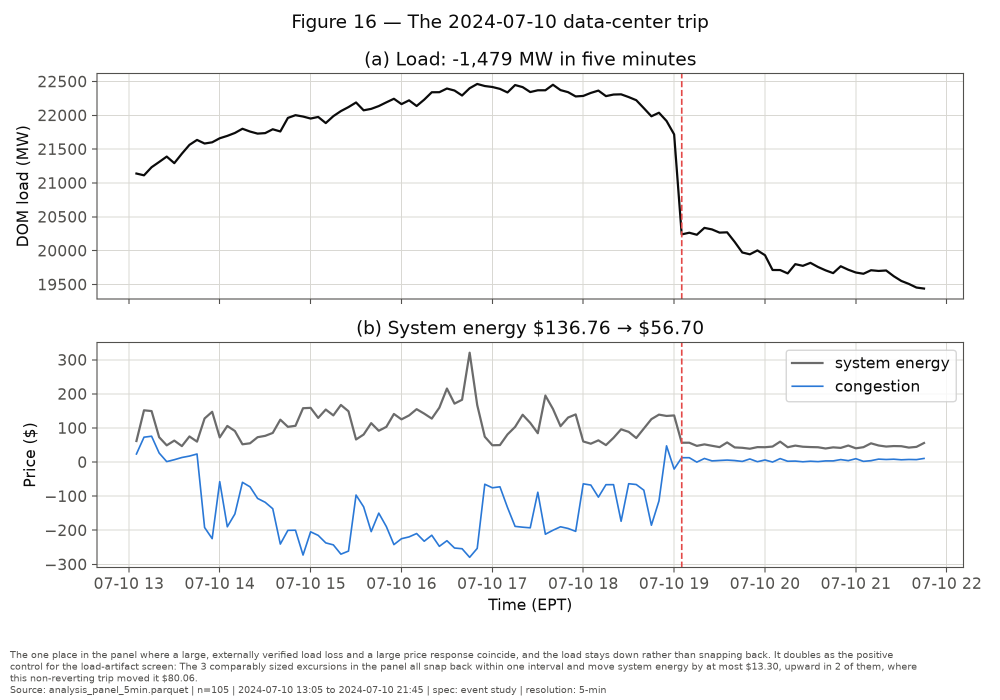
*Figure 16. The 2024-07-10 ride-through event in the project's 5-minute series: load, gradient, and the system-energy price response. The congestion component is negative for most of that afternoon, and that is real, not a plotting error: PJM measures congestion relative to a load-weighted reference bus, so a node on the cheap side of a constraint that is binding somewhere else in PJM gets a negative congestion price. The cluster mean ran between −57 and −280 $/MWh from 14:00 to 18:30, and all four cluster nodes were negative; PJM's own paper notes that the congestion and loss components can each be positive or negative [11].*

**The event catalog (note H) and the event-correlation scan.** Additional research was also conducted to find external events that could cause further grid stress: thirty dated PJM and DOM
grid-stress and market events from February 2023 to July 2026, built from
Monitoring Analytics, PJM, NERC, and DOE primary records, with a
year-by-year census of PJM-declared alerts. The panel's own flag for
synchronized-reserve events (37 events, 39 event-hours) turned out to be an
unused ground-truth signal, and only 2 of the 39 event-hours fall inside the
proposal's filter. Ranking days by congestion and searching each one
externally corroborated seven events or clusters: Winter Storm Elliott
(2022-12-23 and 2022-12-24, cluster total LMP about $4,130 against the
$3,700 cap), the January 2025 all-time winter peak (143,714 MW), a second
January 2024 cold-weather alert, a tornado outbreak on 2024-05-26 (the
only price event without an elevated gradient), and the cold wave of
2026-01-24 to 2026-02-09. Eight candidate dates stayed unexplained after
equal effort, the largest being 2025-05-01 to 2025-05-03 at $1,020. A
naive scan of the largest gradients mostly re-finds the 9 AM daily ramp
(31 of the top 50 rows). The catalog also records NERC's Level 3
"Essential Action" alert on computational loads (2026-05-04), the all-time
PJM peak of 168,158 MW on 2026-07-02, and the 2026-07-22 Ashburn event in
which about 3.1 GW of data-center load transferred to backup power in about
30 seconds, the largest on record, just outside the panel window. Note that no statistical analysis was done here; this was research and context
exploration.

*Full record: `decisions.md` 2026-07-21 (three entries), 2026-07-30, 2026-08-08; `research-notes/H-event-catalog.md`; `plans/2026-07-21-subq3-event-catalog-scan.md`.*

### 3.6 ERCOT Stage 1

**The question.** Do the DOM findings hold in a different market? ERCOT was
the first out-of-market check. The panel is 83,975 hourly rows from
2017-01-01 to 2026-07-31: load for the eight weather zones plus the ERCOT
total (nine series), and prices at fifteen settlement points. Figure 17
shows the weather zones.

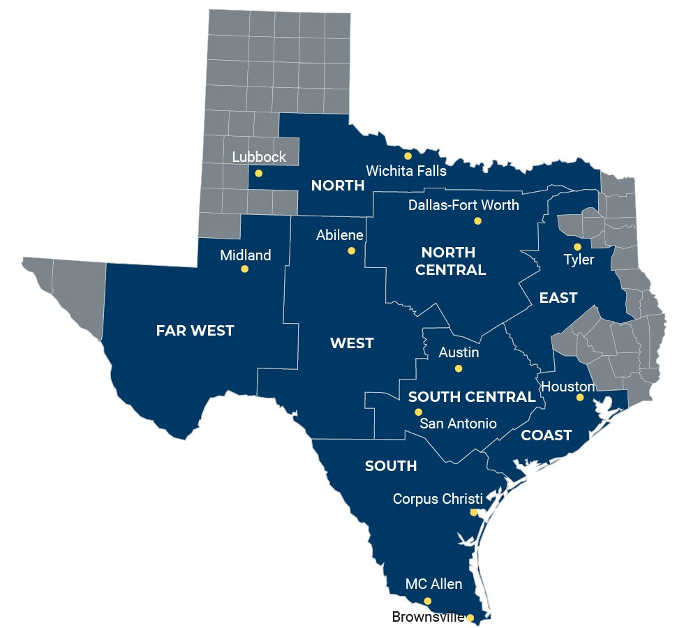
*Figure 17. ERCOT's eight weather zones, from ERCOT's own map [107]. Far West holds the Permian Basin oil and gas load that drives its growth; North Central holds Dallas-Fort Worth, and Coast holds Houston.*

"Stage 1" is the project's name for the level-versus-volatility check that
every market after DOM went through: for each zone, how much of the price
is explained by the zone's load level, and how much by its load volatility?
Table 5 gives the ERCOT growth and volatility numbers behind Figures 18 and
19.

**Table 5.** ERCOT: change from 2017 to 2025 in mean load, raw ramp, and normalized ramp, for the system and four zones.

| Zone | Mean load 2017 to 2025 | Raw ramp | Normalized ramp | 95th pct normalized |
|---|---|---|---|---|
| ERCOT | +36.7% | +8.4% | −20.7% | −23.3% |
| FWEST | +211.0% | +156.0% | −17.7% | −1.0% |
| NORTH | +106.5% | +93.4% | −6.3% | −10.7% |
| SOUTH | +27.9% | +3.4% | −19.2% | −18.4% |
| EAST | +29.9% | +29.6% | −0.3% | −2.6% |

Figure 18 plots the normalized ramp (the mean hour-to-hour change in load
divided by the mean load, so a dimensionless number) for every zone and
year. Every line drifts down over the decade, the ERCOT-wide line by
20.7%, and Far West sits far below the rest because its load is dominated
by flat industrial demand. This is the figure that says growth was being
mistaken for volatility: load got bigger, and its movements did not keep
up.

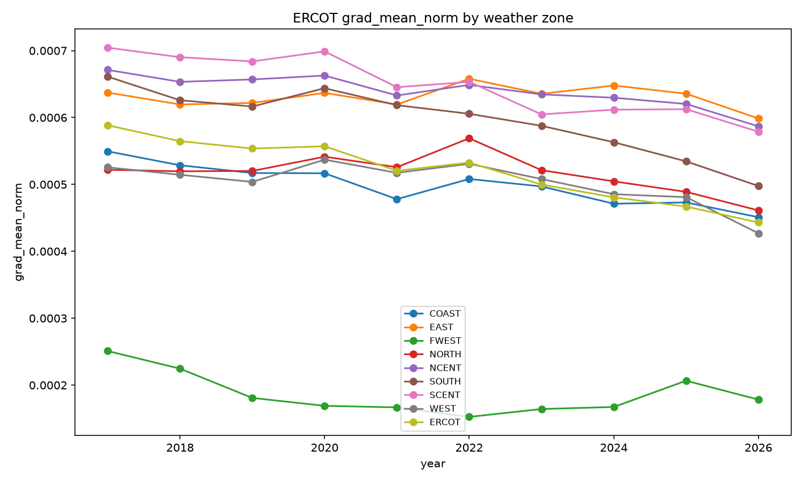
*Figure 18. ERCOT: normalized ramp (`grad_mean_norm`, mean absolute hour-over-hour change in MW per minute divided by mean load) by weather zone and year, 2017 to 2026. Every zone falls; the ERCOT total (yellow) falls 20.7%.*

Figure 19 plots the mean load itself, and is the other half of the same
story: the ERCOT total grew 36.7% and Far West more than tripled, so any
statistic that is not normalized by load would read as "more volatile"
simply because there is more load.

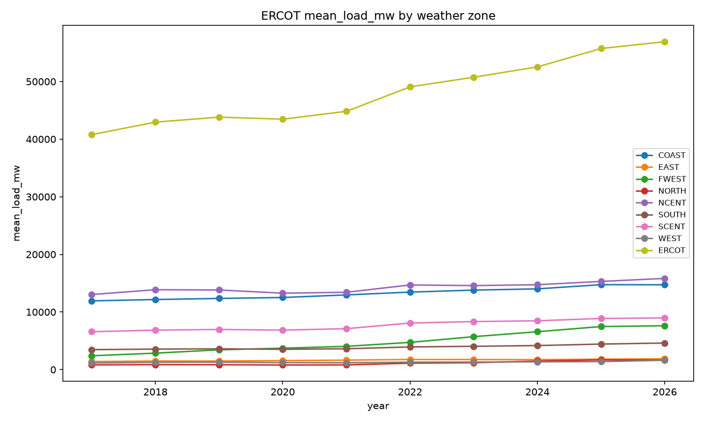
*Figure 19. ERCOT: mean load in MW by weather zone and year, 2017 to 2026. The ERCOT total (top line) grows 36.7% over the window; Far West (green) grows 211%.*

Thus, two conclusions were made from the ERCOT analysis.

- Normalized volatility (the ramp divided by the load of the day) falls in
  all nine series. Raw ramps grow, Far West's by 156%, but more slowly than
  load. Growth was being mistaken for volatility.
- Load level beats load volatility as a predictor of price in 132 of 135
  zone-by-settlement-point pairs (standardized regression coefficients; for
  ERCOT against the hub average, level +0.185 and volatility −0.036).
  Volatility's coefficient is *negative* in 8 of 9 zones. Far West inverts,
  and that is the wind confound (electrification load in the Permian
  coincides with high wind and low prices), not a data-center signal.

*Full record: `decisions.md` 2026-08-07 (ERCOT Stage 1); `specs/2026-08-07-ercot-…`; `plans/2026-08-07-ercot-diagnostic-ERRATA.md`.*

### 3.7 Cross-ISO Stage 1: Eight Markets, Eleven Panels

**The question.** Is "level beats volatility" a DOM fact or a general one?
The same descriptive horse race was run in every market with a public
archive: a standardized regression of each zone's price on its own load
level and its own absolute load gradient, with no time controls, at each
market's maximum window and again at a locked common window (2023-01-01 to
2025-05-01). The machinery is shared (`src/surg/diagnostics/stage1.py`), and each market has one fetch script and one diagnostic driver. Table 6
summarizes every panel; "level wins" counts the zone-price pairs in which
load level had the larger standardized coefficient, and R² is how much of
the price variation the two variables explain together (0 is none, 1 is
all).

**Table 6.** The cross-ISO Stage 1 results, one row per panel.

| Market / panel | Price depth | Load growth (span) | %/yr | Normalized volatility change | Level wins (common window) | Median R² |
|---|---|---|---|---|---|---|
| DOM (5-min, reference) | ~3.4 yr | +28.0% (2023 to 2026) | +8.58 | 0.1850% to 0.1596% (falling) | see §3.2 | n/a |
| ERCOT (hourly) | ~9 yr | +36.7% (2017 to 2025) | +3.99 | −20.7% | 132/135 (97.8%) | 0.004 to 0.056 |
| NYISO, merged (10 zones) | ~25 yr | −4.5% (2002 to 2025) | −0.20 | −12.6% | 213/220 (96.8%) | 0.175 |
| NYISO, split (11 zones) | ~21 yr | −6.5% (2006 to 2025) | −0.35 | −8.7% | 235/242 (97.1%) | 0.163 |
| CAISO, full depth (4 zones) | ~2.3 yr | +31.4% (2010 to 2025) | +1.84 | −9.8% | 8/8 | 0.194 |
| CAISO, modern (6 zones) | ~2.3 yr | +2.4% (2019 to 2025) | +0.40 | −3.5% | 11/12 (91.7%) | 0.108 |
| IESO (Ontario) | ~22 yr | −8.5% (2004 to 2024) | −0.44 | −1.1% | 11/11 | 0.119 |
| MISO (6 LRZ groups) | 2023 to 2026 | +3.8% (2023 to 2025) | +1.88 | −5.6% | 36/36 | 0.332 |
| ISO-NE (8 zones, control) | 2016 to 2026 | −5.2% (2016 to 2025) | −0.59 | +9.9% | 64/64 | 0.274 |
| SPP (17 zones) | 2017 to 2026 | +13.2% (2016 to 2025) | +1.39 | −14.2% | 289/289 | 0.245 |
| Italy (7 zones, ENTSO-E) | 2015 to 2025 | n/a | n/a | falls in 5 of 6, Sardinia +4.7% | 36/36 | n/a |

**Finding 1: level beats volatility essentially without exception.** Between
91.7% and 100% of zone-price pairs in eleven panels, twelve with Italy. It is
the most robust cross-market regularity in the project.

**Finding 2: "normalized volatility always falls" no longer holds, and it
failed in the control market.** ISO-NE came out at +9.9%, with 5 of 8 zones
rising. But decomposing it, the raw gradient rose only 3.7% (and in only 3
zones) while load fell 5.2%: mostly a shrinking-denominator effect. Only
Vermont (raw +38.9%) and Maine (+18.9%) rose in absolute terms. The
working explanation was that these are the states with the least
data-center growth and the least grid investment; the follow-up in §3.8
then traced Vermont's rise to rooftop solar (its midday load floor has
collapsed) and Maine's partly to the same. Sardinia later added a second
exception.

**Finding 3: the control market behaves exactly like the treated ones.**
ISO-NE, whose operator says New England "has not experienced similar growth
so far, and only a small amount is expected in the coming decade", returns
64 of 64 with a *higher* median R² than most treated markets. That cuts
against reading the pattern as anything data-center-specific: on this
evidence it is a property of how power systems price load.

The figures that follow show, for each market, the same two plots as
Figures 18 and 19 for ERCOT: the normalized ramp by zone and year on top,
and the mean load by zone and year underneath. They are the evidence
behind the "normalized volatility change" and "load growth" columns of
Table 6, and the thing to look for in each pair is whether the top plot
falls while the bottom plot rises.

MISO (Figure 20) is the shortest panel, 2023 to 2026, because MISO
retains its market reports only for the current year plus three.
Normalized volatility falls in five of the six LRZ groups and rises only
in LRZ4 (Illinois); load grows 3.8%. Level wins 36 of 36 pairs, with the caveat from
§2 that LRZ3_5 and LRZ4 share a hub and so are not independent.

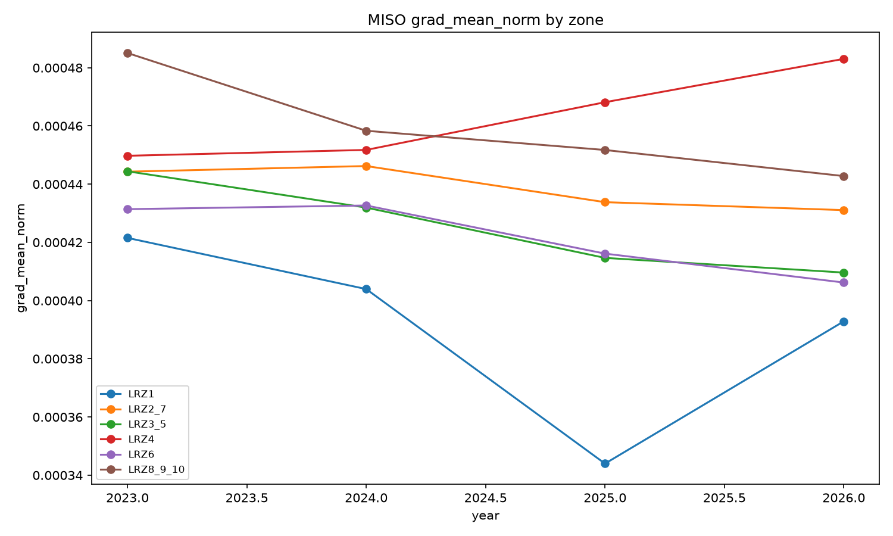
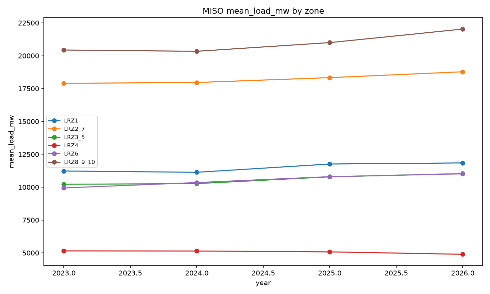
*Figure 20. MISO: normalized volatility (top) and load level (bottom) by LRZ group and year, 2023 to 2026 (LRZ3_5 and LRZ4 share ILLINOIS.HUB).*

SPP (Figure 21) covers seventeen control zones in the most wind-penetrated
region in North America. Load grows 13.2% over 2016 to 2025, and normalized volatility falls 14.2%; level wins every one of the 289 pairs. It is the
cleanest instance of the pattern in a market with almost no data-center
story of its own.

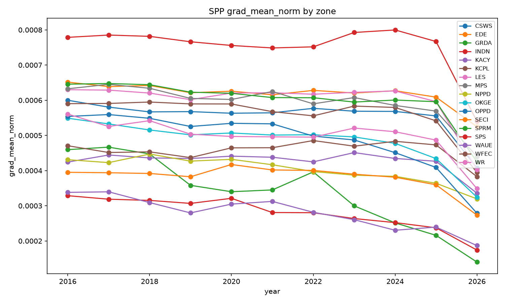
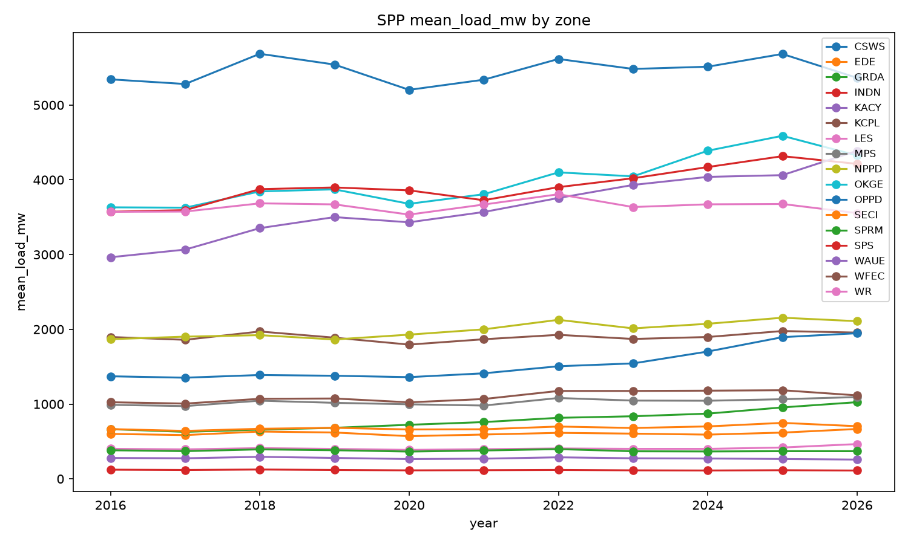
*Figure 21. SPP: normalized volatility (top) and load level (bottom) by control zone and year, 2017 to 2026.*

ISO-NE (Figure 22) is the control market, and the one panel in which the
top plot rises. Vermont's normalized volatility climbs steadily from 2017,
Maine's and Rhode Island's jump after 2023, and the Massachusetts zones
fall; meanwhile, load falls 5.2%, so much of the rise is a shrinking
denominator. §3.8 traces the Vermont rise to rooftop solar.

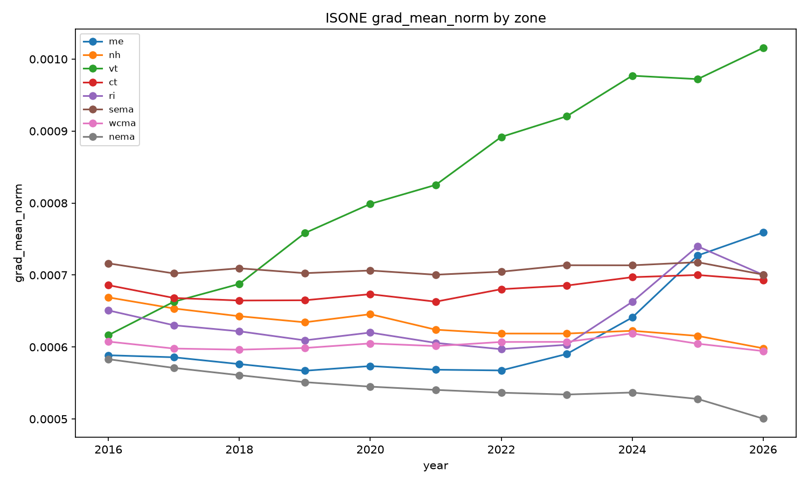
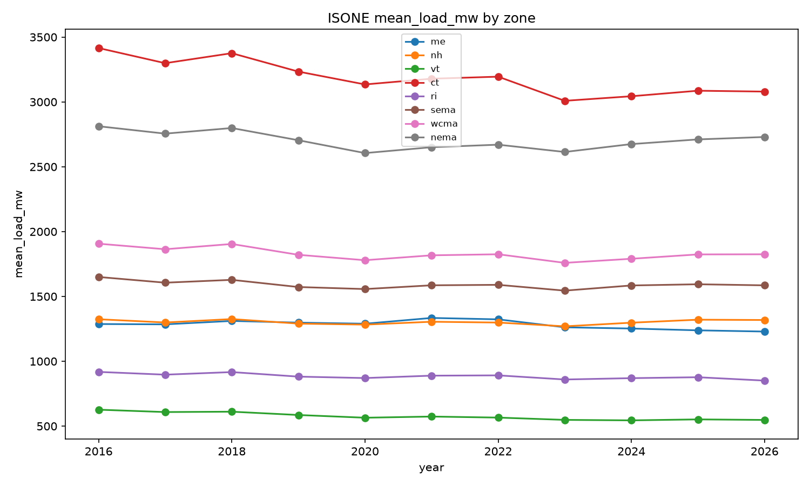
*Figure 22. ISO-NE, the control market: normalized volatility (top) and load level (bottom) by zone and year, 2016 to 2026. Normalized volatility rises in five zones (Vermont most of all) while load falls; §3.8 says what that turned out to be.*

NYISO (Figure 23) is the longest panel, a quarter century on the merged
10-zone roster. Normalized volatility falls in most zones from 2001 to
about 2020 (Millwood most dramatically) and turns up again after 2021 in
several, while load falls 4.5% over the span; level wins 213 of 220 pairs.
The recent upturn is worth a follow-up that this project did not do.

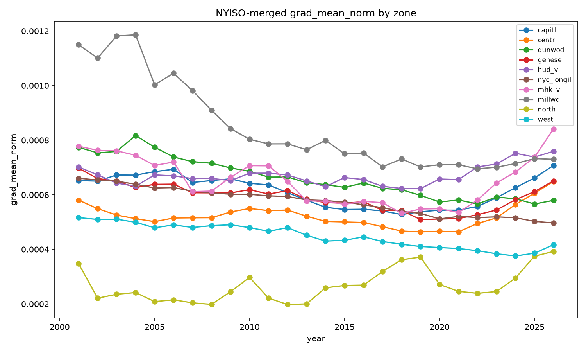
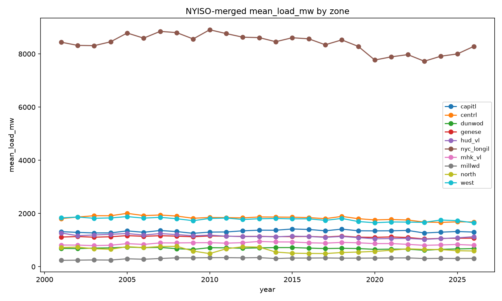
*Figure 23. NYISO (merged 10-zone roster): normalized volatility (top) and load level (bottom) by zone and year, 2001 to 2026.*

CAISO (Figure 24) is the modern six-area panel, because CAISO's price
archive only reaches back to April 2023. Load is nearly flat (+2.4% over
2019 to 2025) and normalized volatility falls 3.5%; level wins 11 of 12
pairs. Silicon Valley's data-center cluster is invisible here because
Santa Clara is served by a municipal utility outside CAISO's load areas.

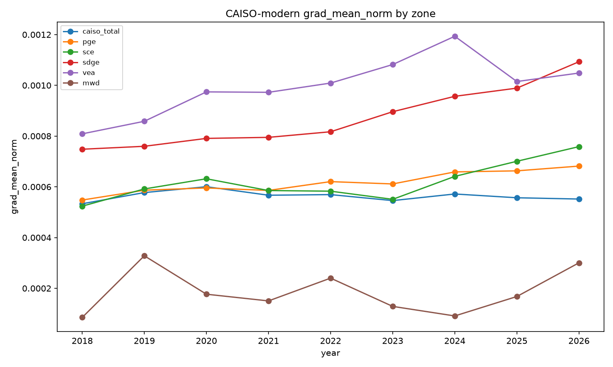
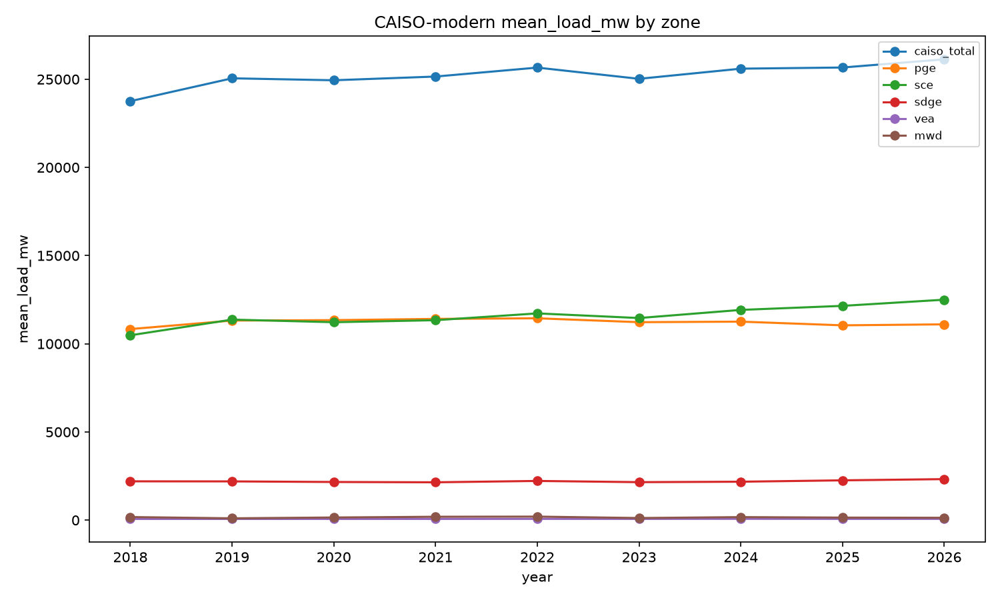
*Figure 24. CAISO (modern panel): normalized volatility (top) and load level (bottom) by utility area and year, 2018 to 2026. Price depth only from April 2023.*

IESO (Figure 25) is Ontario, whose growth story is electric vehicles
rather than data centers. Load falls 8.5% over 2004 to 2024, and normalized volatility is essentially unchanged (−1.1%); level wins 11 of 11 pairs.

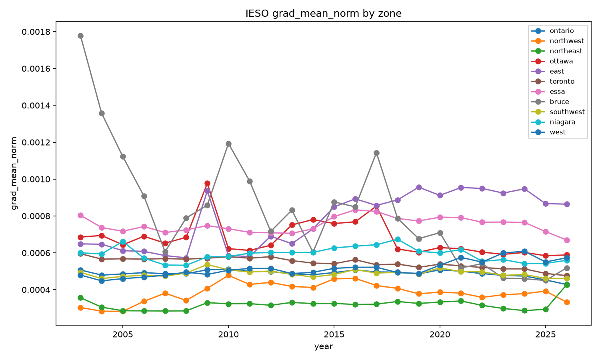
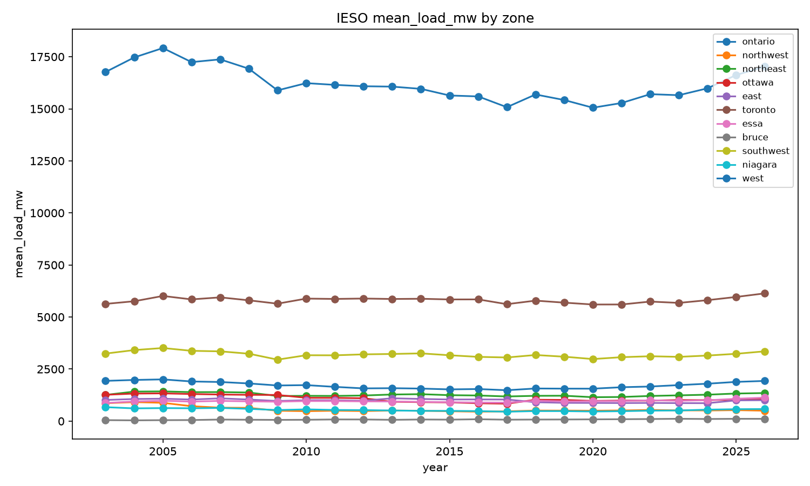
*Figure 25. IESO, Ontario: normalized volatility (top) and load level (bottom) by zone and year, 2003 to 2026. An EV-driven growth story, not a data-center one.*

Italy (Figure 26) is a robustness check rather than a finding: the same
statistic on six European bidding zones from the ENTSO-E panel of §3.10.
Normalized volatility falls in five of the six, with the South and Sicily
spiking in 2022 and 2023 before falling back; Sardinia (the large island west of mainland Italy, which is its own
bidding zone) is the exception, rising 4.7%. Level wins 36 of 36 pairs.

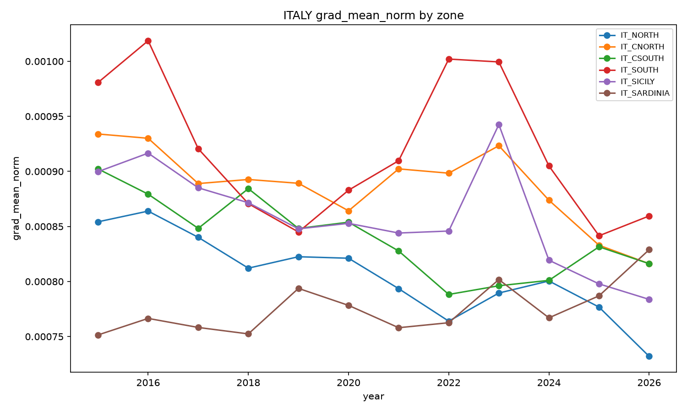
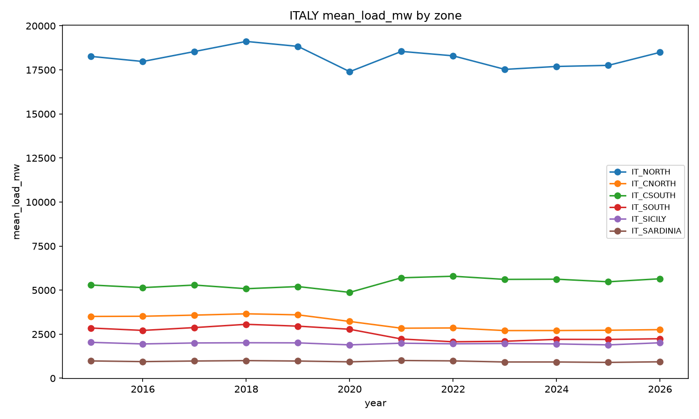
*Figure 26. Italy: normalized volatility (top) and load level (bottom) by bidding zone and year, 2015 to 2026. Six bidding zones (Calabria excluded: a bidding zone only from 2021).*

*Full record: `decisions.md` 2026-08-09 (four entries), 2026-08-10 (capstone), 2026-08-12 (Italy); `sources/availability/cross-iso-data-availability-summary.md`; `plans/2026-08-09-cross-iso-stage1-plan-a-trio.md`, `…-08-10-…-plan-b.md`.*

### 3.8 ISO-NE Follow-Ups: The Canadian Tie, Solar, and NECEC

**The question.** Following the results for ISO-NE from the last section, the project then pivoted to finding whether New England's rising volatility comes from its connection to Canada and its increased use of renewable energy sources, which may be more volatile. The answer was a resounding no.

**1. The Canada-tie hypothesis fails on three independent grounds.**

- Mechanism: imports over an interface (a transmission connection to a
  neighboring grid) are supply, and never enter metered demand.
- Geography: ISO-NE's complete list of external interfaces lands in Maine
  (New Brunswick, 1,000 MW), Massachusetts (the Phase I/II HVDC link,
  2,000 MW at Sandy Pond; HVDC is high-voltage direct current, the
  technology used for long transmission lines) and Vermont (Highgate, 225
  MW); Rhode Island has no external interface of any kind and rises anyway,
  and the largest line lands where volatility *fell* in all three
  Massachusetts zones (−3.2%, −4.8%, −12.7%).
- Timing: there is no step change inside the window.

**2. A pre-registered test for a distributed-solar fingerprint.** If rooftop
solar is behind the rise, the midday hours should have gained volatility and
the night hours should not. The rising zones (Vermont, Maine, Rhode Island)
do show the midday gradient up 66% to 126% between 2016-17 and 2024-25 with
night flat, but so do all five falling zones (up 32% to 49%), so the test is
uninformative on the question asked. What it established instead is
region-wide: every ISO-NE zone gained volatility in the solar-day hours (11
to 19) and lost it in the late evening and morning shoulders, and a zone's
annual sign is decided by which side wins. The seasonal clause of the
pre-registration failed as written.

**3. An exploratory mechanism scan, not a result.** The share of days whose
minimum load falls between 10 AM and 4 PM (the "duck curve" migrating into
the daytime: the dip in metered load when rooftop solar is producing) went
from 1.4% to 68.2% in Vermont, 0% to 36.7% in Maine, and 0% to 0.5% in
Rhode Island; its rank correlation with the volatility trend is +0.707.
Floor erosion (the annual minimum divided by the mean) is −91.7% in Vermont, −20.1% in Maine, and −38.5% in Rhode Island, with a rank
correlation of −0.952 and no overlap between rising and falling zones
(partly by definition). Vermont's annual minimum fell from 420 to 31 MW: at
midday the meter has stopped seeing the load. The rising trio is not one
phenomenon. Vermont is solar, Maine partly, and Rhode Island's stable
overnight core shrank with its minimum still at 3 AM.

**4. The NECEC dose check.** The New England Clean Energy Connect line, a
1,200 MW HVDC link from Québec to Lewiston, Maine, began commercial
operation on 2026-01-16. It runs as a firm block of about 1,059 MW (89% of
its rating, with almost no hour-to-hour variation), which is dispatchable
reservoir hydro, not variable renewables. The legacy Hydro-Québec
interfaces fell from +558 to +27.5 MW at the same time: a gigawatt of
Canadian injection *relocated* from Massachusetts and Vermont into Maine.
Data-quality find: EIA-930's ISO-NE to Hydro-Québec interchange series omits
NECEC.

**5. A pre-registered price test for NECEC.** The test, its result, its robustness checks, and its caveats are laid out one at a time below, because
this is the one place in the ISO-NE work where a pre-registered prediction
partly failed.

*The test.* If the new line changed anything, it should show up in Maine's
price relative to its neighbors. The "basis" is that relative price: Maine's
day-ahead price minus the average of Connecticut's and Rhode Island's, so a
negative basis means Maine is cheaper than the rest of New England. For
February to June, Maine's basis went from −1.88 $/MWh in 2025 to −4.82 in
2026, and Maine averaged $56.41/MWh against $60 to $63 everywhere else.

*Could it be chance?* To judge whether a change of that size could have
happened by chance, the same before-and-after comparison was run on 45
"placebo" cells (other zones and other periods, where NECEC should have had
no effect); none of the 45 moved as much as Maine did (p = 0.0217, the
smallest value the design can produce). The result holds on medians and in
all 24 hours of the day, and the Massachusetts zones, which lost a gigawatt
of Canadian injection to Maine, moved the opposite way, as predicted
(+0.34, weak). After the fact: Maine's basis is positive on every day
before 2026-01-16 and negative on every day after (2026-01-01 to
2026-01-15: +1.45; 2026-01-16 to 2026-01-31: −14.54).

*The part that failed.* The pre-registered *volatility* prediction (that
the basis would get calmer, or not change) failed: the mean absolute daily
change in the basis went from 0.87 to 1.96, more than in any of the 45
placebo cells. But the typical hour got *calmer* (median 0.345 to 0.310),
so the extra movement is in the tails, consistent with an export limit
that binds now and then.

*The caveat and the honest formulation.* Maine's basis was already falling
in 2025 (April 2025 was −4.52 with no NECEC). The honest formulation:
NECEC did not create Maine's negative basis; it roughly tripled it. It
does not support the original hypothesis. A constant was added to a
congested network; nothing variable arrived. Figure 27 shows the basis by
year against the placebo distribution.

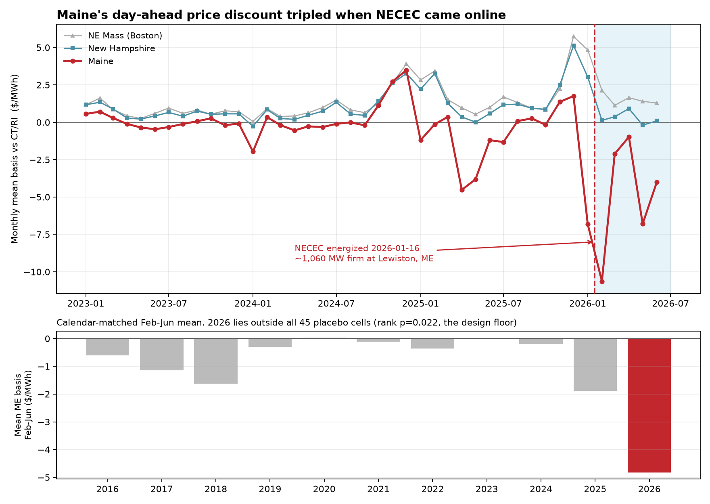
*Figure 27. Maine's day-ahead basis against the Connecticut/Rhode Island reference by year, February to June, with the 45-cell placebo distribution. The 2026 point sits outside every placebo.*

*Full record: `plans/2026-08-11-isone-canada-tie-verification.md`, `…-isone-der-fingerprint-prereg.md`, `…-isone-volatility-mechanism-scan.md`, `…-necec-dose-check.md`, `…-isone-necec-price-prereg.md`; `scripts/necec_price_test.py`.*

### 3.9 Is Data-Center Load Actually Spiky? UKPN Facility Profiles (Note J)

**The question.** Everything up to here used regional aggregates in which
data centers are one unlabeled part. UK Power Networks publishes the first
facility-level data in the project: 96 anonymized distribution-connected
data centers in London, the East, and the South East, as a half-hourly
utilization ratio (observed apparent power divided by contracted import
capacity), 2023 to 2026. No MW, no location, no price; 71 sites survive
screening. Every statistic is a within-site ratio so that the
contracted-capacity denominator cancels. Table 7 sets the UKPN numbers
against its closest comparator.

**Table 7.** Flatness of the 71 UK data-center sites against matched comparators (medians across sites, annual basis).

| Quantity (median across 71 sites, annual) | UKPN | Matched comparator |
|---|---|---|
| Diurnal spread (busiest hour divided by quietest hour, local time) | 1.050 | 1.467 (ISO-NE, 27 zone-years) |
| Load factor against own 99th percentile / against own realized peak | 0.836 / 0.723 | 0.88 colocation, 0.94 hyperscale (EPRI; resolution unstated) |
| Coefficient of variation (σ/μ) | 0.094 | n/a |
| Normalized hourly ramp | 0.000240 (1.44%/h) | 0.000574 (3.44%/h, 60 ISO zones) |

Figure 28 shows the distributions behind the table: one panel per
statistic, with the 71 sites as a histogram, the ISO-NE comparator marked,
and the value for the aggregate of all sites marked separately.

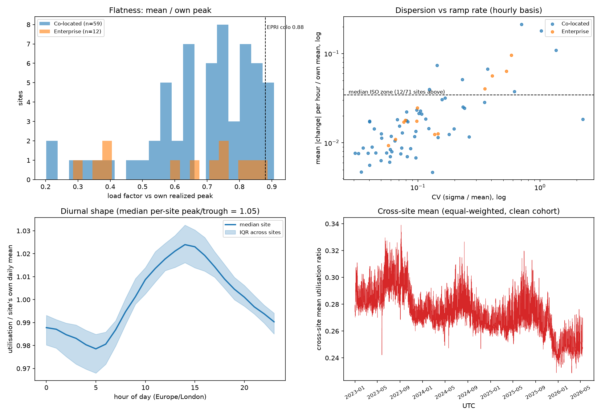
*Figure 28. Note J. Distributions of the within-site flatness metrics across 71 UK data-center sites, the matched ISO-NE comparator, and the cross-site aggregate. The sites cluster far to the flat side of the ISO zones on every metric.*

Thus, a few conclusions can be made from the UKPN dataset.

- There is almost no daily cycle: a 5% swing between the busiest and
  quietest hour, with 77.5% of sites below 1.10, while an ISO zone's system
  demand swings about nine times more across the day. Whatever the sites are
  doing, they are not following human activity as much as other sources.
- The sites do not move together. Each site on its own wanders by about 9%
  around its average over a year (a coefficient of variation, the standard
  deviation divided by the mean, of 0.094 for the median site), but the
  average across all sites wanders by only 3.4 to 4.5%, and the hour-to-hour
  ramps of that average are 0.31 times the typical site's in all three
  years. In other words, roughly two-thirds of what any one site does is
  canceled out by the others: their ups and downs are idiosyncratic rather
  than synchronized. For a price question, that is the finding that matters,
  because the grid sees the sum, not the sites.
- There is no trend toward spikier on the balanced 71-site panel. EPRI (the
  Electric Power Research Institute) had reported, from 4 metered
  facilities, that data centers run close to their own peak nearly all the
  time; the same qualitative picture holds here on 71 sites. Whether the
  numbers match (EPRI's 88 to 94% against 72 to 84% here) cannot be
  settled, because it depends on what counts as the "peak": using each
  site's 99th-percentile hour instead of its single highest hour moves the
  answer by 11 percentage points, more than the gap between the two
  studies.
- Limits: these are probably conventional colocation and enterprise sites,
  not hyperscale AI training; the denominator is *contracted* capacity; and
  half-hourly resolution cannot see the seconds band.

*Full record: `research-notes/J-ukpn-flatness.md`; `sources/ukpn-api-constraints.md`; `scripts/ukpn_flatness.py`.*

### 3.10 Europe: Ireland, the Netherlands, and Solar (Notes K and L)

**Why Ireland.** Its data-center exposure is *measured* (CSO table MEC02),
the first time in the project after a summer of geographic proxies.
Data-center consumption went from 291 to 1,991 GWh (6.84 times), all metered
consumption grew 1.28 times, and non-data-center consumption was flat at
1.02 times: essentially every megawatt of Irish demand growth over eleven
years was data centers, and their share went from 4.43% to 23.65%. The Netherlands, which matched on renewable share, was designed as a placebo (a country with the same kind of data but no
data-center growth), and it turned out to be a low-dose control instead
(CBS: 1.48% to 4.58%, tripled), which converted the design into a
dose-response test: did the country with the larger data-center "dose"
change more?

**Note K: the shape changed, and the control changed too (2015 to 2025).**
Table 8 compares the two countries' hourly load series at the two ends of
the window.

**Table 8.** Ireland against the Netherlands, 2015 to 2025: the change in each load-shape statistic, written as a multiplier (×0.719 means the 2025 value is 71.9% of the 2015 value).

| Hourly panel | Ireland | Netherlands |
|---|---|---|
| mean load | ×1.298 | ×1.196 |
| raw mean \|Δload\| (MW/min) | ×0.933 | ×0.854 |
| `vol_norm` = \|Δload\| ÷ mean load | ×0.719 | ×0.714 |
| daily peak ÷ trough (median) | 1.694 to 1.399 | 1.669 to 1.363 |
| night floor (daily min ÷ mean) | 0.722 to 0.823 | 0.715 to 0.840 |
| corr(raw \|Δload\|, Irish DC share), n = 44 quarters | −0.261 | −0.268 |

The normalized decline is mostly a denominator effect (raw volatility fell
6.7% while load grew 30%), the ISO-NE artifact a second time and in the
opposite direction. The mechanism is shared: the day flattened by filling in
the night, with the largest change at 3 AM in both countries. Per percentage point of dose, the Netherlands moved 2.5 to 3.9 times *more*, so there is no
dose ordering either way. Figure 29 shows the flattening directly: the
average load at each hour of the day, scaled to the daily mean, in 2015
and in 2025.

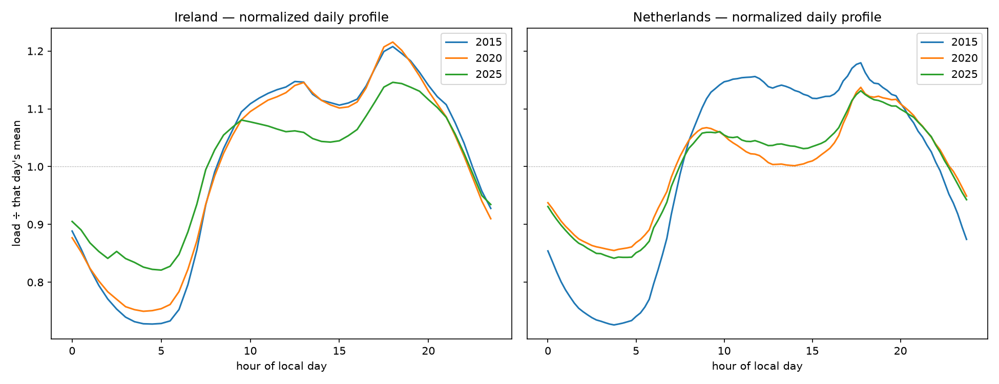
*Figure 29. Note K. Normalized hour-of-day load profiles, Ireland and the Netherlands, 2015 against 2025. The night fills in, in both.*

Moreover, Figure 30 tracks five yearly statistics of the load shape for both
countries, 2015 to 2026. Each is computed from the hourly load series of one
country in one year:

- `vol_norm` is the average hour-to-hour change in load, divided by that
  year's average load: how much the load moves, as a share of how big it is.
  This is the project's standard volatility measure.
- `mean_abs_grad` is the same average hour-to-hour change in raw MW per
  minute, without dividing by anything. It is plotted next to `vol_norm`
  because a ratio can fall simply because its denominator (load) grew, and
  this panel shows whether the numerator moved at all. The Dutch line sits
  higher only because the Dutch system is about 3.4 times larger.
- `pt_ratio` is the daily peak divided by the daily trough, for the median
  day of the year: how much bigger the busiest hour is than the quietest. A
  value of 1.7 means the peak is 70% above the trough; a flatter day gives a
  number closer to 1.
- `load_factor` is the year's average load divided by its single highest
  hour: how fully the system is used on average. Higher means flatter.
- `night_floor` is the daily minimum divided by the daily mean, for the
  median day: how far load falls at night. Rising toward 1 means the night
  is filling in.

Read together: in both countries the day got flatter (`pt_ratio` down,
`night_floor` up), the normalized volatility fell, and the raw MW/min
movement barely changed. The two countries move the same way, which is the
point of note K.

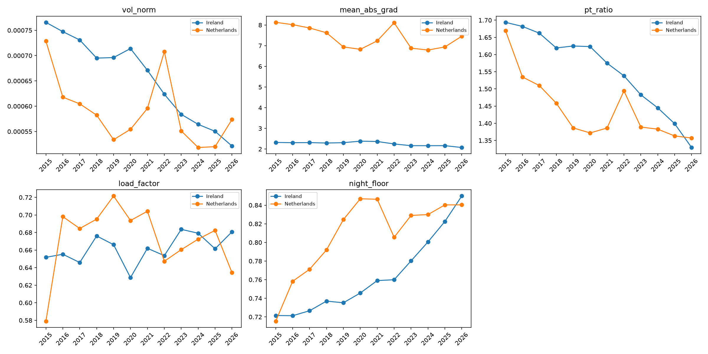
*Figure 30. Note K. The five annual shape statistics defined above for Ireland and the Netherlands, 2015 to 2026.*

**Note L: the Dutch series breaks, and Ireland's flattening is seasonal.**

Note L is the follow-up that checked whether note K's Ireland-against-the-Netherlands comparison survived two problems it had not anticipated: a definitional break in the Dutch series and a seasonal pattern in the Irish flattening.

- First, the Dutch load series changes definition in April 2023 (a
  midday-concentrated +1,395 MW step, absent in every other zone and year, found by comparing April against March in that year versus every
  other year and every other zone), so note K had compared a pre-break
  Irish endpoint with a post-break Dutch one. Re-run on the break-free 2015
  to 2022 window, `vol_norm` is ×0.814 for Ireland against ×0.971 for the
  Netherlands: the matched null on `vol_norm` dies. What survives, cleaner,
  is the denominator finding (Irish raw volatility −3.2% against load
  +18.9%) and the raw-numerator null (r = −0.078 for Ireland against −0.133
  for the Netherlands, n = 32). Ruling: no consistent dose ordering in
  either direction, no detectable movement in raw volatility in either
  country, the Irish load-shape change still cannot be attributed to data centers.
- Second, Ireland's winter midday deviation went from +313 to +320 MW,
  unchanged across eleven years, while its summer midday deviation fell from
  +435 to +193 MW (−56%). Data centers run flat year-round and cannot
  produce a seasonal signature; rooftop solar can.
- Third, across 12 zones, the summer-minus-winter signature tracks installed
  solar with a rank correlation of +0.714 (n = 7). That is suggestive only,
  because ENTSO-E's installed-capacity feed covers about 100% of national PV
  in the Netherlands and about 3% in Finland; Finland (the lowest dose) does
  not move, and both Danish zones move against. Spain moves the solar way
  against its own cooling confound (summer −62% against winter −38%).

Figure 31 plots the summer-minus-winter signature against installed solar
for every zone and year, and Figure 32 shows the seasonal daily profiles
for Ireland that produced the second bullet.

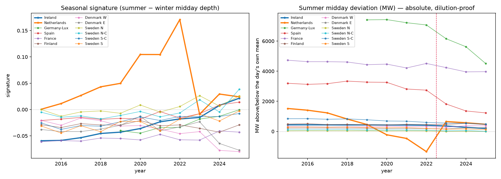
*Figure 31. Note L. Summer-minus-winter midday signature by zone and year against installed solar capacity; Finland flat, Denmark against.*

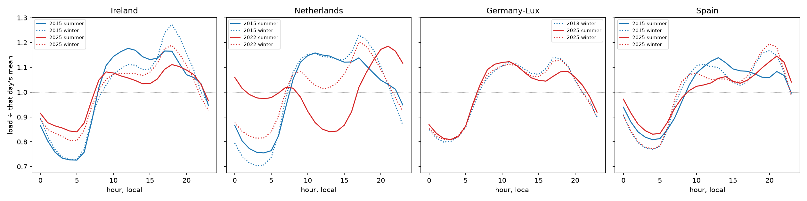
*Figure 32. Note L. Seasonal diurnal profiles: Ireland's winter curve is unchanged in absolute MW; its summer midday has hollowed out.*

It should be noted that an independent re-derivation of every headline
number from the raw parquet files caught four defects in the original work
(capacity years off by one; the break detector run on a different day
sample; a corruption guard blind to intra-day corruption; a
rank-correlation robustness check used as reassurance it could not
provide). All are recorded and fixed; the load-only findings were
untouched.

*Full record: `decisions.md` 2026-08-12 (four entries); `research-notes/K-…`, `L-…`; `plans/2026-08-12-entsoe-ireland-design.md`; `src/surg/analysis/entsoe_seasonal.py`.*

### 3.11 Pecan Street and XFRA: Is There Panel Headroom for a Home Compute Node? (Note M)

**The question.** Professor Wei asked about SPAN and NVIDIA's XFRA program:
a 16-GPU, roughly 12.5 kW always-on compute node plus a 15 kWh battery in
new houses, in a 100-home pilot with PulteGroup. Does the "idle residential
capacity" exist, and does it survive the hottest afternoon? The data is the
Pecan Street dataset from 73 real homes (Austin 25, New York 25,
California 23) at 1-minute and 1-second resolution, with whole-home draw
reconstructed through the panel. Table 9 gives the answer for three
electrical service sizes (the amperage rating of the home's main panel).

**Table 9.** Share of homes whose panel could fit a 12.5 kW firm node at the home's single worst minute of the year, by service rating (Austin / New York / California; the National Electrical Code's 80% continuous-load derating applied, meaning a circuit may carry only 80% of its rating continuously).

| Node size | 100 A service | 150 A | 200 A |
|---|---|---|---|
| 12.5 kW firm, at the home's single worst minute of the year | 0.04 / 0.16 / 0.48 | 0.84 / 0.91 / 0.91 | 1.00 / 1.00 / 1.00 |

**The answer is decided by the electrical service rating, which the free
tier never records.** At 200 A, every home fits the node at its worst minute; at 100 A, that collapses to 4 to 48%. Excluding the homes enrolled in a
load-changing intervention program (which leaves 9 Austin, 25 New York, and 12 California homes) leaves the 200 A result unchanged at 1.00 in all
three cities and softens Austin's 150 A figure only slightly, from 0.84
to 0.78, so the headline is not an artifact of the intervention homes.
The data is excellent and decisive, but the one variable that determines
the answer is the one nobody measured: the project's binding constraint
in miniature.

**Homes barely touch their limits.** The typical annual peak minute is 7 to
12 kW against about 38 kW usable on a 200 A panel, and most minutes sit
below 5 kW. Two-thirds of Austin homes set their annual peak on a summer
afternoon near 5 PM, and headroom never approaches zero. Fifteen-minute
files understate true 1-minute peaks by about 20% (peak-shaving ratio 0.78
to 0.80). Figures 33 to 35 show, for each city, the distribution of
whole-home draw and when each home's annual peak minute falls; Figure 36
shows one ordinary day in one home, with the 12.5 kW node drawn on top of
it for scale.

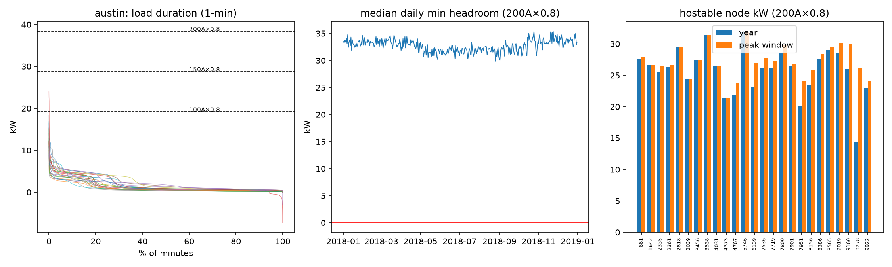
*Figure 33. Note M. Austin: distribution of whole-home draw (left) and the coincidence of each home's annual peak minute with hour of day and season (right).*

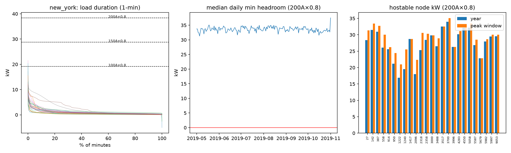
*Figure 34. Note M. New York (six months, no winter): distribution of whole-home draw (left) and the coincidence of each home's annual peak minute with hour of day and season (right).*

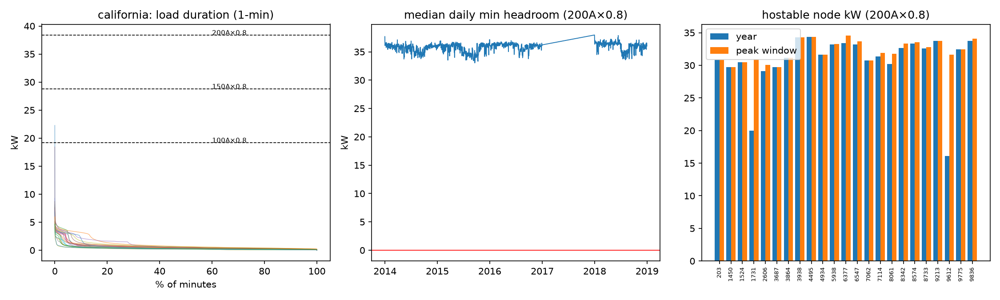
*Figure 35. Note M. California (in fact San Diego; 1-minute data only): distribution of whole-home draw (left) and the coincidence of each home's annual peak minute with hour of day and season (right).*

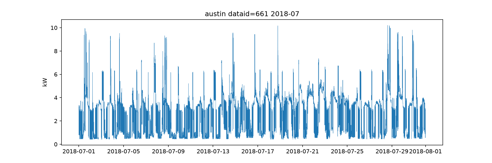
*Figure 36. Note M. One Austin home, one day, 1-minute: what a 12.5 kW firm node would sit on top of.*

**The node is firm, not oscillating.** The white paper (p. 15) keeps the node
running and curtails the battery first and EV charging second, so XFRA is a
capacity question, not a power-quality one. If a node did pulse at full
amplitude, each swing would be about seven times a home's largest everyday
step.

**Household 1-second volatility is tiny and self-canceling.** The median
second-to-second change is about 2 W against 12,500 W for the node, and
across N homes it cancels as √N (σ = 0.396 kW for one home): pooling four
times as many homes halves the relative wobble, because the homes' small
movements are independent of each other. However, while the √N result applies to residential homes, it does not generalize to all workloads' load profiles (§3.12). Figure
37 shows the cancellation as more homes are pooled, and Figure 38 shows the
power spectral density (how much of the 1-second signal's variation sits at
each frequency) of the whole-home draw.

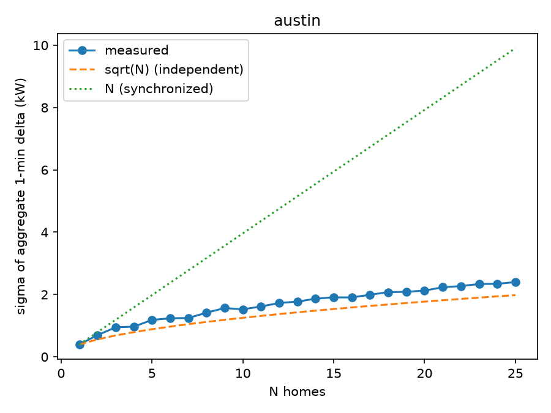
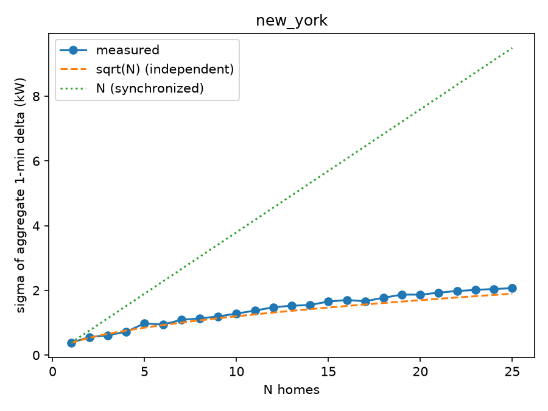
*Figure 37. Note M. Aggregate 1-minute volatility against the number of homes pooled, Austin (top) and New York (bottom): √N cancellation.*

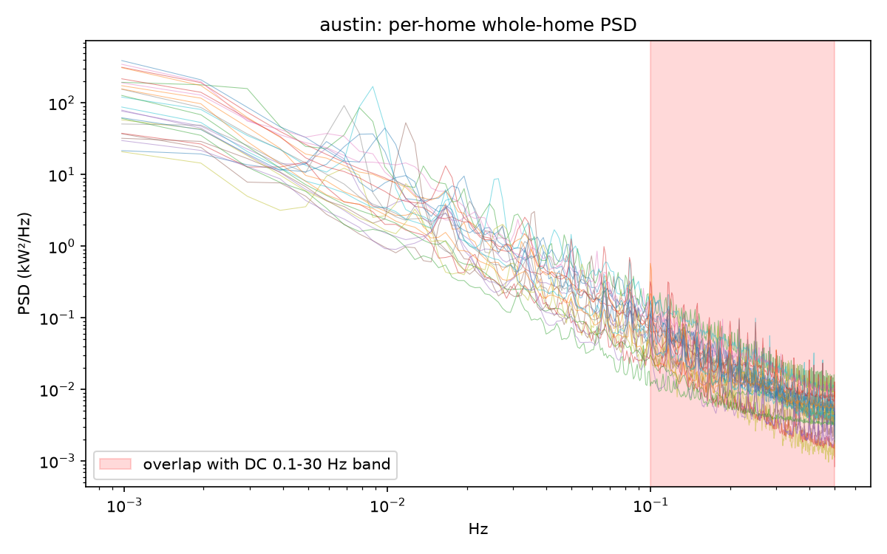
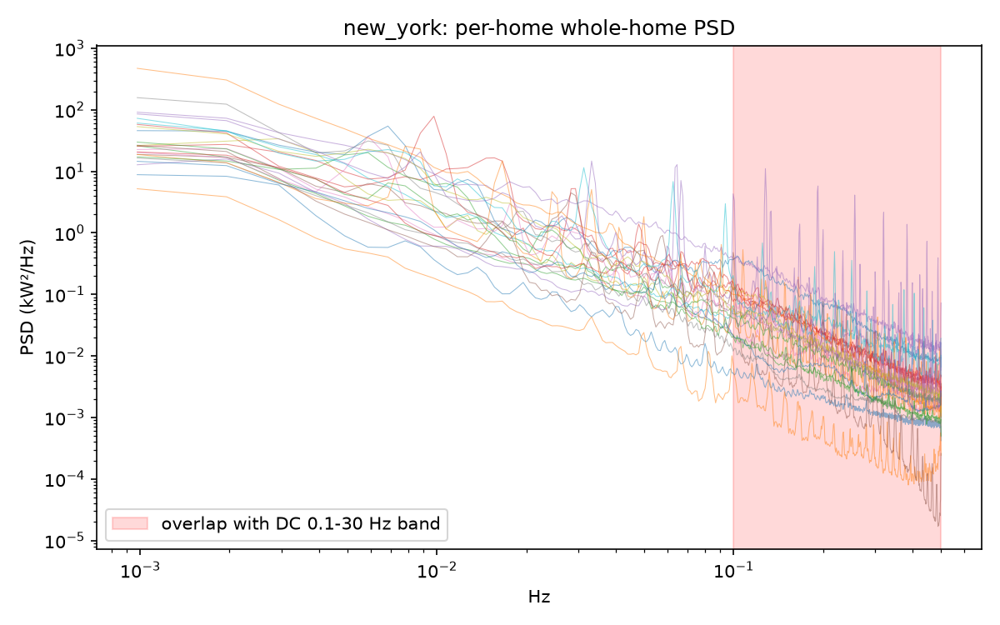
*Figure 38. Note M. Power spectral density of 1-second whole-home draw, Austin (top) and New York (bottom). The Nyquist frequency, the highest frequency a 1-second sample can resolve, is 0.5 Hz.*

**Subtracting residential load from system totals cannot isolate data-center
load,** for four independent reasons: the sample is volunteers, it is not
representative, the residual is all commercial and industrial load, and
the data pre-dates modern AI hyperscaler build-outs.

**Limits.** The data is 2018 to 2019 vintage (before heat pumps, induction, and Level-2 EV charging spread); tilted to solar and EV owners; New York
has six months and no winter; and 1-second sampling reaches only about 11%
(linear) or 34% (log) of the measured 0.2 to 3 Hz band.

*Full record: `research-notes/M-pecanstreet-xfra-headroom.md`; `specs/2026-08-14-pecanstreet-xfra-headroom-design.md`; `sources/pecanstreet-access-constraints.md`; `scripts/pecanstreet_*.py` (24 tests).*

### 3.12 Where the Sub-Second Claim Comes From, and Why Hourly Load Is Flat (Note N)

**The question.** After analyzing the Pecan Street data, a deeper dive into the load signatures of AI workloads (model training, fine-tuning, inference) was executed. One source, the NERC Large Loads Task Force (LLTF) slide deck, claimed that workloads caused load fluctuations at the second and sub-second level, up to tens of MW at a time. This prompted a deeper dive into this claim, described below.

**Where "10 to 20 MW several times per second" comes from.** Table 10 is
the provenance ladder: every source found that supports the claim (within a tight timeframe; more sources definitely exist), from least to most substantiated.

**Table 10.** The provenance of the sub-second volatility claim.

| Source | What it is | What it actually shows | Weight |
|---|---|---|---|
| #1 | [Tesla's slides at the NERC Large Loads Task Force workshop](https://www.nerc.com/globalassets/who-we-are/standing-committees/rstc/llwg/lltf_april_meeting__technical_workshop_presentations_.pdf), with Musk's line from a podcast that AI loads shift "10 to 20 MW several times per second", and a Google technical lead's statement that batch-synchronous ML workloads on dedicated clusters show "power fluctuations in the tens of megawatts" | Nothing published and no data released, and Tesla is selling the Megapack battery that supposedly fixes it | Lowest |
| #2 | [arXiv 2508.14318](https://arxiv.org/abs/2508.14318), *Power Stabilization for AI Training Datacenters* (Microsoft, OpenAI, and NVIDIA, August 2025, about 50 authors; not a neutral study) | Production telemetry: each training iteration has a compute phase with GPUs at maximum power and a communication phase at low power, and the switching is the swing; FFT energy (the share of the signal's variation at each frequency) concentrated at 0.2 to 3 Hz; amplitude grows in proportion to GPU count; GPUs are more than half of server power; jobs can span a majority of a data center or several on one grid. Every figure is normalized 0 to 1 with no MW axis, and no raw data is released | The best quantification that exists, and it is the operators' own |
| #3 | The [rs-7943457 dataset](https://github.com/Ahmed-Elsayed95/High-resolution-AI-Data-Center-Training-Workloads-Dataset) (York University and IESO; [preprint](https://www.researchsquare.com/article/rs-7943457/v1)): 32 real training runs on 8-GPU H100 and B200 nodes, per-GPU power at an effective ~10 Hz (the file says 50 Hz; the sensor refreshes every ~103 ms) | None of the sessions oscillate in the 0.2 to 3 Hz band; the cycle repeats every 8.5 to 15.9 seconds (0.06 to 0.12 Hz), but each transition inside it is a step of 2 to 4.5 kW completed in about a second, the abrupt change the claim describes at the scale of one node. Cross-GPU coherence inside the node is 0.994 to 0.995, independent confirmation that GPUs in a synchronized job move together | One node, one parallelism strategy, small models (frontier models are trillions of parameters) |
| #4 | EPRI's [*Powering Intelligence*](https://powering-intelligence.epri.com/annual-peak-use.html) (annual and peak use) | A footnote: "Despite relatively constant levels of output across minutes and hours, abrupt and large changes in load at second and sub-second timescales (that result from coordinated computing tasks stopping and starting) can have significant implications for operational reliability of the grid", with a link to an EPRI report that costs $25,000. Unfortunately, the EPRI report's $25,000 price tag exceeded the budget of this project by $25,000 | The duty-cycle numbers (94% and 88%) are metered; the sub-second claim is a footnote |

NERC's May 2026 Reliability Guideline cites source #2 by name (footnotes 28
and 40) as the basis for its mitigations, so the regulatory framework rests
on operator-supplied data, perhaps increasing its credibility.

**The three filters between a GPU and a meter.** Three things stand between
a swing inside a server and what a grid meter records, and they do not all
work in the same direction.

- Averaging. Any meter reports an average over its interval, and an average
  over a window of length T shrinks a fluctuation at frequency f by a factor
  of at least πfT. At the center of the measured band, a 250 MW campus
  swinging ±112.5 MW leaves 0.05 MW of ripple in an hourly meter, 0.02% of
  the campus. Every dataset in this project would show a flat hourly load
  even if the industry claim were true in full; this is arithmetic, not a
  finding.
- Coherence, which does *not* filter for training. GPUs in a synchronized
  training job all switch at the same moment, so their swings add up: the
  aggregate amplitude scales with the number of GPUs N, and the √N
  cancellation that holds for homes (§3.11) does not apply. This was measured inside a real 8-GPU node: the power of the eight cards moves together with
  a correlation of 0.994 to 0.995, a third and independent line of evidence
  for coherence. For *inference* (serving a trained model to users),
  requests arrive unsynchronized, and arXiv 2608.01250 finds the ramp-rate
  risk shrinking as 1/√N. Whether neighboring campuses swing in step with
  each other has never been measured in the field; arXiv 2606.13853
  assumes a correlation of about 0.4 in simulation.
- On-site absorbers. The uninterruptible power supply (UPS) or a battery can
  supply the swing so the meter never sees it, and the non-GPU load in the
  building (cooling, storage, networking) dilutes whatever gets through (although the impact is minimal; discussed in further detail below).

**Additional relevant questions about why fluctuations don't seem to appear, and their respective answers.**

- Is a battery fast enough to absorb second/sub-second fluctuations in load? Yes, easily. The measured band swings with periods of 0.33 to 5 seconds; a battery's power electronics respond in
  tens of milliseconds, and a full grid-forming response takes about 250 ms.
  Tesla's Megapack does exactly this at xAI's Colossus.
- Does data center facility HVAC cancel out fluctuations? No. A power usage effectiveness (PUE, total
  facility power divided by the power that reaches the computing equipment)
  of 1.10 (Google, Q2 2026) or 1.08 (Meta, 2023) means that cooling and
  everything else outside the servers is only about 9% of the load, and
  cooling has minutes-scale thermal inertia, so it cannot follow swings at
  0.2 to 3 Hz.
- What does regulation say? NERC's White Paper 2 (March 2026) admits that no
  allowable-oscillation limit exists in any NERC standard and that standard
  instrumentation cannot characterize the fast band. ERCOT proposed a limit
  on 2026-02-19 ("load power shall not repetitively exceed 10 MW change in a
  sliding 5-second window"), a flat 10 MW peak-to-peak cap across the whole
  measured band, against which a frontier-scale cluster would be
  non-compliant by up to an order of magnitude. Under such a rule, the room
  for oscillation at a given point on the grid becomes a first-come,
  first-served locational resource, structurally like congestion.

**Additional analysis from the rs-7943457 telemetry (York University and IESO).** Figure 39 shows what the four baseline sessions look like in the time domain, before any spectral analysis: the power drawn by the whole 8-GPU node, over the full 15-minute session on the left and over one 60-second window on the right. The cycle is plain to the eye: a rise to full power and a fall back toward idle every 8 to 16 seconds. What the repetition rate hides is how fast each transition is: the drop and the recovery inside every cycle are steps of 2 to 4.5 kW completed in about a second (0.7 to 1.8 s from 10% to 90% of the swing; Table 11), so the traces do contain the abrupt second-scale changes that EPRI's footnote and the operators describe, repeated slowly rather than oscillating at 0.2 to 3 Hz.

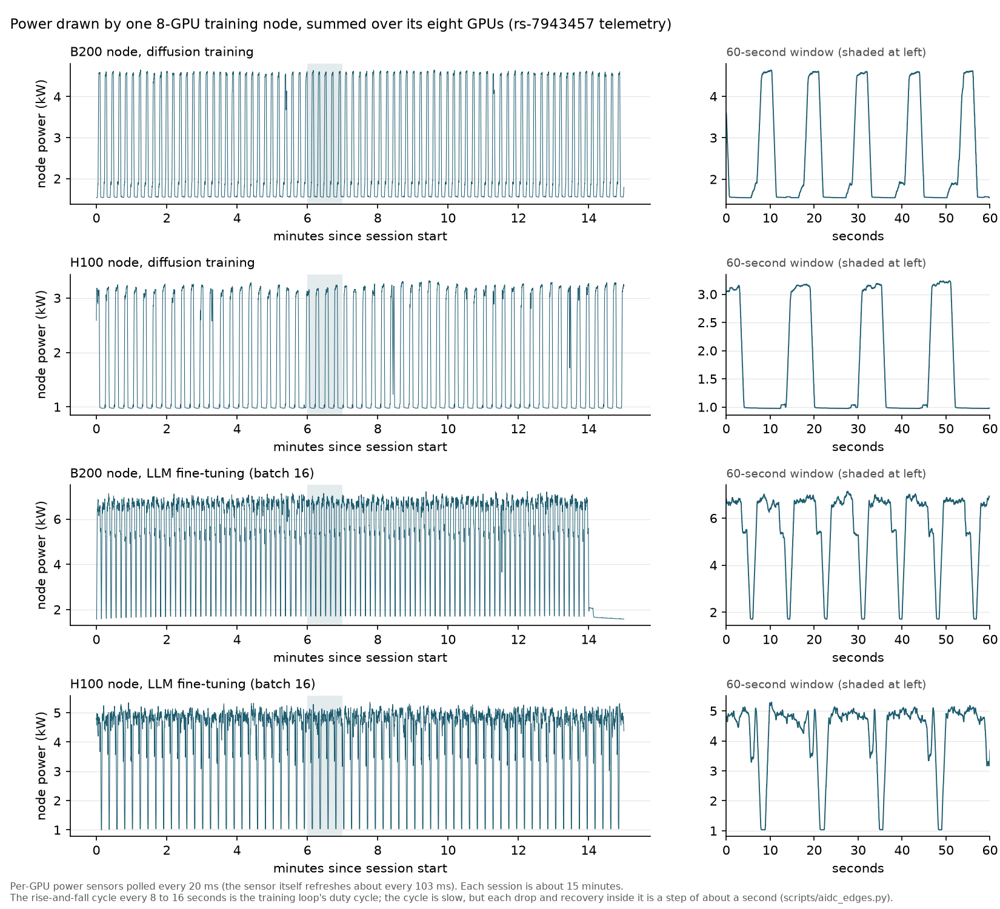
*Figure 39. Node power (the sum of the eight GPUs' power sensors) over time for the four baseline rs-7943457 sessions: full session (left) and a 60-second window from its steady state (right, shaded on the left). Diffusion training switches cleanly between about 1.5 and 4.5 kW; LLM fine-tuning idles for shorter fractions of each cycle. The repetition is slow, but each drop and recovery is a step of about a second. Drawn by `scripts/plot_aidc_timeseries.py`.*

Four sessions were analyzed (H100 and B200, diffusion and LLM
fine-tuning of 1B to 8B models), with node power summed over the 8 GPUs,
trimmed, detrended, and analyzed with a Welch power spectral density and a
periodogram cross-checked against the autocorrelation (three standard ways
of measuring which frequencies carry the variation). Table 11 gives, for each session, the dominant cycle period, how much of the variation falls in each frequency band, and how large and how fast each transition inside the cycle is: the node's low and high power levels, and the median time each drop and recovery takes to cover the middle 80% of that swing (10% to 90%).

**Table 11.** The project's own spectrum and edge speed: dominant period, share of variance by band, and the size and speed of each transition (medians over the session's cycles), four rs-7943457 sessions.

| Session | Dominant period | Variance below 0.1 Hz | Variance 0.1 to 2 Hz (NERC) | Variance 0.2 to 3 Hz (measured) | Low to high (kW) | Fall / rise, 10 to 90% (s) | Ramp rate, fall / rise (kW/s) |
|---|---|---|---|---|---|---|---|
| B200 diffusion | 11.4 s | 72.9% | 26.3% | 5.4% | 1.6 to 4.6 | 0.84 / 1.56 | 2.9 / 1.5 |
| H100 diffusion | 15.9 s | 75.6% | 24.3% | 7.3% | 1.0 to 3.2 | 0.82 / 0.92 | 2.2 / 1.9 |
| B200 LLM (batch 16) | 8.5 s | 0.4% | 99.5% | 36.8% | 2.4 to 6.9 | 1.79 / 0.74 | 2.0 / 4.8 |
| H100 LLM (batch 16) | 13.5 s | 45.7% | 54.2% | 31.2% | 2.0 to 5.0 | 0.70 / 0.68 | 3.5 / 3.6 |

Out of all of the sessions observed, none sustains an oscillation in the 0.2 to 3 Hz operator band; all repeat more slowly (0.06 to 0.12 Hz), but one node at one scale cannot say how frequency scales with job size. What every session does reproduce is the abruptness of the transitions: a drop of 2.2 to 4.5 kW in 0.7 to 1.8 s and a recovery in 0.7 to 1.6 s, 2 to 5 kW/s for a single node, which is the "coordinated computing tasks stopping and starting" of EPRI's footnote at the scale of one server. Because the GPUs in a synchronized job switch together (the 0.994 to 0.995 coherence above), steps of that speed add up across nodes rather than cancelling, and the megawatt swings the operators report are what such steps look like at the scale of thousands of nodes. So the telemetry partially supports the operator claim rather than contradicting it: it shows the fast edges at 8-GPU scale, but not a sustained 0.2 to 3 Hz oscillation.

**Scaling the node to a training job.** The claim is about jobs of tens of thousands of GPUs, so the last step is to ask what the node's transitions would look like at that scale (`scripts/aidc_scale.py`). Divided by its eight cards, the node's step is 0.28 to 0.56 kW per GPU, 61 to 69% of the node's high level. If every GPU in a job stepped at the same moment, which is what the 0.994 within-node coherence suggests and what the operators' account requires, the step would grow in proportion to the GPU count, and Table 12 gives the result for four job sizes taken from public descriptions of real training clusters. A 10 MW step takes about 18,000 to 36,000 synchronized GPUs and a 20 MW step about 36,000 to 72,000, the size of the jobs that arXiv 2508.14318 describes, so the operators' 10 to 20 MW sits inside the range the node telemetry implies for them (the paper's upper figure of over 100 MW would take roughly 180,000 to 360,000 GPUs at these per-GPU steps). The ramp rate scales the same way, 7 to 22 MW/s at 36,000 GPUs, so a single step of that size would exceed ERCOT's proposed limit of 10 MW in any 5-second window on its own. Three caveats bound the arithmetic. The sessions are small models running below the cards' rated power (0.4 to 0.86 kW per GPU at the high level, against 0.7 kW for an H100 and 1 kW for a B200), so a frontier job's per-GPU step could be larger; coherence across nodes is assumed, not measured; and the number is the load before any UPS or battery absorbs it, which is the quantity the claim is about.

**Table 12.** The node's per-GPU step scaled to a synchronized training job of N GPUs (perfect coherence assumed; per-GPU step 0.28 to 0.56 kW and ramp rate 0.19 to 0.61 kW/s from the four sessions in Table 11; each range is the spread across sessions).

| GPUs in the job | What that is | Step | Ramp rate |
|---|---|---|---|
| 16,384 | Llama 3 405B pre-training [108] | 4.5 to 9.2 MW | 3.2 to 9.9 MW/s |
| 24,576 | One of Meta's two 2024 H100 clusters [109] | 6.8 to 13.8 MW | 4.7 to 14.9 MW/s |
| 50,000 | A round number | 13.8 to 28.0 MW | 9.7 to 30.3 MW/s |
| 100,000 | xAI's Colossus, first phase [110] | 27.6 to 56.0 MW | 19.3 to 60.6 MW/s |
| 17,800 to 36,200 | GPUs needed for a 10 MW step | 10 MW | |
| 35,700 to 72,400 | GPUs needed for a 20 MW step | 20 MW | |

*Full record: `research-notes/N-subsecond-provenance-and-filters.md` (§0 to 11); `scripts/aidc_psd.py`; `scripts/aidc_edges.py`; `scripts/aidc_scale.py`; `plans/advisor/2026-08-24-advisor-meeting-agenda.md`.*

### 3.13 Desk Research Digest

The notes below collect additional, scattered desk research. It provides
context rather than findings, and some of it is only loosely tied to the
main question.

**A, primary-source verification.** The trade-press claims about the FERC (Federal Energy Regulatory Commission) co-location order, the Virginia SCC (State Corporation Commission) rate cases, and PJM's transmission plan are all confirmed by the primary records: 193 FERC ¶ 61,217 stands with its compliance process still open, the SCC created the GS-5 class for customers of 25 MW and up, and PJM's board approved $11.84B of new projects, including a 3,000 MW underground HVDC line into Loudoun.

**B, Loudoun geography.** Goose Creek substation is the terminus of two concurrent import builds, and SKFFSCRK, a 500 kV switching station about 150 miles away on the Hampton Roads peninsula, still tracks the Loudoun cluster at r = 0.870, so congestion in the pocket is network-wide rather than local.

**C, capacity and forecast.** PJM's capacity auction clearing price went from $28.92/MW-day to $269.92 in a single year and has held at $325 to $333 since, the RTO (regional transmission organization, PJM's whole footprint) is 6,600 to 6,800 MW short of its reliability requirement, and DOM's import capability sits below its requirement while the Chanceford to Doubs line is delayed.

**D, JLARC and LBNL.** JLARC finds that data centers currently pay the full cost of serving them and projects +$14 to $37 a month for a Dominion residential customer by 2040, while LBNL (Lawrence Berkeley National Laboratory), Brattle, and E3 back the "rates aren't rising" claim and the Harvard Electricity Law Initiative and the PJM market monitor rebut it.

**E, flexible load.** Curtailable data-center load is mostly announced rather than demonstrated: Emerald AI showed a 40% reduction in under 60 seconds at five sites, EPRI's DCFlex has nine sites and no quantified results yet, Google has 1 GW of demand response under contract with no dispatched event reported, and the 2026-07-22 Ashburn event moved 3.1 GW.

**F, the January 2026 driver.** Winter Storm Fern ranks first as the explanation of the simultaneous January 2026 step in both price components (§3.3).

**G, control nodes.** A candidate list of control buses outside DOM, with the structural finding that the good control sites are exactly where data centers are now siting (Mountaineer dropped, Conemaugh at elevated risk).

**H, the event catalog.** Thirty dated PJM and DOM stress events from February 2023 to July 2026 (§3.5).

**External context.** PJM's compliance proposal makes new loads above 50 MW ineligible for netting, 9.8 GW of nuclear and small modular reactor (SMR) co-location is committed nationally, and CRS (Congressional Research Service) report R48646 finds that the states with the largest data-center growth generally saw prices fall from 2019 to 2025 except where the grid is constrained, which is the DOM story stated nationally.

**I, Professor Wei's links.** Across the five links from the 2026-08-10 meeting (PJM's machine-learning forecasting deck, EPRI's *Powering Intelligence* and headroom framework, the NERC task-force deck, and arXiv 2601.02275), not one claims an energy-price effect from load volatility; every stated consequence is reliability.

**EU-0 to EU-5.** The method does not port to Europe, because the day-ahead coupling algorithm prices congestion inside a bidding zone at exactly zero and the EU facility database is legally closed, but the scoping produced UKPN's facility profiles (§3.9), Ireland's measured dose (§3.10), and the solar question that note L went on to test.

**The JLARC napkin projection.** With JLARC's 1.95, 2.23, and 2.90 times scenarios and the quantile-regression slopes, the $850 benchmark was uninformative, and the formal projection layer was scrapped after the pivot away from the original proposal's question.

---
## 4. Papers, Reports and Primary Sources Read

Sources are grouped by what they were used for in the order they were read: the original proposal's references, the PJM and Virginia-specific material, the cross-ISO sources, the European sources, and finally the additional resources considered. Each row contains one reference, what it is about, what was found in it, and what was taken away from it. The bracketed numbers point to the full citations in §6, and each source links to its document.

**Table 13.** Framing and mechanism (the proposal's references).

| Ref | Source | What it is about | What was found | What was taken away from it |
|---|---|---|---|---|
| [1] | [JLARC, *Data Centers in Virginia*, Report 598 (December 2024)](https://jlarc.virginia.gov/pdfs/reports/Rpt598-2.pdf) | Virginia's legislative audit of the data-center industry: demand forecasts to 2040 under 1.95×, 2.23×, and 2.90× scenarios, and rate-impact projections | It treats data-center load as flat baseload on annual and monthly data; finds data centers currently pay the full cost of serving them; projects +$14 to $37 a month for a Dominion residential customer by 2040 | The growth scenarios and the 0.26 data-center share of DOM load for the (later abandoned) projection, and the "chronic state" half of the original question |
| [2] | [Y. Li and Y. Li, *AI load dynamics: a power electronics perspective* (arXiv 2502.01647)](https://arxiv.org/abs/2502.01647) | AI training load from the power-electronics side, with GPU-level measurements | It measures a single workstation, not a facility; the megawatt claims are extrapolation | The "spiky load" premise. Its evidence is single-GPU, not facility-scale (§3.12) |
| [3] | [X. Chen et al., *Electricity demand and grid impacts of AI data centers* (arXiv 2509.07218)](https://arxiv.org/abs/2509.07218) | A survey of AI data-center electricity demand and grid impacts | A review of the same operator claims, with no new measurement | Premise and framing for the proposal |
| [4] | [PJM Manual 11, *Energy & Ancillary Services Market Operations* (revision 137)](https://www.pjm.com/-/media/DotCom/documents/manuals/m11.pdf) | PJM's rules for the energy and reserve markets, including the reserve demand curves | The $850 and $300 steps sit on every reserve demand curve (section 4.3.3); congestion is priced on line loadings (section 2.2); load volatility has no route into the scarcity channel | The price-formation model in §0 and the ORDC figure |
| [5] | [PJM Manual 12, *Balancing Operations* (revision 57)](https://www.pjm.com/-/media/DotCom/documents/manuals/m12.pdf) | How PJM keeps generation and load matched in real time, and how reserve shortages are declared | Shortages are declared per reserve product and location, which is what triggers the ORDC penalty | The scarcity-channel half of §0 |
| [6] | [PJM Manual 03, *Transmission Operations* (revision 71)](https://www.pjm.com/-/media/DotCom/documents/manuals/m03.pdf) | How transmission constraints are monitored and controlled | The constraint-control actions that produce congestion prices | The congestion-channel half of §0 |
| [7] | [Monitoring Analytics, *2023 State of the Market Report for PJM*, Volume 1](https://www.monitoringanalytics.com/reports/PJM_State_of_the_Market/2023/2023-som-pjm-vol1.pdf) | The independent market monitor's annual report on PJM for 2023 | The Pleasant View to Ashburn and Goose Creek constraints, with DOM congestion costs already rising | The choice of Loudoun nodes (§0) |
| [8] | [Monitoring Analytics, *2024 State of the Market Report for PJM*, Volume 1](https://www.monitoringanalytics.com/reports/PJM_State_of_the_Market/2024/2024-som-pjm-vol1.pdf) | The same report for 2024 | The same constraints named again, and the census of PJM alerts for 2024 | The choice of Loudoun nodes (§0) and the event catalog (§3.5) |
| [9] | [Monitoring Analytics, *2025 State of the Market Report for PJM*, Volume 1](https://www.monitoringanalytics.com/reports/PJM_State_of_the_Market/2025/2025-som-pjm-vol1.pdf) | The same report for 2025 | DOM congestion costs and the census of PJM alerts for 2025 | The event catalog (§3.5) |
| [10] | [Monitoring Analytics, *2026 Quarterly State of the Market Report for PJM: January through March*](https://www.monitoringanalytics.com/reports/PJM_State_of_the_Market/2026/2026q1-som-pjm.pdf) | The monitor's quarterly report covering January 2026 | The monitor's own diagnosis of the January 2026 price step | §3.3 and the event catalog (§3.5) |
| [11] | [PJM, *Formation of LMP and its system energy component during reserve shortage events* (March 2023)](https://www.pjm.com/-/media/DotCom/markets-ops/energy/real-time/reserve-shortage-pricing-paper.pdf) | How the reserve-shortage penalty enters the price, worked through a real shortage day | The penalty is a step function that lands in the uniform system energy component; the congestion and loss components can each be positive or negative | The reason the tail model was dropped as the primary test on day one and threshold plus quantile regression took its place; the reading of the negative congestion in Figure 16 (§3.5) |
| [12] | [W. Hogan and S. Harvey, *Locational marginal prices and electricity markets* (2022)](https://whogan.scholars.harvard.edu/sites/g/files/omnuum4216/files/whogan/files/locational_marginal_prices_and_electricity_markets_hogan_and_harvey_paper_101722.pdf) | The economics of locational marginal pricing | LMP = system energy + congestion + marginal loss | The three-component price definition used throughout |
| [13] | [P. Hines et al., *Cascading failures in power grids* (IEEE Potentials, 2009)](https://doi.org/10.1109/MPOT.2009.933498) | Self-organized criticality in power grids | Grids behave linearly up to a stress limit and then cascade | The "phase transition" framing of the proposal, which the price data did not support |
| [14] | [Z. Yang et al., distribution LMPs for a data-center park (2023)](https://doi.org/10.35833/MPCE.2022.000450) | An optimization model of a data-center park under distribution-level LMPs | Demand-side resources can be scheduled against distribution prices | Background on distribution-level pricing; not used in the analysis |
| [15] | [J. Lindberg et al., locational marginal CO₂ (2021)](https://doi.org/10.24251/HICSS.2021.384) | Using locational marginal emissions to shift hyperscale load between regions | Geographic load shifting is a real lever for hyperscalers | Background on load as something operators move; not used in the analysis |
| [16] | [B. E. Hansen, *Inference when a nuisance parameter is not identified under the null hypothesis* (1996)](https://doi.org/10.2307/2171789) | Testing for a threshold whose location is unknown, when there may be none | The bootstrap p-value for the threshold test | The p-value in the TAR test (§3.1) |
| [17] | [B. E. Hansen, *Sample splitting and threshold estimation* (2000)](https://doi.org/10.1111/1468-0262.00124) | Estimating a threshold and its confidence interval | The sample-splitting estimator | The TAR estimator that found, and then un-found, the threshold (§3.1) |

**Table 14.** PJM and Virginia policy and markets (notes A to H, external context).

| Ref | Source | What it is about | What was found | What was taken away from it |
|---|---|---|---|---|
| [18] | [FERC, *Order on Show Cause Proceeding*, 193 FERC ¶ 61,217 (2025-12-18)](https://www.ferc.gov/news-events/news/fact-sheet-ferc-directs-nations-largest-grid-operator-create-new-rules-embrace) | FERC directing PJM to rewrite its rules for co-located (behind-the-meter) load and generation | PJM's tariff was found unjust and unreasonable; the 50 MW netting threshold is a PJM convention chosen to capture hyperscale loads | The answer to "why would transmission costs fall on homeowners": co-located load still leans on the grid for backup and reliability, and fixed costs are recovered per billed MWh (note A) |
| [19] | [FERC, orders on PJM's compliance filings: Docket ER26-1088 (2026-04-16) and Docket EL25-49-002 (2026-06-18)](https://www.ferc.gov/media/e-2-el25-49-002) | FERC's rulings on PJM's first two attempts at the new rules | Both filings were rejected in part; the process is still open | A shelf-life caveat on all metered-load data: what counts as load is still being redefined |
| [20] | [PJM, thirty-day compliance filing (2026-01-20, Docket ER26-1088) and sixty-day compliance filing (2026-02-23, Docket ER26-1479) in response to the EL25-49 order](https://www.pjm.com/pjmfiles/directory/etariff/FercDockets/9461/20260223-er26-1479-000.pdf) | PJM's proposed co-location rules | New loads above 50 MW would be ineligible for netting; netted behind-the-meter generation is invisible in metered load | Note A and the external-context digest (§3.13) |
| [21] | [Virginia SCC, biennial review order PUR-2025-00058 (2025-11-25)](https://www.scc.virginia.gov/about-the-scc/newsreleases/release/scc-issues-order-on-dev-biennial-review-2025/scc-rules-in-dev-biennial-review-case.html) | Dominion's rate review | A new GS-5 class for customers of 25 MW and up, with 85% and 60% minimum demand charges from 2027-01-01 | The state's own answer to who pays (note A) |
| [22] | [Virginia SCC, Rider T-1 final order PUR-2026-00056 (2026-07-31)](https://www.scc.virginia.gov/docketsearch/DOCS/8dt001!.PDF) | Dominion's transmission rider | The residential rider cut from $2.90 to $0.94 a month, and 90 days for Dominion to produce a direct-connect cost policy | Note A |
| [23] | [PJM, *2026 PJM load forecast report* (January 2026)](https://www.pjm.com/-/media/DotCom/library/reports-notices/load-forecast/2026-load-report.pdf) | PJM's long-term load forecast | DOM growing at 6.5%/yr against 1.6%/yr RTO-wide | Note C |
| [24] | [PJM, *2025/2026 base residual auction report*](https://www.pjm.com/-/media/DotCom/markets-ops/rpm/rpm-auction-info/2025-2026/2025-2026-base-residual-auction-report.pdf) | The capacity auction for 2025/26 | A clearing price of $269.92/MW-day, up from $28.92 the year before; DOM cleared at a $444.26 zonal cap | Note C |
| [25] | [PJM, *2026/2027 base residual auction report*](https://www.pjm.com/-/media/DotCom/markets-ops/rpm/rpm-auction-info/2026-2027/2026-2027-bra-report.pdf) | The capacity auction for 2026/27 | $329.17/MW-day under the FERC-approved price collar (ER25-1357) | Note C |
| [26] | [PJM, *2027/2028 base residual auction report* (December 2025)](https://www.pjm.com/-/media/DotCom/markets-ops/rpm/rpm-auction-info/2027-2028/2027-2028-bra-report.pdf) | The capacity auction for 2027/28 | $333.44/MW-day; the collar masked a DOM-specific adder that binds in the uncapped simulation ($542.83 against $529.80 RTO-wide); the RTO 6,623 MW short of its reliability requirement | Note C |
| [27] | [PJM, *2028/2029 base residual auction report* (July 2026)](https://www.pjm.com/-/media/DotCom/markets-ops/rpm/rpm-auction-info/2028-2029/2028-2029-bra-results-report.pdf) | The capacity auction for 2028/29 | $325.00/MW-day under the extended collar (ER26-1556); the RTO 6,831 MW short; DOM's import capability below its requirement while the Chanceford to Doubs line is delayed | Note C |
| [28] | [PJM Transmission Expansion Advisory Committee (TEAC), white paper to the Board on the 2025 RTEP window (approved 2026-02-12)](https://www.pjm.com/-/media/DotCom/committees-groups/committees/teac/2026/20260203/20260203-pjm-board-whitepaper-february-2026.pdf) | The transmission plan approved by PJM's board | $11.84B of new baseline projects, including the roughly $2.3B, 185-mile, 3,000 MW underground HVDC line into Loudoun (June 2032) | Note C |
| [29] | [PJM, *PJM reviews January cold weather operations* (Inside Lines, 2026)](https://insidelines.pjm.com/pjm-reviews-january-cold-weather-operations/) | PJM's review of Winter Storm Fern | 18 to 19 GW of forced generator outages, about $798M of gas-electric misalignment uplift, spot prices above $3,000/MWh PJM-wide | Winter Storm Fern as the best explanation of the January 2026 step (§3.3) |
| [30] | [PJM, *System performed well during Winter Storm Gerri* (Inside Lines, 2024)](https://insidelines.pjm.com/pjm-review-system-performed-well-during-winter-storm-gerri/) | PJM's review of the January 2024 cold-weather event | A cold-weather alert with a far smaller outage total than Fern | The January 2024 entry in the event catalog (§3.5) |
| [31] | [PJM, *PJM serves load through record-breaking July heat* (Inside Lines, July 2026)](https://insidelines.pjm.com/pjm-serves-load-through-record-breaking-july-heat/) | PJM's review of the July 2026 heat | The all-time PJM peak of 168,158 MW on 2026-07-02 | The event catalog (§3.5) |
| [32] | [NERC, *2026 Summer Reliability Assessment*](https://www.nerc.com/globalassets/our-work/assessments/nerc_sra_2026.pdf) | The reliability regulator's summer outlook | Large loads treated as a planning obligation rather than an emerging risk | The regulator's own framing (note A) |
| [33] | [NERC, *2025 Long-Term Reliability Assessment*](https://www.nerc.com/globalassets/our-work/assessments/nerc_ltra_2025.pdf) | The ten-year reliability outlook | The resource-adequacy picture that note C's PJM shortfalls sit inside | Note C |
| [34] | [NERC, incident review of the 2024-07-10 large load loss](https://www.nerc.com/globalassets/our-work/reports/event-reports/incident_review_large_load_loss.pdf) | The regulator's review of the one verified event | About 1,500 MW across 60 facilities dropped to backup power after a 230 kV fault | The verified event (§3.5) |
| [35] | [NERC, Level 3 alert on computational loads (2026-05-04)](https://www.nerc.com/newsroom/nerc-issues-level-3-alert-reliability-guideline-focused-on-large-load-challenges) | NERC's "Essential Action" alert, issued with the May 2026 Reliability Guideline [88] | Large loads escalated to the regulator's highest alert level | The event catalog (§3.5) |
| [36] | [Congressional Research Service, R48646, *Data Centers and Their Energy Consumption: FAQ* (May 2026)](https://crsreports.congress.gov/product/pdf/R/R48646) | A primer for Congress on data-center energy use, prices, and data collection | States with the largest data-center growth generally saw prices fall from 2019 to 2025, except where the grid is constrained; the Energy Information Administration's (EIA) data collection failed twice; the Clean Cloud Act would give the EPA and the EIA collection authority | The national statement of the DOM story, and the "data hidden even from government" conclusion (§5) |
| [37] | [A. Shehabi et al., LBNL, *2024 United States Data Center Energy Usage Report* (December 2024)](https://eta-publications.lbl.gov/sites/default/files/2024-12/lbnl-2024-united-states-data-center-energy-usage-report.pdf) | The national data-center energy estimate | LBNL's national numbers; LBNL itself flags PJM as the exception to the flat-rates picture | Note D |
| [38] | [R. Wiser et al., LBNL and Brattle, *Retail Electricity Price Trends and Drivers: Data Update, 2026 edition* (March 2026, updated July 2026)](https://eta-publications.lbl.gov/sites/default/files/2026-07/retail_price_trends_2026_edition_julyupdate.pdf) | Retail price trends and what drives them | Backs the "rates aren't rising" claim nationally | Note D |
| [39] | [E3, *Understanding the Drivers of Rising Electricity Rates and the Role of Data Centers* (May 2026)](https://www.ethree.com/electricity-rate-drivers-data-center-role-2026/) | The same question, funded by the Data Center Coalition | Backs "rates aren't rising" | Note D |
| [40] | [E. Martin and A. Peskoe, Harvard Electricity Law Initiative, *Extracting Profits from the Public* (March 2025)](https://eelp.law.harvard.edu/wp-content/uploads/2025/03/Harvard-ELI-Extracting-Profits-from-the-Public.pdf) | The rebuttal: how ratepayers pay for Big Tech's power | Rebuts the "rates aren't rising" claim, as does the PJM market monitor | Note D; JLARC's numbers are the ones used |
| [41] | [T. Norris et al., Duke, *Rethinking Load Growth* (February 2025)](https://climate.duke.edu/annual-report/items/rethinking-load-growth/) | Whether flexible large loads can be absorbed by existing systems | Argues that flexible load can be absorbed with little new capacity | Notes D and E |
| [42] | [DOE §202(c) order 202-26-02 (January 2026)](https://www.energy.gov/ceser/federal-power-act-section-202c-pjm-interconnection-pjm-order-no-202-26-02) | The emergency order during Winter Storm Fern | PJM's data centers ordered onto backup generation | The event catalog (§3.5) and the January 2026 step (§3.3) |
| [43] | [DOE §202(c) order 202-25-8 (August 2025)](https://www.energy.gov/sites/default/files/2025-08/202c%20Order%20No.%20202-25-8.pdf) | An earlier emergency order under the same authority | The scope of DOE's emergency powers over grid operators | Note E |
| [44] | [DOE §202(c) order 202-26-23 (June 2026)](https://www.energy.gov/ceser/federal-power-act-section-202c-pjm-interconnection-llc-pjm-order-no-202-26-23) | A further emergency order for PJM | The same authority used again in summer 2026 | The event catalog (§3.5) |
| [45] | [Texas Senate Bill 6 (89th Legislature, 2025)](https://capitol.texas.gov/BillLookup/History.aspx?LegSess=89R&Bill=SB6) | Texas's large-load law | Loads above 75 MW must join demand response | Note E |
| [46] | [PUCT docket 59220, the Goodnight ruling (2026-07-23)](https://interchange.puc.texas.gov/search/filings/?controlNumber=59220) | Curtailment of a co-located campus in Texas | An entire co-located campus made curtailable within 30 minutes | Note E |
| [47] | [NVIDIA, Emerald AI case study](https://www.nvidia.com/en-us/case-studies/emerald-ai/) | A demonstration of flexible AI load | A 40% reduction in under 60 seconds at five sites | Note E: demonstrated against announced |
| [48] | [EPRI, DCFlex expands to nine demonstration sites](https://www.prnewswire.com/news-releases/epris-dcflex-initiative-expands-to-nine-demonstration-sites-across-us-europe-302676241.html) | EPRI's flexible-data-center initiative | Nine sites and no quantified results yet | Note E |
| [49] | [Google, *A milestone for demand response at our data centers*](https://blog.google/innovation-and-ai/infrastructure-and-cloud/global-network/demand-response-data-center-milestone/) | Google's demand-response contracts | 1 GW under contract with no dispatched event reported | Note E |
| [106] | [PJM, zone map (2023-05-11)](https://www.pjm.com/-/media/DotCom/about-pjm/pjm-zones.pdf) | PJM's official map of its transmission zones | Where the Dominion zone sits relative to the other 20 zones | Figure 2 (§3.1) |

**Table 15.** Cross-ISO sources (`sources/availability/`).

| Ref | Source | What it is about | What was found | What was taken away from it |
|---|---|---|---|---|
| [50] | [ISO New England, *ISO-NE establishes forecast framework for data centers, other large loads* (May 2026)](https://isonewswire.com/2026/05/18/iso-ne-establishes-forecast-framework-for-data-centers-other-large-loads/) | New England's load outlook | "Has not experienced similar growth so far, and only a small amount is expected in the coming decade" | The control-market designation (§3.7); read with ISO-NE's external-interface list (the ATCID) and the NECEC commercial-operation notices, the Canada-tie work (§3.8) |
| [51] | [EIA, *Hourly Electric Grid Monitor* (EIA-930)](https://www.eia.gov/electricity/gridmonitor/) | Hourly demand and interchange for every US balancing authority | The ISO-NE to Hydro-Québec interchange series omits NECEC | The NECEC dose check (§3.8) |
| [52] | [MISO, *2026 Long-Term Load Forecast* (April 2026)](https://www.misoenergy.org/engage/committees/long-term-load-forecast/) | MISO's own view of data-center growth | Data centers from 9.6 to 266 TWh by 2046, a 28-fold increase | The MISO description in §3.7 |
| [53] | [IESO, *2026 Annual Planning Outlook*](https://ieso.ca/Sector-Participants/Planning-and-Forecasting/Annual-Planning-Outlook/2026-APO-Summary) | Ontario's planning outlook | Growth is EV-driven; data-center materialization is called "uncertain" | The IESO description in §3.7 |
| [54] | [SPP, High Impact Large Load (HILL) integration](https://spp.org/markets-operations/high-impact-large-load-hill-integration/) | SPP's large-load program | Interconnection agreements promised within 90 days; a near-doubling of peak load expected within ten years | The SPP description in §3.7 |
| [55] | [NYISO, *Load & Capacity Data Report* (the Gold Book)](https://www.nyiso.com/load-capacity-data-report-gold-book-) | New York's load and capacity data (Table IV-7) | NYISO's forecast of large-load additions | The NYISO description in §3.7 |
| [56] | [University of Texas at Austin, Bureau of Economic Geology, *Advancing sustainable data center development in Texas*](https://www.beg.utexas.edu/energyecon/advancing-sustainable-data-center-development-in-texas) | The "TRAIL Map" white paper, read with ERCOT's large-flexible-load reports | ERCOT's large flexible load was 54 TWh in 2025 with a mostly speculative queue; the TRAIL Map is a policy paper, not a data release | The ERCOT description (§3.6), and the finding that no public facility-level source exists for Texas |
| [57] | [Pecan Street, *Waveform release* (October 2025)](https://www.pecanstreet.org/2025/10/waveform-release/) | The Dataport catalog, data dictionary, and the planned 2 kHz release | The free tier stops at 1 second; the waveform release is a request flow | §3.11 and the open 2 kHz question |
| [58] | [PJM Data Miner 2](https://dataminer2.pjm.com/list) | PJM's public data portal | See Source 1 in §2 | Datasets 1 to 6 and 38 |
| [59] | [gridstatus.io](https://www.gridstatus.io/) | A hosted warehouse of ISO data | See Source 2 in §2 | Datasets 7 to 9 |
| [60] | [ERCOT market information archives](https://www.ercot.com/) | The Texas operator's public archives | See Source 3 in §2 | Datasets 10 and 11 |
| [61] | [MISO market reports](https://www.misoenergy.org/markets-and-operations/real-time--market-data/market-reports/) | The Midcontinent operator's report files | See Source 4 in §2 | Datasets 12 and 13 |
| [62] | [SPP file portal](https://portal.spp.org/) | The Southwest Power Pool's file browser | See Source 5 in §2 | Datasets 14 and 15 |
| [63] | [NYISO market information system archives](http://mis.nyiso.com/public/) | The New York operator's monthly CSV archives | See Source 6 in §2 | Datasets 16 to 18 |
| [64] | [ISO New England, SMD hourly data workbooks](https://www.iso-ne.com/) | The New England operator's annual workbooks | See Source 7 in §2 | Dataset 19 |
| [65] | [IESO public reports](https://reports-public.ieso.ca/public/) | Ontario's public report directory | See Source 8 in §2 | Datasets 20 to 22 |
| [66] | [CAISO OASIS](http://oasis.caiso.com/) | The California operator's data API | See Source 9 in §2 | Datasets 23 and 24 |
| [67] | [CSO PxStat API, table MEC02](https://ws.cso.ie/public/api.restful/PxStat.Data.Cube_API.ReadDataset/MEC02/JSON-stat/2.0/en) | The Irish statistics office's API | See Source 12 in §2 | Dataset 31 |
| [68] | [Pecan Street Dataport](https://www.pecanstreet.org/dataport/) | The residential corpus | See Source 14 in §2 | Datasets 33 to 36 and 39 |
| [107] | [ERCOT, weather zone map](https://www.ercot.com/news/mediakit/maps) | ERCOT's official map of its eight weather zones | Which zone holds which city, and where Far West's Permian load sits | Figure 17 (§3.6) |

**Table 16.** Europe (notes EU-0 to EU-5, K, and L).

| Ref | Source | What it is about | What was found | What was taken away from it |
|---|---|---|---|---|
| [69] | [ENTSO-E Transparency Platform](https://transparency.entsoe.eu/) | Europe's shared platform for load, price, and capacity data | Parameter names are case-insensitive, size caps are enforced per endpoint, and the A03 curve format needs expanding | The European panel (§2, source 11) |
| [70] | [ENTSO-E, *Introduction guide for new users*](https://transparencyplatform.zendesk.com/hc/en-us/articles/13772306625428-Introduction-guide-for-new-users) | The platform's help center | Irish load lives on the CTA identifier; what each document type returns | `sources/entsoe-api-constraints.md` |
| [71] | [Commission Delegated Regulation (EU) 2024/1364](https://eur-lex.europa.eu/legal-content/EN/TXT/HTML/?uri=OJ:L_202401364) | The EU data-center rating scheme and its database | Article 5(5): facility data is confidential by regulation | Europe cannot supply facility data either (EU-3) |
| [72] | [DG ENER, reply to access-to-documents request 2025/3469 (2025-08-29)](https://www.asktheeu.org/request/access_to_data_centres_consumpti/response/60793/attach/2/2025%203469%20reply%20EN%20final.pdf) | A university's request for the database | Refused in August 2025 | EU-3 |
| [73] | [ACER, *Key developments in European electricity and gas markets, 2026*](https://acer.europa.eu/monitoring/electricity-gas-key-developments-2026) | European wholesale price developments | The European fat tail is negative (German negative-price hours went 301, 457, 573); intra-zone congestion is priced at zero by construction | Why the method does not port to Europe (EU-4) |
| [74] | [CSO, *Data centres metered electricity consumption*, table MEC02](https://www.cso.ie/en/statistics/energy/datacentresmeteredelectricityconsumption/) | Measured Irish data-center consumption | The data-center share went from 4.43% to 23.65% | The only measured dose in the project (§3.10) |
| [75] | [CBS, *Elektriciteit geleverd aan datacenters, 2017-2024*](https://www.cbs.nl/nl-nl/maatwerk/2025/51/elektriciteit-geleverd-aan-datacenters-2017-2024) | Measured Dutch data-center consumption | The Dutch share had not stayed flat at 4.6% but tripled, 1.48% to 4.58% | The control dose (§3.10) |
| [76] | [L. Hirth, J. Mühlenpfordt and M. Bulkeley, *The ENTSO-E Transparency Platform* (Applied Energy, 2018)](https://doi.org/10.1016/j.apenergy.2018.04.048) | How ENTSO-E data deviates from national sources | The deviations are systematic, so mixing sources would add artifacts | The national series were used for validation only |
| [77] | [EirGrid, *All-island resource adequacy assessment*](https://www.eirgrid.ie/airaa) | The Irish operator's own statistics | Validation values for the Irish series | Validation only |
| [78] | [Terna, *Electricity demand of 311.3 TWh in 2025*](https://www.terna.it/en/media/press-releases/detail/electricity-consumption-2025) | The Italian operator's own statistics | Validation values for the Italian series | Validation only |
| [79] | [UK Power Networks, open data portal](https://ukpowernetworks.opendatasoft.com) | The data-center demand profiles dataset and its license | CC BY 4.0; 100k calls a day; an export counts as one call | §3.9 |

**Table 17.** Additional sources considered (notes I and N).

| Ref | Source | What it is about | What was found | What was taken away from it |
|---|---|---|---|---|
| [80] | [PJM, *Hourly Electricity Load Forecasting Using Machine Learning Algorithms* (FERC technical conference, 2024)](https://www.ferc.gov/sites/default/files/2024-07/PJM%20FERC%20Technical%20Conference%202024%20-%20Hourly%20Electricity%20Load%20Forecasting%20Using%20Machine%20Learning%20Algorithms.pdf) | PJM benchmarking four machine-learning models against its production forecast | XGBoost beat the production forecast in every large zone except Dominion; "Dominion data center load is challenging" | The defect PJM sees is unpredictability, not jumpiness (note I) |
| [81] | [EPRI, *Powering Intelligence 2026: Annual and Peak Electricity Use*](https://powering-intelligence.epri.com/annual-peak-use.html) | Metered annual and peak use at real facilities | Facilities run at 94% (hyperscale) and 88% (colocation) of their own realized peak; real peaks land at 62 to 80% of nameplate; a footnote locates the volatility at second and sub-second timescales | The duty-cycle numbers that make the hourly null substantive (§3.12) |
| [82] | [EPRI, *A Proposed Framework to Assess Headroom for Integrating Data Centers* (3002034162)](https://www.epri.com/research/products/000000003002034162) | A four-step method for finding unused grid capacity for large loads: hourly probabilistic screening, nodal limits, sub-hourly limits, local equipment | Its only price claim runs the other way (growth lowers the average price through utilization); it relies on data centers ramping down on request | The mitigation-side view, compared with XFRA |
| [83] | [EPRI 3002033303, the metered sub-second report](https://www.epri.com/research/products/3002033303) | The one metered sub-second source EPRI cites | Paywalled at $25,000; not read | A lead only |
| [84] | [EPRI, *Data Center Load Shape Library* (3002033424)](https://www.epri.com/research/products/000000003002033424) | A library of measured data-center load shapes | Paywalled; not read | A lead only |
| [85] | [NERC Large Loads Task Force, April 2025 workshop deck](https://www.nerc.com/globalassets/who-we-are/standing-committees/rstc/llwg/lltf_april_meeting__technical_workshop_presentations_.pdf) | The task force's 145-page technical workshop | Tesla's and Google's slides are the origin of the "10 to 20 MW several times a second" claim; utilities describe the undervoltage-trip-and-reconnect mechanism | The top rung of the provenance ladder (§3.12) |
| [86] | [NERC, *Characteristics and risks of emerging large loads*, White Paper 1](https://www.nerc.com/globalassets/who-we-are/standing-committees/rstc/3_doc_white-paper-characteristics-and-risks-of-emerging-large-loads.pdf) | The task force's first description of the risk | The reliability framing of large-load behavior, before any limit existed | §3.12 |
| [87] | [NERC, *Assessment of gaps in existing practices, requirements, and reliability standards*, White Paper 2 (March 2026)](https://www.nerc.com/globalassets/our-work/guidelines/reliability/white-paper---assessment-of-gaps.pdf) | Where the standards fall short | Admits that no allowable-oscillation limit exists in any NERC standard and that standard instrumentation cannot characterize the fast band | §3.12 |
| [88] | [NERC, *Reliability guideline: risk mitigation for emerging large loads* (May 2026)](https://www.nerc.com/globalassets/our-work/guidelines/reliability/RG_Risk-Mitigation-For-Emerging-Large-Loads.pdf) | The mitigation framework: voltage ride-through, fast frequency response, and soft-start | Cites arXiv 2508.14318 by name (footnotes 28 and 40) as its evidence base | The regulatory view of the sub-second problem (§3.12) |
| [89] | [ERCOT Large Load Working Group, *Large Load Power Variation Requirement Consideration* (2026-02-19), with the Electranix framework behind it](https://www.ercot.com/files/docs/2026/02/19/ERCOT-LEL-SSO-Power-Variation-Consideration.pdf) | The first proposed numerical limit on large-load oscillation | "Load power shall not repetitively exceed 10 MW change in a sliding 5-second window", a flat cap across the whole measured band; oscillation headroom becomes a first-come, first-served locational resource | The limit quoted in §3.12 and §5, against which a frontier cluster is non-compliant |
| [90] | [E. Choukse et al. (Microsoft, OpenAI, and NVIDIA), *Power stabilization for AI training datacenters* (arXiv 2508.14318)](https://arxiv.org/abs/2508.14318) | Production telemetry from training jobs of tens of thousands of GPUs, and the operators' mitigations | Swings of 10 MW to over 100 MW; spectral energy at 0.2 to 3 Hz; every plot normalized 0 to 1 with no MW axis; no data released; GPUs are more than half of server power | The measured band, and its weight: the best quantification that exists, self-reported and unreplicated |
| [91] | [Y. Li et al. (University of Alberta), *The unseen AI disruptions for power grids: LLM-induced transients* (arXiv 2409.11416)](https://arxiv.org/abs/2409.11416) | Single-GPU power measurements at high resolution | The GPU-level swing that the facility-scale extrapolations start from | A rung of the provenance ladder (§3.12) |
| [92] | [R. Vercellino et al. (National Laboratory of the Rockies), *Measurement of generative AI workload power profiles for whole-facility data center infrastructure planning* (arXiv 2604.07345)](https://arxiv.org/abs/2604.07345) | Node-level measurements at 10 Hz | Swing amplitude scales linearly with node count | §3.12 |
| [93] | [C. Chaudhary et al. (Michigan State University), *Spatial load correlation in AI data-center-dominated power systems* (arXiv 2606.13853)](https://arxiv.org/abs/2606.13853) | A simulation of several facilities swinging together on the IEEE 39-bus test system | Assumes a cross-facility correlation of about 0.4; no field measurement exists | The coherence argument (§3.12) |
| [94] | [P. Li et al., *Smoothing the ramp, not the peak: scheduling-induced power dynamics of LLM inference and their grid-scale consequences* (arXiv 2608.01250)](https://arxiv.org/abs/2608.01250) | Load shape under inference rather than training | Ramp-rate risk falls as 1/√N because requests are unsynchronized | §3.12 |
| [95] | [S. Jadhav and Z. Liu, *Machine learning guided cooling system optimization for data center* (arXiv 2601.02275)](https://arxiv.org/abs/2601.02275) | Machine-learning-guided cooling at Frontier | 10-minute data; cannot see the band | Not useful (note I) |
| [96] | [C. Mishra et al., *Understanding the inception of 14.7 Hz oscillations emerging from a data center* (Sustainable Energy, Grids and Networks, 2025)](https://doi.org/10.1016/j.segan.2025.101735) | A grid oscillation event measured by third parties | A power-electronics control interaction, cured by a firmware upgrade | The only independent rung of the ladder (§3.12) |
| [97] | [J. Sun et al., *Data center power system stability, part I: power supply impedance modeling* (CSEE Journal of Power and Energy Systems, 2022)](https://doi.org/10.17775/CSEEJPES.2021.02010) | Data-center power-system stability | The measured events are control interactions, not workload synchronization | §3.12 |
| [98] | [A. A. Elsayed, A. A. Al-Obaidi, and H. E. Z. Farag, *Characterization of high-resolution AI data center training workloads* (rs-7943457)](https://www.researchsquare.com/article/rs-7943457/v1) | Per-GPU telemetry from 32 training runs on H100 and B200 nodes | The sensor refreshes every ~103 ms, not at 50 Hz; cross-GPU correlation 0.994; the node cycles every 8.5 to 15.9 seconds, and each transition inside the cycle is a step of about a second | The project's own spectrum (§3.12) |
| [99] | [A. Elsayed, *High-resolution AI data center training workloads dataset* (GitHub)](https://github.com/Ahmed-Elsayed95/High-resolution-AI-Data-Center-Training-Workloads-Dataset) | The dataset behind [98], CC BY 4.0 | The sequence-length sweep is not independent runs | Dataset 37 (§2, source 15) |
| [100] | [SPAN and NVIDIA, *XFRA White Paper* (2026)](https://ap.span.io/XFRA_White_Paper.pdf) | A 12.5 kW always-on compute node plus a 15 kWh battery in new houses | The node runs firm; the battery and the EV charger curtail first (p. 15) | The headroom question note M answers (§3.11) |
| [101] | [Latitude Media, *SPAN to launch mini AI data centers for distributed at-home compute* (2026)](https://www.latitudemedia.com/news/span-to-launch-mini-ai-data-centers-for-distributed-at-home-compute/) | Coverage of the launch and the pilot | A 100-home PulteGroup pilot; SPAN pays the electricity bill | §3.11 |
| [102] | [pv magazine USA, *SPAN and NVIDIA to develop AI data centers in your backyard* (April 2026)](https://pv-magazine-usa.com/2026/04/15/span-and-nvidia-to-develop-ai-data-centers-in-your-backyard-lowering-electric-bills/) | Coverage of the launch from a second outlet | The "lowering electric bills" pitch, and the same pilot | §3.11 |
| [103] | [Google, *Data center efficiency*](https://datacenters.google/efficiency/) | Google's power usage effectiveness | PUE 1.10 (Q2 2026): about 9% overhead | Cooling cannot be the averaging mechanism (§3.12) |
| [104] | [Meta, *2024 Responsible Business Practices report*](https://sustainability.atmeta.com/wp-content/uploads/2024/08/Meta-2024-Responsible-Business-Practices-Report-Index.pdf) | Meta's power usage effectiveness | PUE 1.08 (2023) | §3.12 |
| [105] | [A. Gandhi et al., *AutoScale: dynamic, robust capacity management for multi-tier data centers* (ACM Transactions on Computer Systems, 2012)](https://doi.org/10.1145/2382553.2382556) | Turning servers on and off with demand, as a software-side way of shaping a data center's power draw | Suggested at the 2026-08-24 meeting; not yet read | A future direction (§5) |
| [108] | [A. Grattafiori et al. (Meta), *The Llama 3 herd of models* (arXiv 2407.21783)](https://arxiv.org/abs/2407.21783) | Meta's report on training the Llama 3 models | The 405B model was pre-trained on 16,384 H100 GPUs | A real job size for the scale-up in Table 12 (§3.12) |
| [109] | [Meta Engineering, *Building Meta's GenAI infrastructure* (March 2024)](https://engineering.fb.com/2024/03/12/data-center-engineering/building-metas-genai-infrastructure/) | Meta's description of its two 2024 training clusters | 24,576 H100 GPUs in each cluster | A real cluster size for Table 12 (§3.12) |
| [110] | [NVIDIA, *NVIDIA Ethernet networking accelerates world's largest AI supercomputer, built by xAI* (October 2024)](https://nvidianews.nvidia.com/news/spectrum-x-ethernet-networking-xai-colossus) | The announcement of xAI's Colossus cluster | 100,000 H100 GPUs in the first phase | A real cluster size for Table 12 (§3.12) |

---

## 5. Conclusion

The project originally set out to measure how data-center load behaves and its impact on prices and the grid. Unfortunately, the clearest result is that the lack of data availability makes things very unclear. Facility-level load for a US hyperscale data
center does not exist in public data anywhere. Even the government's
attempts have failed: EIA's 2021 pilot drew 9 responses from 50 facilities,
and its 2024 survey was stopped by a lawsuit and the collected data
destroyed. Every US series in this project is a regional aggregate in which
data centers are one unlabeled part, and no sub-zonal or per-customer load
exists for DOM because PJM dispatches against unpublished bus loads.
Furthermore, the attempts to isolate data-center load statistically, by
restricting the panel to shoulder months and the 2 to 5 AM window in which
little else is running, are not realistic. Unfortunately, they cut out the
very events the question is about: inside that window, the price never exceeded $250 in 2,027 hours.

In Europe, the facility database is confidential by law. Unfortunately, a
university's request for it was refused in 2025. Where facility-level data did exist (96 UK sites), it existed as shape only, with no MW, no location, and no price,
and the sites are, as far as can be told, conventional colocation and
enterprise facilities rather than hyperscale AI training. Therefore, the
load signature is different altogether, and at half-hourly resolution the
sub-second fluctuations the project was looking for are invisible anyway.

The only series fine-grained enough to see fast fluctuations was the Pecan Street data, which is residential only, and the rs-7943457 GPU telemetry,
which is one server node rather than a facility. Trying to isolate
data-center load by subtracting residential load from system totals was a
dead end as well, because 73 volunteer homes cannot stand in for millions,
the sample is tilted to solar and EV owners, whatever is left after the
subtraction is all commercial and industrial load, and the data (2018 to
2019) pre-dates modern AI hyperscaler build-outs. The GPU telemetry is fast enough (about 10 Hz) but sees eight GPUs, not the thousands whose synchronized swings the industry claims are about; its cycle repeats well below the claimed band, although each transition inside the cycle is a step of about a second. Moreover, every other dataset held is sampled at one second or slower, while the industry claim lives at 0.2 to
3 Hz, and Microsoft, OpenAI, and NVIDIA, who measured those swings, released no data and no exact, reproducible numbers.

**What can and cannot be said.** Because of all of the reasons listed above,
the conclusions that can be confidently asserted are very limited in scope.

- The volatility threshold the original proposal asked for does not exist in
  DOM prices, at least not as a single number. The price response to load ramps is a smooth curve.
- Overall, DOM load level has been growing, about 28% from 2023 to 2026.
  However, its volatility and ramp rate have not, and normalized with
  respect to overall load level, they fell every year.
- Where load is metered at the facility (UK), it is among the flattest loads on the system, and two-thirds of site-level movement cancels in aggregate.
  Where it is measured nationally (Ireland), the load-shape change that
  coincided with it tracks rooftop solar, not data centers. Moreover, both
  of these are measured at timescales far above sub-second.
- The sub-second swings the industry worries about are real enough to have
  produced a proposed ERCOT limit (load may not repeatedly change by more
  than 10 MW within any 5-second window), but the evidence for them is
  operator-supplied and unreplicated, and the independent analysis on GPU telemetry reproduces the shape of the claim (abrupt steps of about a second, coherent across the node's eight GPUs) but not its numbers or its repetition rate (although it should be noted that a single workstation and hyperscale data centers are on completely different scales). Scaled by GPU count alone, the node's 0.28 to 0.56 kW per-GPU step reaches 10 MW at about 18,000 to 36,000 synchronized GPUs, the size of the training jobs the operators describe, so the claim is at least consistent in magnitude with the telemetry (§3.12).
- The one thing that can be said with some confidence is narrow: at every timescale observed in load and price data (hourly, 5-minute, half-hourly at the facility, and 1-second at the home), the hypothesized volatility does not show up in either load or prices. The one place it does show up is inside the server: the 10 Hz telemetry of one GPU node records steps of a few kilowatts completed in about a second, repeated every 8 to 16 seconds. That does not prove it is absent from the grid; it means that if it reaches the grid, it lives below the sampling rate of every public dataset, where only reliability, not price, can register it.
- Given that the volatility cannot be seen at any timescale the public data reaches, and that its stated consequences are reliability rather than price, the working explanation is that modern mitigation is absorbing it before any meter sees it. On-site batteries and the uninterruptible power supply
  (UPS) mitigate the sub-second swings, voltage ride-through and soft-start
  requirements limit what a facility can do to the grid, behind-the-meter
  generation takes load off the meter altogether, and the facility-level
  shapes that do exist (UK) are flat. If that is right, the volatility is
  real inside the building and invisible outside it, which is consistent
  with everything measured here, but has not been tested directly.

**Where this could go from here.**

- Wait for data. Facility-level load becomes public only if someone is made
  to publish it: the Clean Cloud Act (S. 1475) would give EPA and EIA the
  authority, and the EU database exists but is closed by regulation. Either
  would change what this project can do more than any new method would, but
  both options are also highly unlikely in the near future.
- Measure load directly. The alternative to waiting is to instrument a
  training cluster and record its power at 10 Hz or better. Reaching the
  megawatt swings in question takes hundreds to thousands of GPUs, which is
  incredibly expensive and most likely outside the scope of what
  Northwestern can provide, but it is still a possibility that could be
  considered.
- Watch the field. The problem is being engineered around in real time:
  on-site batteries (Tesla's Megapack at xAI's Colossus), soft-start and
  ride-through requirements (NERC's guideline), ERCOT's oscillation limit,
  FERC's co-location rules, and behind-the-meter and SMR co-location. These
  are recent advancements in technology and policy, and they all change
  what a meter would see. Therefore, the answer to the original question is
  a moving target, and researching future mitigation strategies from
  different perspectives may be worthwhile in its own right.
- Explore software scheduling as a mitigation. Going along with the previous
  bullet point, the compute-and-communication cycle that produces the
  sub-second swings is set by the training job's schedule, so a scheduler
  that staggers or overlaps the phases across GPUs, or fills the
  communication phase with dummy work, could flatten the power draw at the
  source before any battery sees it. Whether software can do at the source
  what batteries do at the meter, and at what cost in training throughput,
  is an open-ended question.

---
## 6. References

[1] Joint Legislative Audit and Review Commission (JLARC), "Data centers in Virginia," Commonwealth of Virginia, Richmond, VA, USA, Rep. 598, Dec. 2024. [Online]. Available: https://jlarc.virginia.gov/pdfs/reports/Rpt598-2.pdf

[2] Y. Li and Y. Li, "AI load dynamics: a power electronics perspective," Dept. of Electrical and Computer Engineering, University of Alberta, Edmonton, Canada, Jan. 2025, arXiv:2502.01647. [Online]. Available: https://arxiv.org/abs/2502.01647

[3] X. Chen, X. Wang, A. Colacelli, M. Lee, and L. Xie, "Electricity demand and grid impacts of AI data centers: challenges and prospects," Sep. 2025, arXiv:2509.07218. [Online]. Available: https://arxiv.org/abs/2509.07218

[4] PJM Interconnection, "Manual 11: Energy & Ancillary Services Market Operations," Rev. 137, Norristown, PA, USA, 2026. [Online]. Available: https://www.pjm.com/-/media/DotCom/documents/manuals/m11.pdf

[5] PJM Interconnection, "Manual 12: Balancing Operations," Rev. 57, Norristown, PA, USA, Apr. 2026. [Online]. Available: https://www.pjm.com/-/media/DotCom/documents/manuals/m12.pdf

[6] PJM Interconnection, "Manual 03: Transmission Operations," Rev. 71, Norristown, PA, USA, May 2026. [Online]. Available: https://www.pjm.com/-/media/DotCom/documents/manuals/m03.pdf

[7] Monitoring Analytics, "2023 State of the Market Report for PJM: Volume 1," Mar. 2024. [Online]. Available: https://www.monitoringanalytics.com/reports/PJM_State_of_the_Market/2023/2023-som-pjm-vol1.pdf

[8] Monitoring Analytics, "2024 State of the Market Report for PJM: Volume 1," Mar. 2025. [Online]. Available: https://www.monitoringanalytics.com/reports/PJM_State_of_the_Market/2024/2024-som-pjm-vol1.pdf

[9] Monitoring Analytics, "2025 State of the Market Report for PJM: Volume 1," Mar. 2026. [Online]. Available: https://www.monitoringanalytics.com/reports/PJM_State_of_the_Market/2025/2025-som-pjm-vol1.pdf

[10] Monitoring Analytics, "2026 Quarterly State of the Market Report for PJM: January through March," May 2026. [Online]. Available: https://www.monitoringanalytics.com/reports/PJM_State_of_the_Market/2026/2026q1-som-pjm.pdf

[11] PJM Interconnection, "Formation of locational marginal pricing and its system energy component during reserve shortage events," Norristown, PA, USA, Mar. 2023. [Online]. Available: https://www.pjm.com/-/media/DotCom/markets-ops/energy/real-time/reserve-shortage-pricing-paper.pdf

[12] W. Hogan and S. Harvey, "Locational marginal prices and electricity markets," Harvard University, Cambridge, MA, USA, Oct. 2022. [Online]. Available: https://whogan.scholars.harvard.edu/sites/g/files/omnuum4216/files/whogan/files/locational_marginal_prices_and_electricity_markets_hogan_and_harvey_paper_101722.pdf

[13] P. Hines, K. Balasubramaniam, and E. C. Sanchez, "Cascading failures in power grids," IEEE Potentials, vol. 28, no. 5, pp. 24-30, Sep.-Oct. 2009, doi: 10.1109/MPOT.2009.933498. [Online]. Available: https://doi.org/10.1109/MPOT.2009.933498

[14] Z. Yang, A. Trivedi, M. Ni, H. Liu, and D. Srinivasan, "Distribution locational marginal pricing based equilibrium optimization strategy for data center park with spatial-temporal demand-side resources," Journal of Modern Power Systems and Clean Energy, vol. 11, no. 4, pp. 1959-1970, 2023, doi: 10.35833/MPCE.2022.000450. [Online]. Available: https://doi.org/10.35833/MPCE.2022.000450

[15] J. Lindberg, L. Roald, and B. Lesieutre, "The environmental potential of hyper-scale data centers: using locational marginal CO2 emissions to guide geographical load shifting," in Proc. 54th Hawaii Int. Conf. System Sciences, Maui, HI, USA, Jan. 2021, pp. 3158-3167, doi: 10.24251/HICSS.2021.384. [Online]. Available: https://doi.org/10.24251/HICSS.2021.384

[16] B. E. Hansen, "Inference when a nuisance parameter is not identified under the null hypothesis," Econometrica, vol. 64, no. 2, pp. 413-430, 1996, doi: 10.2307/2171789. [Online]. Available: https://doi.org/10.2307/2171789

[17] B. E. Hansen, "Sample splitting and threshold estimation," Econometrica, vol. 68, no. 3, pp. 575-603, 2000, doi: 10.1111/1468-0262.00124. [Online]. Available: https://doi.org/10.1111/1468-0262.00124

[18] Federal Energy Regulatory Commission, "Order on show cause proceeding," 193 FERC ¶ 61,217, Docket No. EL25-49-000 (consolidated with AD24-11 and EL25-20), Dec. 18, 2025. Fact sheet [Online]. Available: https://www.ferc.gov/news-events/news/fact-sheet-ferc-directs-nations-largest-grid-operator-create-new-rules-embrace

[19] Federal Energy Regulatory Commission, order on PJM Interconnection's compliance filing, Docket No. ER26-1088-000, Apr. 16, 2026, and order addressing arguments raised on rehearing and on compliance, Docket No. EL25-49-002, Jun. 18, 2026. [Online]. Available: https://www.ferc.gov/media/e-2-el25-49-002

[20] PJM Interconnection, thirty-day compliance filing, Docket No. ER26-1088-000, Jan. 20, 2026, and sixty-day compliance filing, Docket No. ER26-1479-000, Feb. 23, 2026, both in response to the order in Docket No. EL25-49-000. [Online]. Available: https://www.pjm.com/pjmfiles/directory/etariff/FercDockets/9461/20260223-er26-1479-000.pdf

[21] Virginia State Corporation Commission, final order in Case No. PUR-2025-00058 (Dominion Energy Virginia biennial review), Nov. 25, 2025. News release [Online]. Available: https://www.scc.virginia.gov/about-the-scc/newsreleases/release/scc-issues-order-on-dev-biennial-review-2025/scc-rules-in-dev-biennial-review-case.html

[22] Virginia State Corporation Commission, final order in Case No. PUR-2026-00056 (Dominion Energy Virginia Rider T1), Jul. 31, 2026. [Online]. Available: https://www.scc.virginia.gov/docketsearch/DOCS/8dt001!.PDF

[23] PJM Interconnection, "2026 PJM load forecast report," Jan. 2026. [Online]. Available: https://www.pjm.com/-/media/DotCom/library/reports-notices/load-forecast/2026-load-report.pdf

[24] PJM Interconnection, "2025/2026 base residual auction report," Jul. 30, 2024. [Online]. Available: https://www.pjm.com/-/media/DotCom/markets-ops/rpm/rpm-auction-info/2025-2026/2025-2026-base-residual-auction-report.pdf

[25] PJM Interconnection, "2026/2027 base residual auction report," Jul. 22, 2025. [Online]. Available: https://www.pjm.com/-/media/DotCom/markets-ops/rpm/rpm-auction-info/2026-2027/2026-2027-bra-report.pdf

[26] PJM Interconnection, "2027/2028 base residual auction report," Dec. 17, 2025. [Online]. Available: https://www.pjm.com/-/media/DotCom/markets-ops/rpm/rpm-auction-info/2027-2028/2027-2028-bra-report.pdf

[27] PJM Interconnection, "2028/2029 base residual auction report," Jul. 14, 2026. [Online]. Available: https://www.pjm.com/-/media/DotCom/markets-ops/rpm/rpm-auction-info/2028-2029/2028-2029-bra-results-report.pdf

[28] PJM Interconnection, Transmission Expansion Advisory Committee, "TEAC recommendations to the PJM Board," white paper on the 2025 Regional Transmission Expansion Plan window, Feb. 2026 (approved by the Board Feb. 12, 2026). [Online]. Available: https://www.pjm.com/-/media/DotCom/committees-groups/committees/teac/2026/20260203/20260203-pjm-board-whitepaper-february-2026.pdf

[29] PJM Interconnection, "PJM reviews January cold weather operations," Inside Lines, 2026. [Online]. Available: https://insidelines.pjm.com/pjm-reviews-january-cold-weather-operations/

[30] PJM Interconnection, "PJM review: system performed well during Winter Storm Gerri," Inside Lines, 2024. [Online]. Available: https://insidelines.pjm.com/pjm-review-system-performed-well-during-winter-storm-gerri/

[31] PJM Interconnection, "PJM serves load through record-breaking July heat," Inside Lines, Jul. 2026. [Online]. Available: https://insidelines.pjm.com/pjm-serves-load-through-record-breaking-july-heat/

[32] North American Electric Reliability Corporation, "2026 summer reliability assessment," May 2026. [Online]. Available: https://www.nerc.com/globalassets/our-work/assessments/nerc_sra_2026.pdf

[33] North American Electric Reliability Corporation, "2025 long-term reliability assessment," Dec. 2025. [Online]. Available: https://www.nerc.com/globalassets/our-work/assessments/nerc_ltra_2025.pdf

[34] North American Electric Reliability Corporation, "Incident review: considering simultaneous voltage-sensitive load reductions," review of the July 10, 2024 large load loss event. [Online]. Available: https://www.nerc.com/globalassets/our-work/reports/event-reports/incident_review_large_load_loss.pdf

[35] North American Electric Reliability Corporation, "NERC issues Level 3 alert, reliability guideline focused on large load challenges," newsroom, May 2026. [Online]. Available: https://www.nerc.com/newsroom/nerc-issues-level-3-alert-reliability-guideline-focused-on-large-load-challenges

[36] Congressional Research Service, "Data centers and their energy consumption: frequently asked questions," Rep. R48646, updated May 2026. [Online]. Available: https://crsreports.congress.gov/product/pdf/R/R48646

[37] A. Shehabi et al., "2024 United States data center energy usage report," Lawrence Berkeley National Laboratory, Berkeley, CA, USA, Rep. LBNL-2001637, Dec. 2024, doi: 10.71468/P1WC7Q. [Online]. Available: https://eta-publications.lbl.gov/sites/default/files/2024-12/lbnl-2024-united-states-data-center-energy-usage-report.pdf

[38] R. Wiser, G. Barbose, W. Gorman, E. O'Shaughnessy, S. Forrester, P. Donohoo-Vallett, P. Cappers, J. Deason, R. Hledik, and L. Lam, "Retail electricity price trends and drivers: data update, 2026 edition," Lawrence Berkeley National Laboratory and The Brattle Group, Mar. 2026 (Jul. 2026 update). [Online]. Available: https://eta-publications.lbl.gov/sites/default/files/2026-07/retail_price_trends_2026_edition_julyupdate.pdf

[39] Energy and Environmental Economics (E3), "Understanding the drivers of rising electricity rates and the role of data centers," white paper funded by the Data Center Coalition, May 2026. [Online]. Available: https://www.ethree.com/electricity-rate-drivers-data-center-role-2026/

[40] E. Martin and A. Peskoe, "Extracting profits from the public: how utility ratepayers are paying for Big Tech's power," Harvard Electricity Law Initiative, Harvard Law School, Cambridge, MA, USA, Mar. 2025. [Online]. Available: https://eelp.law.harvard.edu/wp-content/uploads/2025/03/Harvard-ELI-Extracting-Profits-from-the-Public.pdf

[41] T. Norris et al., "Rethinking load growth: assessing the potential for integration of large flexible loads in US power systems," Nicholas Institute, Duke University, Feb. 2025. [Online]. Available: https://climate.duke.edu/annual-report/items/rethinking-load-growth/

[42] U.S. Department of Energy, "Federal Power Act Section 202(c), PJM Interconnection, Order No. 202-26-02," Jan. 2026. [Online]. Available: https://www.energy.gov/ceser/federal-power-act-section-202c-pjm-interconnection-pjm-order-no-202-26-02

[43] U.S. Department of Energy, "Federal Power Act Section 202(c), Order No. 202-25-8," Aug. 2025. [Online]. Available: https://www.energy.gov/sites/default/files/2025-08/202c%20Order%20No.%20202-25-8.pdf

[44] U.S. Department of Energy, "Federal Power Act Section 202(c), PJM Interconnection, Order No. 202-26-23," Jun. 2026. [Online]. Available: https://www.energy.gov/ceser/federal-power-act-section-202c-pjm-interconnection-llc-pjm-order-no-202-26-23

[45] Texas Legislature, Senate Bill 6, 89th Legislature, Regular Session, 2025. [Online]. Available: https://capitol.texas.gov/BillLookup/History.aspx?LegSess=89R&Bill=SB6

[46] Public Utility Commission of Texas, order in Docket No. 59220 (Goodnight co-located load curtailment), Jul. 23, 2026. [Online]. Available: https://interchange.puc.texas.gov/search/filings/?controlNumber=59220

[47] NVIDIA, "Emerald AI: flexible AI factories," case study. [Online]. Available: https://www.nvidia.com/en-us/case-studies/emerald-ai/

[48] Electric Power Research Institute, "EPRI's DCFlex initiative expands to nine demonstration sites across US, Europe," news release. [Online]. Available: https://www.prnewswire.com/news-releases/epris-dcflex-initiative-expands-to-nine-demonstration-sites-across-us-europe-302676241.html

[49] Google, "A milestone for demand response at our data centers," blog. [Online]. Available: https://blog.google/innovation-and-ai/infrastructure-and-cloud/global-network/demand-response-data-center-milestone/

[50] ISO New England, "ISO-NE establishes forecast framework for data centers, other large loads," ISO Newswire, May 18, 2026. [Online]. Available: https://isonewswire.com/2026/05/18/iso-ne-establishes-forecast-framework-for-data-centers-other-large-loads/

[51] U.S. Energy Information Administration, "Hourly electric grid monitor (EIA-930)." [Online]. Available: https://www.eia.gov/electricity/gridmonitor/

[52] Midcontinent Independent System Operator, "2026 long-term load forecast," Apr. 2026. [Online]. Available: https://www.misoenergy.org/engage/committees/long-term-load-forecast/

[53] Independent Electricity System Operator, "2026 annual planning outlook," summary. [Online]. Available: https://ieso.ca/Sector-Participants/Planning-and-Forecasting/Annual-Planning-Outlook/2026-APO-Summary

[54] Southwest Power Pool, "High impact large load (HILL) integration." [Online]. Available: https://spp.org/markets-operations/high-impact-large-load-hill-integration/

[55] New York Independent System Operator, "Load & capacity data report (Gold Book)," Apr. 2026. [Online]. Available: https://www.nyiso.com/load-capacity-data-report-gold-book-

[56] Bureau of Economic Geology, University of Texas at Austin, "Advancing sustainable data center development in Texas." [Online]. Available: https://www.beg.utexas.edu/energyecon/advancing-sustainable-data-center-development-in-texas

[57] Pecan Street, "Waveform release," Oct. 2025. [Online]. Available: https://www.pecanstreet.org/2025/10/waveform-release/

[58] PJM Interconnection, "Data Miner 2.0." [Online]. Available: https://dataminer2.pjm.com/list

[59] Grid Status, "gridstatus.io API." [Online]. Available: https://www.gridstatus.io/

[60] Electric Reliability Council of Texas, market information archives. [Online]. Available: https://www.ercot.com/

[61] Midcontinent Independent System Operator, "Market reports." [Online]. Available: https://www.misoenergy.org/markets-and-operations/real-time--market-data/market-reports/

[62] Southwest Power Pool, file portal. [Online]. Available: https://portal.spp.org/

[63] New York Independent System Operator, market information system archives. [Online]. Available: http://mis.nyiso.com/public/

[64] ISO New England, SMD hourly data workbooks. [Online]. Available: https://www.iso-ne.com/

[65] Independent Electricity System Operator, public reports. [Online]. Available: https://reports-public.ieso.ca/public/

[66] California Independent System Operator, "OASIS." [Online]. Available: http://oasis.caiso.com/

[67] Central Statistics Office (Ireland), PxStat API, table MEC02. [Online]. Available: https://ws.cso.ie/public/api.restful/PxStat.Data.Cube_API.ReadDataset/MEC02/JSON-stat/2.0/en

[68] Pecan Street, "Dataport." [Online]. Available: https://www.pecanstreet.org/dataport/

[69] ENTSO-E, "Transparency Platform." [Online]. Available: https://transparency.entsoe.eu/

[70] ENTSO-E, "Introduction guide for new users," Transparency Platform help center. [Online]. Available: https://transparencyplatform.zendesk.com/hc/en-us/articles/13772306625428-Introduction-guide-for-new-users

[71] European Commission, "Commission Delegated Regulation (EU) 2024/1364 of 14 March 2024 on the first phase of the establishment of a common Union rating scheme for data centres," Official Journal of the European Union, 2024. [Online]. Available: https://eur-lex.europa.eu/legal-content/EN/TXT/HTML/?uri=OJ:L_202401364

[72] European Commission, Directorate-General for Energy, reply to access-to-documents request 2025/3469, Ref. Ares(2025)7003195, Aug. 29, 2025. [Online]. Available: https://www.asktheeu.org/request/access_to_data_centres_consumpti/response/60793/attach/2/2025%203469%20reply%20EN%20final.pdf

[73] Agency for the Cooperation of Energy Regulators (ACER), "Key developments in European electricity and gas markets, 2026." [Online]. Available: https://acer.europa.eu/monitoring/electricity-gas-key-developments-2026

[74] Central Statistics Office (Ireland), "Data centres metered electricity consumption," table MEC02. [Online]. Available: https://www.cso.ie/en/statistics/energy/datacentresmeteredelectricityconsumption/

[75] Centraal Bureau voor de Statistiek, "Elektriciteit geleverd aan datacenters, 2017-2024," Dec. 2025. [Online]. Available: https://www.cbs.nl/nl-nl/maatwerk/2025/51/elektriciteit-geleverd-aan-datacenters-2017-2024

[76] L. Hirth, J. Mühlenpfordt, and M. Bulkeley, "The ENTSO-E Transparency Platform: a review of Europe's most ambitious electricity data platform," Applied Energy, vol. 225, pp. 1054-1067, Sep. 2018, doi: 10.1016/j.apenergy.2018.04.048. [Online]. Available: https://doi.org/10.1016/j.apenergy.2018.04.048

[77] EirGrid, "All-island resource adequacy assessment." [Online]. Available: https://www.eirgrid.ie/airaa

[78] Terna, "Electricity demand of 311.3 TWh in 2025," press release, 2026. [Online]. Available: https://www.terna.it/en/media/press-releases/detail/electricity-consumption-2025

[79] UK Power Networks, "Open data portal." [Online]. Available: https://ukpowernetworks.opendatasoft.com

[80] PJM Interconnection, "Hourly electricity load forecasting using machine learning algorithms," FERC Technical Conference, 2024. [Online]. Available: https://www.ferc.gov/sites/default/files/2024-07/PJM%20FERC%20Technical%20Conference%202024%20-%20Hourly%20Electricity%20Load%20Forecasting%20Using%20Machine%20Learning%20Algorithms.pdf

[81] Electric Power Research Institute, "Powering intelligence 2026: annual and peak electricity use, history and future projections." [Online]. Available: https://powering-intelligence.epri.com/annual-peak-use.html

[82] Electric Power Research Institute, "A proposed framework to assess headroom for integrating data centers into regional power systems: an industry playbook for unlocking system potential with flexibility," Product 3002034162. [Online]. Available: https://www.epri.com/research/products/000000003002034162

[83] Electric Power Research Institute, Product 3002033303 (metered sub-second data-center load). [Online]. Available: https://www.epri.com/research/products/3002033303

[84] Electric Power Research Institute, "Data center load shape library," Product 3002033424. [Online]. Available: https://www.epri.com/research/products/000000003002033424

[85] North American Electric Reliability Corporation, Large Loads Task Force, "April meeting and technical workshop presentations," Apr. 2025. [Online]. Available: https://www.nerc.com/globalassets/who-we-are/standing-committees/rstc/llwg/lltf_april_meeting__technical_workshop_presentations_.pdf

[86] North American Electric Reliability Corporation, "Characteristics and risks of emerging large loads," White Paper 1. [Online]. Available: https://www.nerc.com/globalassets/who-we-are/standing-committees/rstc/3_doc_white-paper-characteristics-and-risks-of-emerging-large-loads.pdf

[87] North American Electric Reliability Corporation, "Assessment of gaps in existing practices, requirements, and reliability standards," White Paper 2, Mar. 2026. [Online]. Available: https://www.nerc.com/globalassets/our-work/guidelines/reliability/white-paper---assessment-of-gaps.pdf

[88] North American Electric Reliability Corporation, "Reliability guideline: risk mitigation for emerging large loads," May 2026. [Online]. Available: https://www.nerc.com/globalassets/our-work/guidelines/reliability/RG_Risk-Mitigation-For-Emerging-Large-Loads.pdf

[89] J. Zhang and J. Rose, "Large load power variation requirement consideration," ERCOT Large Load Working Group, Feb. 19, 2026, with the supporting Electranix framework presented Jan. 22, 2026. [Online]. Available: https://www.ercot.com/files/docs/2026/02/19/ERCOT-LEL-SSO-Power-Variation-Consideration.pdf

[90] E. Choukse et al., "Power stabilization for AI training datacenters," Microsoft, OpenAI, and NVIDIA, Aug. 2025, arXiv:2508.14318. [Online]. Available: https://arxiv.org/abs/2508.14318

[91] Y. Li, M. Mughees, Y. Chen, and Y. R. Li, "The unseen AI disruptions for power grids: LLM-induced transients," University of Alberta, Sep. 2024, arXiv:2409.11416. [Online]. Available: https://arxiv.org/abs/2409.11416

[92] R. Vercellino et al., "Measurement of generative AI workload power profiles for whole-facility data center infrastructure planning," National Laboratory of the Rockies, Apr. 2026, arXiv:2604.07345. [Online]. Available: https://arxiv.org/abs/2604.07345

[93] C. Chaudhary, A. Abdelkader, Y. Pei, M. Benidris, and J. Mitra, "Spatial load correlation in AI data-center-dominated power systems," Michigan State University, Jun. 2026, arXiv:2606.13853. [Online]. Available: https://arxiv.org/abs/2606.13853

[94] P. Li, Y. Chen, X. Miao, and D. Wang, "Smoothing the ramp, not the peak: scheduling-induced power dynamics of LLM inference and their grid-scale consequences," Aug. 2026, arXiv:2608.01250. [Online]. Available: https://arxiv.org/abs/2608.01250

[95] S. Jadhav and Z. Liu, "Machine learning guided cooling system optimization for data center," Jan. 2026, arXiv:2601.02275. [Online]. Available: https://arxiv.org/abs/2601.02275

[96] C. Mishra, L. Vanfretti, J. Delaree, T. Purcell, and K. Jones, "Understanding the inception of 14.7 Hz oscillations emerging from a data center," Sustainable Energy, Grids and Networks, vol. 43, art. 101735, Sep. 2025, doi: 10.1016/j.segan.2025.101735. [Online]. Available: https://doi.org/10.1016/j.segan.2025.101735

[97] J. Sun, M. Xu, M. Cespedes, and M. Kauffman, "Data center power system stability, part I: power supply impedance modeling," CSEE Journal of Power and Energy Systems, vol. 8, no. 2, pp. 403-419, Mar. 2022, doi: 10.17775/CSEEJPES.2021.02010. [Online]. Available: https://doi.org/10.17775/CSEEJPES.2021.02010

[98] A. A. Elsayed, A. A. Al-Obaidi, and H. E. Z. Farag, "Characterization of high-resolution AI data center training workloads on single and multiple GPU nodes," Research Square, preprint rs-7943457, Oct. 29, 2025. [Online]. Available: https://www.researchsquare.com/article/rs-7943457/v1

[99] A. Elsayed, "High-resolution AI data center training workloads dataset," GitHub repository, CC BY 4.0. [Online]. Available: https://github.com/Ahmed-Elsayed95/High-resolution-AI-Data-Center-Training-Workloads-Dataset

[100] A. Rao and C. Lander, "XFRA white paper," SPAN.IO and NVIDIA, 2026. [Online]. Available: https://ap.span.io/XFRA_White_Paper.pdf

[101] Latitude Media, "SPAN to launch mini AI data centers for distributed at-home compute," 2026. [Online]. Available: https://www.latitudemedia.com/news/span-to-launch-mini-ai-data-centers-for-distributed-at-home-compute/

[102] pv magazine USA, "SPAN and NVIDIA to develop AI data centers in your backyard, lowering electric bills," Apr. 15, 2026. [Online]. Available: https://pv-magazine-usa.com/2026/04/15/span-and-nvidia-to-develop-ai-data-centers-in-your-backyard-lowering-electric-bills/

[103] Google, "Data center efficiency." [Online]. Available: https://datacenters.google/efficiency/

[104] Meta, "2024 responsible business practices report." [Online]. Available: https://sustainability.atmeta.com/wp-content/uploads/2024/08/Meta-2024-Responsible-Business-Practices-Report-Index.pdf

[105] A. Gandhi, M. Harchol-Balter, R. Raghunathan, and M. A. Kozuch, "AutoScale: dynamic, robust capacity management for multi-tier data centers," ACM Transactions on Computer Systems, vol. 30, no. 4, pp. 1-26, Nov. 2012, doi: 10.1145/2382553.2382556. [Online]. Available: https://doi.org/10.1145/2382553.2382556

[106] PJM Interconnection, "PJM zone map," May 11, 2023. [Online]. Available: https://www.pjm.com/-/media/DotCom/about-pjm/pjm-zones.pdf

[107] Electric Reliability Council of Texas, "ERCOT weather zone map," media kit. [Online]. Available: https://www.ercot.com/news/mediakit/maps

[108] A. Grattafiori et al., "The Llama 3 herd of models," Meta, Jul. 2024, arXiv:2407.21783. [Online]. Available: https://arxiv.org/abs/2407.21783

[109] Meta Engineering, "Building Meta's GenAI infrastructure," Mar. 12, 2024. [Online]. Available: https://engineering.fb.com/2024/03/12/data-center-engineering/building-metas-genai-infrastructure/

[110] NVIDIA, "NVIDIA Ethernet networking accelerates world's largest AI supercomputer, built by xAI," news release, Oct. 28, 2024. [Online]. Available: https://nvidianews.nvidia.com/news/spectrum-x-ethernet-networking-xai-colossus

---

## Appendix A: The Original Research Proposal

The proposal as submitted, reproduced verbatim from `Yu_Tony_SURG_Grant_Proposal.md` in the repository. Its bracketed reference numbers point to its own reference list at the end of this appendix, not to §6.

### Introduction
Northern Virginia (NOVA), specifically Loudoun and Fairfax counties, handles nearly 70% of the world's internet traffic, earning it the moniker "Data Center Alley" [1]. While this infrastructure is critical for the expanding Artificial Intelligence (AI) economy, it places an unprecedented strain on the local Dominion (DOM) energy grid. The recent (2020-current) rapid expansion of hyperscale data centers, facilities that consume massive amounts of power for cloud computing and AI model training, has shifted the region's energy consumption patterns [1][2]. Current policy discussions often focus on the aggregate capacity needed to meet this demand [1]. However, this macro-level view overlooks the immediate, high-frequency instability caused by the volatile load profiles of modern computing. My project seeks to shift the focus from "how much" energy is consumed to "how volatile" the consumption is and its resulting impacts on grid stability. Specifically, I will model the relationship between high frequency load anomalies and spikes in Locational Marginal Pricing (LMP), a pricing mechanism that sets real-time energy prices at specific grid locations (nodes) by calculating the marginal cost to supply the next unit of electricity [3]. Then, I will determine the critical threshold where future AI infrastructure investment will push NOVA's energy grid into a state of chronic instability, quantifying the "hidden costs" of data center growth on grid stability.

### Background/Literature Review
The energy impact of data centers is a subject of intense scrutiny. The 2024 Joint Legislative Audit and Review Commission (JLARC) report on Virginia's data centers provides a comprehensive forecast of aggregate energy demand, predicting that total energy consumption in the state will double by 2040 [1]. While the JLARC report analyzes the need for new generation capacity and the economic implications, it primarily relies on annual and monthly consumption forecasts. This approach treats data center load as a largely static "baseload," an idealized constant hum of flat energy usage. However, recent studies suggest that the shift toward data center use for generative AI training creates "spiky" load profiles that differ significantly from traditional data storage and cloud computing [2], [3]. When these surges occur simultaneously across multiple facilities in a constrained geographic area like Data Center Alley, they risk overloading transmission lines. In the PJM (the organization managing the grid across the northeastern US) energy market, such congestion is reflected in LMP. LMP is calculated as the sum of three components: the system-wide energy price, the marginal cost of transmission congestion, and the cost of marginal losses [4]. Unusually high LMPs indicate that the grid is physically congested and cannot move power efficiently to where it is needed [4], [5]. The increased construction of data centers in NOVA have already had adverse effects on the DOM grid. The 2024 PJM State of the Market report confirms that average congestion costs have already risen significantly, driven specifically by increased energy demand and transmission constraints from the Pleasant View - Ashburn line and the Goose Creek Transformer [6], [7] in the DOM zone. Congestion in these power lines results from the grid's inability to meet hyper-localized demand, causing increased congestion prices in LMP and widespread power outages in the NOVA region. While it is well established that increased demand correlates with higher prices, the specific saturation point of the DOM grid remains unquantified. Literature on self organized criticality suggests that power grids function linearly up to a specific stress limit, beyond which they undergo a phase of large scale cascading failure, transitioning into a chaotic, heavy tailed pricing regime, where extreme price spikes become frequent rather than anomalous [8]. Identifying this tipping point is crucial for policymakers seeking to balance continued AI expansion with the operational stability of the regional grid. Therefore, my research asks: What is the critical volatility threshold of data center load variance that triggers a non-linear phase transition in Dominion Zone congestion pricing, and at what point in the future will this threshold become the chronic operating state of the NOVA grid?

### Methodology
My research will employ a quantitative statistical analysis of historical grid data to isolate data center energy usage from broader consumption trends. I will conduct this project in three distinct phases over the eight week summer period.

**Phase 1: Data Acquisition and Preprocessing (Weeks 1-3).** I will utilize the PJM Data Miner 2.0 [9] to harvest hourly and, where available, 5-minute interval data for the DOM transmission zone for the years 2020-2025. Specifically, I will extract data from three main datasets: Hourly Metered Load, Real-Time Hourly LMP, and Real-Time Five Minute LMPs. To access the data, PJM provides both a user interface and direct API access [9]. Because API calls are extremely limited to non-members (such as myself), the majority of data will be collected manually through the user interface, with API use when available.

**Phase 2: Signal Isolation (Weeks 4-5).** A major challenge in this analysis is that aggregate load data includes residential, commercial, and industrial electricity use, in addition to data center use. To address this challenge, I will employ a data filtering strategy to minimize the effect of these other variables on the data. First, I will filter the dataset seasonally to focus on months where air conditioning (AC) and heating use are minimized, specifically targeting the months March-May and September-November, the Spring and Fall months in Virginia. Second, I will isolate the time period to the deep night window, between the hours of 2:00 AM and 5:00 AM. During these hours, variable commercial activity (retail/office) and residential activity (lighting/cooking) are negligible, leaving a load profile dominated by continuous industrial baseloads and data centers. Since the JLARC report identifies data centers as the primary driver of the region's exponential load growth, distinct from historical industrial baseloads, any statistically significant increase in high-frequency volatility during these quiet windows can be reasonably attributed to the operational dynamics of data center expansion [1]. Moreover, to prove the spike is demand-driven (data centers) and not supply-driven (grid maintenance) I will check PJM's publicly available outage logs.

**Phase 3: Statistical Correlation and Analysis (Weeks 6-8).** I will then analyze the tail distribution of these residual load spikes to identify the system's failure state. Using a Granger Causality test, I will first verify that sudden ramps in residual load reliably predict subsequent spikes in congestion pricing. Moving beyond correlation, I will mathematically isolate the Critical Volatility Threshold. By fitting a Generalized Pareto Distribution (specifically designed to model extreme outliers) to the pricing data, I will determine the specific load variance value (in MW/min) where the grid's pricing response shifts from linear to exponential, a transition often triggered by specific reserve shortage thresholds [10]. This "tipping point" analysis is supported by the non-convex (step-change) nature of electricity pricing, where costs rise disproportionately during scarcity [11]. Once this threshold is defined, I will apply it to the JLARC growth forecasts, forecasting the specific year between 2025 and 2040 when the baseline volatility of the expanded data center fleet will permanently exceed the grid's stability threshold.

### Qualifications
I am an undergraduate student majoring in Applied Mathematics. My coursework in Data Structures and Algorithms (CS 214) has equipped me with the necessary algorithmic efficiency to handle large datasets. Previously, at American University, I analyzed the correlation between Medicare Part D spending trends and the COVID-19 pandemic. This past project required an exploratory data analysis workflow similar to what I propose for the PJM data: processing, cleaning, and analyzing millions of distinct data points to identify trend anomalies. Moreover, I'm confident that any gaps in knowledge will be covered by working together with my research advisor, Professor Ermin Wei, and senior PHD student Lihui, whose work in analyzing the dynamics of energy markets brings the experience of market analysis in energy markets that I lack. Lastly, I am strongly considering graduate study and a career in academia, and early involvement in research will help me assess whether this path aligns with my interests while building the foundational skills needed to continue.

### References (IEEE)
[1] Joint Legislative Audit and Review Commission (JLARC), "Data centers in Virginia," Commonwealth of Virginia, Richmond, VA, USA, Rep. 598, Dec. 2024. [Online]. Available: https://jlarc.virginia.gov/pdfs/reports/Rpt598-2.pdf
[2] Y. Li and Y. Li, "AI load dynamics--a power electronics perspective," Dept. of Electrical and Computer Engineering, University of Alberta, Edmonton, Canada, Feb. 2025, doi: 2502.01647. [Online]. Available: https://arxiv.org/abs/2502.01647
[3] X. Chen, X. Wang, A. Colacelli, M. Lee, and L. Xie, "Electricity demand and grid impacts of AI data centers: challenges and prospects," Nov. 2025, doi: 2509.07218. [Online]. Available: https://arxiv.org/abs/2509.07218
[4] PJM Interconnection, Norristown, PA, USA. "Manual 11: Energy & Ancillary Services Market Operations," Revision 136, 2024. [Online]. Available: https://www.pjm.com/-/media/DotCom/documents/manuals/m11.pdf
[5] Z. Yang, A. Trivedi, M. Ni, H. Liu and D. Srinivasan, "Distribution locational marginal pricing based equilibrium optimization strategy for data center park with spatial-temporal demand-side resources," Journal of Modern Power Systems and Clean Energy, vol. 11, no. 6, pp. 1959-1970, Nov. 2023, doi: 10.35833/MPCE.2022.000450. [Online]. Available: https://ieeexplore.ieee.org/document/10075349
[6] Monitoring Analytics, "2024 State of the Market Report for PJM: Volume 1," PJM Interconnection, Norristown, PA, USA, Mar. 2025. [Online]. Available: https://www.monitoringanalytics.com/reports/PJM_State_of_the_Market/2024/2024-som-pjm-vol1.pdf
[7] Monitoring Analytics, "2024 State of the Market Report for PJM: Volume 2," PJM Interconnection, Norristown, PA, USA, Mar. 2025. [Online]. Available: https://www.monitoringanalytics.com/reports/PJM_State_of_the_Market/2024/2024-som-pjm-vol2.pdf
[8] P. Hines, K. Balasubramaniam and E. C. Sanchez, "Cascading failures in power grids," IEEE Potentials, vol. 28, no. 5, pp. 24-30, Sep-Oct 2009, doi: 10.1109/MPOT.2009.933498. [Online]. Available: https://ieeexplore.ieee.org/document/5235532
[9] PJM Interconnection, "Data Miner 2.0," 2026. [Online]. Available: https://dataminer2.pjm.com/list
[10] "Formation of locational marginal pricing and its system energy component during reserve shortage events" PJM Interconnection, Norristown, PA, USA, Mar. 2023. [Online]. Available: https://www.pjm.com/-/media/DotCom/markets-ops/energy/real-time/reserve-shortage-pricing-paper.pdf
[11] W. Hogan and S. Harvey, "Locational marginal prices and electricity markets," Harvard University, Cambridge, MA, USA, Oct. 2022. [Online]. Available: https://whogan.scholars.harvard.edu/sites/g/files/omnuum4216/files/whogan/files/locational_marginal_prices_and_electricity_markets_hogan_and_harvey_paper_101722.pdf
[12] J. Lindberg, L. Roald, and B. Lesieutre, "The environmental potential of hyper-scale data centers: using locational marginal CO2 emissions to guide geographical load shifting," in 54th Hawaii International Conference on System Sciences, Maui, HI, Jan. 2021, pp. 3158-3167, doi: 10.24251/HICSS.2021.384. [Online]. Available: https://scholarspace.manoa.hawaii.edu/items/90c129f8-2f2e-4625-8c54-7430a300afd4

## Appendix B: Figure Index

**Table 18.** Every figure in this record, the file it is stored in under `assets/final_report/`, and the script that drew it.

| Figure | File | Section | Script |
|---|---|---|---|
| 1 | `ordc_two_step.png` | §0 | `scripts/plot_ordc.py` |
| 2 | `pjm_zones_map.png` | §3.1 | PJM's zone map [106], rasterized from PJM's PDF |
| 3 | `hourly__dom_load_and_lmp.png` | §3.1 | `scripts/plot_hourly_series.py` |
| 4, 5 | `hourly_filtered__tail_risk_primary.png`, `hourly_nofilter__tail_risk_primary.png` | §3.1 | `surg-analyze` (inside the filter), `surg-analyze --no-filter` (full panel) |
| 6, 7, 8, 9 | `F1_premise.png`, `F2_load_vs_volatility.png`, `F6_effect_size.png`, `F8_tail_risk_nofilter.png` | §3.2 | `python -m scripts.plot_subq1_results` (inputs from `scripts/compute_figure_inputs.py`) |
| 10 | `fivemin_nofilter__tail_risk_cluster.png` | §3.2 | `scripts/run_5min_nofilter.py` |
| 11, 12, 13, 14 | `F4_events_per_month.png`, `F4b_severity_by_month.png`, `F11_what_changed.png`, `F3_prices_over_time.png` | §3.3 | `python -m scripts.plot_subq1_results` |
| 15 | `F7_location.png` | §3.4 | same |
| 16 | `F10_nerc_event.png` | §3.5 | same |
| 17 | `ercot_weather_zones_map.jpg` | §3.6 | ERCOT's weather zone map [107] |
| 18, 19 | `ercot_diagnostic__fig1_volatility_trend_normalized.png`, `ercot_diagnostic__fig2_level_trend.png` | §3.6 | `scripts/ercot_diagnostic.py` |
| 20 to 25 | `<market>_diagnostic__fig1_volatility_trend_normalized.png`, `…fig2_level_trend.png` (MISO, SPP, ISO-NE, NYISO, CAISO, IESO) | §3.7 | `scripts/<market>_diagnostic.py` |
| 26 | `italy_stage1__fig1_volatility_trend_normalized.png`, `italy_stage1__fig2_level_trend.png` | §3.7 | `scripts/entsoe_italy_stage1.py` |
| 27 | `isone__necec_me_basis.png` | §3.8 | `scripts/necec_price_test.py` |
| 28 | `ukpn__ukpn_flatness.png` | §3.9 | `scripts/ukpn_flatness.py` |
| 29, 30 | `entsoe__fig_diurnal_profiles.png`, `entsoe__fig_shape_trends.png` | §3.10 | `scripts/entsoe_ireland.py` |
| 31, 32 | `entsoe__fig_solar_signature.png`, `entsoe__fig_solar_diurnal.png` | §3.10 | `scripts/entsoe_solar.py` |
| 33 to 38 | `pecanstreet__*.png` (8 files) | §3.11 | `scripts/pecanstreet_headroom.py`, `scripts/pecanstreet_1sec.py` |
| 39 | `aidc__node_power_timeseries.png` | §3.12 | `scripts/plot_aidc_timeseries.py` |

## Appendix C: Glossary

**Table 19.** Acronyms and technical terms used in this record, in alphabetical order.

| Term | Meaning |
|---|---|
| A03, A68, A75 | ENTSO-E document codes: A03 is the compressed curve format for time series; A68 is installed generation capacity; A75 is actual generation by type |
| ACER | Agency for the Cooperation of Energy Regulators, the EU's energy-regulator body |
| API | Application programming interface: a way for a program to request data from a service over the web |
| Basis | The difference between one zone's price and a reference price; a negative basis means the zone is cheaper |
| Behind-the-meter (BTM) | Generation or load on the customer's side of the utility meter, invisible to the grid's measurements |
| Bidding zone | The area within which Europe's day-ahead market treats electricity as freely tradable at one price |
| Bootstrap | A way of estimating uncertainty by re-running a calculation on many random resamples of the data |
| BRA | Base residual auction, PJM's annual capacity auction |
| CAISO | California Independent System Operator |
| CBS | Centraal Bureau voor de Statistiek, Statistics Netherlands |
| CC BY 4.0 | A Creative Commons license that allows reuse with attribution |
| Coefficient of variation | The standard deviation divided by the mean: how much a series wanders relative to its size |
| Congestion price | The part of an LMP caused by transmission limits; it differs from node to node |
| CRS | Congressional Research Service |
| CSO | Central Statistics Office of Ireland |
| CTA | Control area, the ENTSO-E identifier for the Republic of Ireland's load |
| Decile | One of ten equal groups of observations sorted from lowest to highest |
| Demand response | Customers reducing load on request, usually for payment, during grid stress |
| Distribution | The lower-voltage network that delivers power locally (35 kV in this record), as opposed to transmission |
| DOE | U.S. Department of Energy |
| DOM | The Dominion transmission zone inside PJM, Dominion Energy's Virginia territory |
| Dose | The size of a treatment: here, a country's data-center share of electricity consumption |
| Duty cycle | The fraction of time a device spends at full power rather than idle |
| EIA | U.S. Energy Information Administration; EIA-930 is its hourly grid monitor |
| ENTSO-E | European Network of Transmission System Operators for Electricity |
| EPRI | Electric Power Research Institute |
| ERCOT | Electric Reliability Council of Texas, the Texas grid operator |
| EV | Electric vehicle |
| Fast frequency response | A battery or load reacting within a second to a deviation in grid frequency |
| FERC | Federal Energy Regulatory Commission |
| FFT | Fast Fourier transform, the algorithm that splits a signal into its frequencies |
| GPD | Generalized Pareto distribution, a statistical model of the largest values in a dataset |
| GPU | Graphics processing unit, the chip that does AI training arithmetic |
| Gradient (of load) | The change in load per unit time, in MW per minute; the volatility measure of this record |
| Heavy tail | A distribution in which extreme values are far more common than a bell curve would predict |
| HOEP | Hourly Ontario Energy Price, Ontario's single province-wide price until 2025 |
| Hub | A trading location whose price is the average over a group of nodes |
| HVDC | High-voltage direct current, the technology used for long transmission links |
| IESO | Independent Electricity System Operator, Ontario's grid operator |
| Interface (external tie) | A transmission connection between one grid and a neighboring one |
| ISO | Independent system operator: the organization that runs a regional grid and its wholesale market |
| ISO-NE | ISO New England |
| JLARC | Joint Legislative Audit and Review Commission, Virginia's legislative audit agency |
| LBMP | Locational-based marginal price, NYISO's name for LMP |
| LBNL | Lawrence Berkeley National Laboratory |
| LLM | Large language model |
| LLTF | NERC's Large Loads Task Force |
| LMP | Locational marginal price, the wholesale electricity price at a specific point on the grid |
| Load factor | Average load divided by peak load: how fully a system or facility is used |
| Load zone | A sub-region of an ISO for which load and prices are published |
| LRZ | Local resource zone, MISO's planning regions |
| MAD | Mid-Atlantic/Dominion, a PJM reserve sub-zone |
| Marginal loss price | The part of an LMP that pays for the energy lost as heat in the wires |
| MISO | Midcontinent Independent System Operator |
| MW, MWh, GW, TWh | Megawatt (power), megawatt-hour (energy), gigawatt (1,000 MW), terawatt-hour (1,000,000 MWh) |
| NECEC | New England Clean Energy Connect, a 1,200 MW HVDC line from Québec to Maine |
| NERC | North American Electric Reliability Corporation, the grid reliability regulator |
| Node (pricing node) | A specific point on the grid at which the ISO computes a price |
| Nyquist frequency | The highest frequency a sampled series can resolve, half the sampling rate |
| NYISO | New York Independent System Operator |
| OASIS | Open Access Same-time Information System, CAISO's data API |
| ORDC | Operating reserve demand curve, PJM's schedule of penalties for reserve shortages |
| Percentile / quantile | The value below which a given share of observations fall; τ is the share as a fraction |
| PJM | PJM Interconnection, the grid operator for the Mid-Atlantic and parts of the Midwest |
| Placebo | A comparison case that received no treatment, used to judge whether a change could be chance |
| Pre-registration | Writing down a test and its decision rule before looking at the data |
| PSD | Power spectral density: how much of a signal's variation sits at each frequency |
| PUE | Power usage effectiveness, total facility power divided by computing-equipment power |
| PV | Photovoltaic (solar panels) |
| Quantile regression | A regression that estimates how a chosen percentile of the outcome, rather than its mean, responds |
| R² | The share of the variation in an outcome that a regression explains (0 none, 1 all) |
| Ramp | A change in load from one interval to the next; used interchangeably with gradient |
| RTEP | Regional Transmission Expansion Plan, PJM's transmission planning process |
| RTO | Regional transmission organization; used for PJM's whole footprint |
| SCC | Virginia State Corporation Commission, the state utility regulator |
| SEM | Single Electricity Market, the all-island Irish market |
| Settlement point | A location at which ERCOT settles energy transactions (a hub or a load zone) |
| Shadow price | The cost of moving one more MW across a transmission element that is at its limit |
| Shoulder months | Spring and fall, when heating and cooling loads are lowest |
| SMD | Standard Market Design, the 2003 ISO-NE market redesign whose name its data files carry |
| SMR | Small modular reactor |
| Soft-start | Ramping a facility's load up gradually rather than switching it on at once |
| SPP | Southwest Power Pool |
| Stage 1 | The project's level-versus-volatility diagnostic, run in every market |
| System energy price | The part of an LMP that is the same everywhere in PJM; carries the reserve-shortage penalty |
| TAR | Threshold autoregression, Hansen's threshold regression method |
| Transmission | The high-voltage backbone (500 kV in this record) that moves bulk power across a region |
| UKPN | UK Power Networks, the distribution network operator for London and the South East |
| UPS | Uninterruptible power supply |
| Voltage ride-through | Staying connected through a voltage dip instead of tripping to backup power |
| XFRA | SPAN and NVIDIA's program for a compute node plus battery in new houses |
| Z | This record's name for the load-volatility variable, the absolute load gradient in MW per minute |
| ξ (xi) | The shape parameter of a generalized Pareto distribution; larger means a heavier tail |
